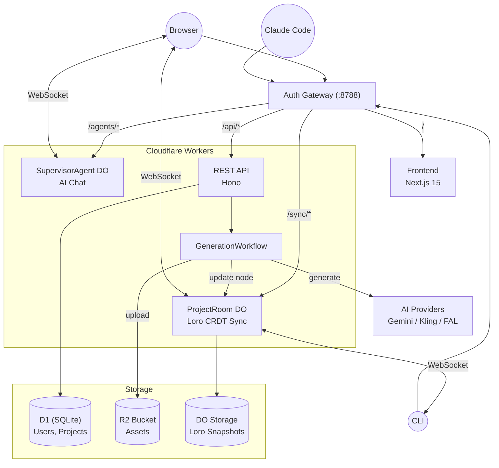

# Clash

> **Next-Gen Co-Creation Platform** — 重新定义 AI 与人类在创意画布上的共生关系。

## Core Vision: Creative Democratization (创作平权)

Clash 致力于进一步降低优质内容的创作门槛，不仅是简单的工具降权，更是创意的升维。

- **Anti-Slop (反垃圾内容)**: 我们反对 AI 生成大量同质化的垃圾内容 (Slop)。我们的目标是利用 AI 赋能人类，去创作原本受限于技术或成本而无法实现的**高质量内容**。
- **Co-Creators (人机共创)**: Human 和 Agent 是平等的合作伙伴。
  1. **Idea First**: 在制作之前，AI 与你共同打磨创意，确保从源头就是高质量的。
  2. **Comprehensive Realization**: 通过 AI 辅助剪辑、AIGC 生成、Motion Graphics 等手段，全方位落地你的想象。

## Core Features

### 1. Idea Co-creation (创意共创)
不再是简单的 "Prompt -> Video"。Agent 会深度参与你的构思过程，提供灵感、挑战逻辑、完善脚本，确保每一个视频都有扎实的创意内核。

### 2. Sleep-time Production (异步制作)
当你休息或专注于构思时，Agent 们正在后台进行繁重的执行工作：深度思考与资产预生成、脚本优化与分镜设计、自动化的粗剪与时间轴编排。

### 3. Skill-Based Agent System (基于技能的智能体系统)
将工业界的最佳实践（SOP）沉淀为可复用的 **Skills**。Agent 可根据意图自动调用专业子智能体完成任务。

### 4. Multi-Client Collaboration (多端协作)
浏览器、CLI、Claude Code 插件共享同一画布状态。基于 Loro CRDT 的实时同步，支持离线编辑与自动冲突解决。

---

## Architecture



### Tech Stack

| Layer | Technology |
|-------|-----------|
| Frontend | Next.js 15, React 19, Tailwind CSS v4, Framer Motion, ReactFlow |
| Backend | Cloudflare Workers (Hono), Durable Objects, Workflows |
| Real-time | Loro CRDT (binary WebSocket protocol) |
| Database | Cloudflare D1 (SQLite), Drizzle ORM |
| Storage | Cloudflare R2 |
| Auth | Better Auth (session + API tokens) |
| AI/ML | Google Gemini, Kling, FAL AI (Sora, Flux), OpenAI SDK |
| Video | Remotion 4 (Cloudflare Containers) |
| Monorepo | pnpm + Turborepo |

### Monorepo Structure

```
apps/
  web/              Next.js frontend (Cloudflare Pages)
  api-cf/           Hono API + Durable Objects (Cloudflare Workers)
  auth-gateway/     Auth reverse proxy (Cloudflare Workers)
  render-server/    Remotion video renderer (Cloudflare Containers)

packages/
  shared-types/     Zod schemas, TypeScript types, model cards
  shared-layout/    Canvas node layout algorithms
  cli/              Terminal CLI tool
  claude-code-plugin/  Claude Code integration
  remotion-core/    Video editor state management
  remotion-components/ Remotion rendering components
  remotion-ui/      Video editor UI
```

---

## Quick Start

### Prerequisites

- Node.js 20+
- pnpm 8.15+
- Wrangler CLI (`npm i -g wrangler`)

### Local Development

```bash
# Install dependencies
make install

# Run D1 migrations
make db-local

# Start all services behind auth gateway
make dev-gateway-full
```

| Service | URL |
|---------|-----|
| **Main entry (gateway)** | `http://localhost:8788` |
| Frontend | `http://localhost:3000` |
| API | `http://localhost:8789` |

### CLI Access

```bash
# Install CLI
cd packages/cli && pnpm link --global

# Authenticate
clash auth login

# List projects
clash projects list

# Work with canvas
clash canvas list --project <id>
clash canvas execute --project <id> --node <id>
```

### Useful Commands

```bash
make dev              # Start web + api-cf (no gateway)
make test             # Run all tests
make lint             # Lint all packages
make format           # Format with Prettier
make clean            # Remove build artifacts
```

---

## Technical Philosophy

- **Shared Context (Canvas)**: 画布即环境 (Environment)。Agent 的操作被简化为对画布状态的 **Read** 和 **Write**。
- **Lightweight Core**: 保持 Agent 骨架的轻量化，通过扩展 **Skills** 来赋予其强大的能力。
- **CRDT-first**: 所有画布状态通过 Loro CRDT 同步，天然支持多端协作与离线编辑。
- **Async-first**: 生成任务通过 Cloudflare Workflows 异步执行，支持长时间运行与自动重试。

---

## License

MIT

---

*"让计算永不停歇，让创意自然流淌。"*
