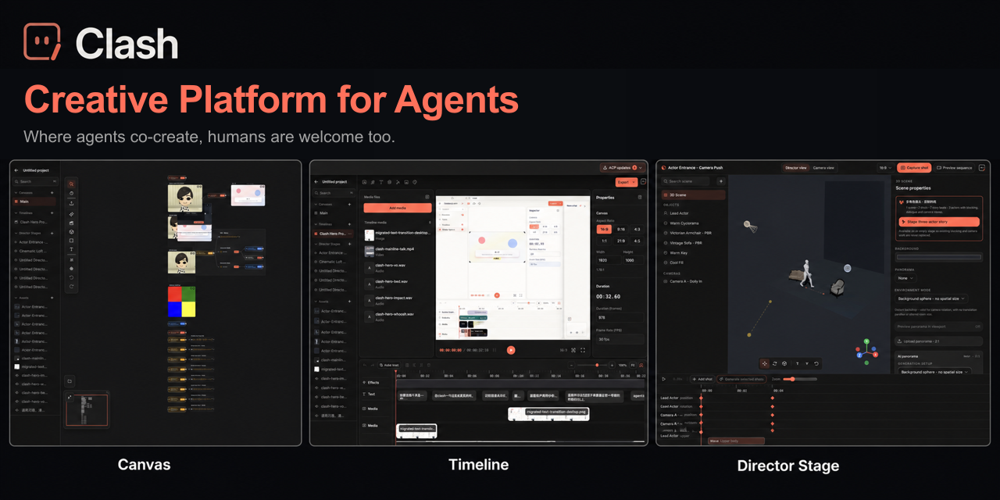

# Clash — 面向 Agent 的创作平台

[English](./README.md) · [简体中文](./README.zh-CN.md)

> **Where agents co-create, humans are welcome too.**

Clash 是一款 source-available、可完整自托管的 **面向 Agent 的创作平台**。
它给 Agent 一份可以理解的真实项目、一组可以直接使用的创作工具，以及把工作
带回给人类品味、判断与许可的明确路径。

今天 Clash 以桌面端为主要载体。Canvas、Timeline、Director Stage、Codex、
ACP、MCP 与 CLI 都是这个环境里的工具，而不是产品本身的定义。

**[官网](https://clash.video)** ·
**[快速开始](#快速开始)** ·
**[自托管](#自托管)** ·
**[架构](#架构)**



## 创作环境

| 工作区             | 能力                                                                                                            |
| ------------------ | --------------------------------------------------------------------------------------------------------------- |
| **Canvas**         | 用节点图组织创意、参考、素材、生成管线与 Agent 批注，多人实时协作。                                             |
| **Timeline**       | 多轨视频剪辑、转录、字幕、关键帧、转场、特效、音频 Ducking 与成片导出。                                         |
| **Director Stage** | 3D 角色、道具、相机、动作片段、全景环境、镜头 Blocking 与预览生成。                                             |
| **Agent Runtime**  | 真实 Codex/ACP 会话、类型化 MCP 工具、可安装 Codex 插件、CLI 投影与版本安全的应用路径。                         |
| **模型与素材**     | 本地 ASR/TTS，以及可路由的图像、视频、音频、文本模型和项目级素材库。                                            |
| **部署方式**       | Electron 桌面端与 local-first 工作流，或 Workers、Durable Objects、D1、R2、Workflows 组成的 Cloudflare 云端栈。 |

Clash 围绕 Agent 创作来设计，不是给传统编辑器外挂一个聊天框。GUI 直接编辑
保持交互与 Undo/Redo；Agent 改动通过可验证的项目投影与显式应用路径进入项目。

## 使用方式

- **桌面端和 Web：** 在 Canvas、Timeline、Director、Assets 与 Copilot
  工作区中完成可视化创作。
- **CLI：** 从终端检查和操作项目、素材、Canvas、Timeline、Director、模型、
  任务、文本与生产工作流。
- **MCP 与 Codex 插件：** 打开 Studio、Canvas、Timeline、Director 等聚焦
  App，由类型化工具连接真实项目，而不是依赖隐藏的浏览器自动化。
- **JavaScript 与 Python SDK：** 把项目操作和本地模型 runtime 接入自定义
  Agent 与生产管线。

## 快速开始

Clash 需要 Node.js 24.18+（Node 24.x）与 pnpm 10+。

CLI 与 MCP 统一由 `clash` 包分发：

```bash
npm install -g clash
clash --help
# MCP 客户端配置为：npx -y clash mcp
```

参与仓库开发：

```bash
git clone https://github.com/clash-space/clash.git
cd clash
corepack enable
pnpm install
pnpm dev
```

本地开发 Electron 桌面端：

```bash
pnpm dev:package @clash/desktop
```

`clash.video` 用的是私有 overlay
([`clash-space/clash-hosted`](https://github.com/clash-space/clash-hosted))，
把这个仓库当 git submodule 套上 billing 层。本仓库本身不依赖它。

---

## 架构

### Local-first Agent 链路

```
人类编辑者 ──▶ Electron / Web ──────────────┐
                                             ▼
Codex / ACP / MCP / CLI ───────────▶ local-api + 项目工作区
                                             │
                  ┌──────────┬──────────┬────┴────┬────────┐
                  ▼          ▼          ▼         ▼        ▼
                Canvas    Timeline   Director   Assets   Models
               (Loro)      (投影)      (3D)     (媒体)  (本地/云端)
```

### 云端协作链路

```
                        ┌──────────────────────────────┐
                        │  clash-web Worker            │
   Browser ─── WS ─────▶│  Vite SPA + Better Auth      │
                        │  代理 /api /sync /agents     │
                        └─────────────┬────────────────┘
                                      │ service binding
                                      ▼
                        ┌──────────────────────────────┐
                        │  clash-api Worker            │
                        │   • Hono 路由                │
                        │   • DO ProjectRoom（Loro）   │
                        │   • DO SupervisorAgent（聊天）│
                        │   • DO RenderContainer       │
                        │   • Workflow generation-*    │
                        └────┬────────────┬────────────┘
                             │            │
                       D1 clash-d1   R2 clash-r2
                       用户 / 项目 /        所有生成媒体 +
                       assets / asset_refs  封面
```

**核心不变量**

- **项目契约是 Agent 边界。** CLI 与 MCP 改动通过类型化、版本感知的投影应用，
  不直接伸进 GUI 内部状态。
- **Loro 是 Canvas 唯一真相。** 边、节点、状态都在 Loro 里；D1 只存 asset 行 +
  auth + project 元数据。两边永远不重复同一个字段。
- **`assetId` 由服务端解析成 R2。** Pending 节点只带 `assetId`；workflow 用
  D1 批量查回 R2 key。`node.data.src` 这个字段已经不存在了。
- **生成全部跑在 Cloudflare Workflows 上。** 长任务按 step 可恢复，前端只
  watch 节点 status。

### 生成链路

```
画布点 Run
  → 前端写 pending 节点 { status, modelId, referenceImageAssetIds }
  → ProjectRoom DO 看到 pending → NodeProcessor
  → 批量 SELECT assets WHERE id IN (...) → R2 keys
  → env.GENERATION_WORKFLOW.create({ params: { referenceImageR2Keys, ... } })
  → resolveProvider → google-image | fal-image | veo | fal-video | ...
  → step("generate")：读 R2 → 调上游 API → 上传结果 → 写 D1 asset 行
  → POST /sync/<projectId>/update-node { status:'completed', assetId }
  → Loro 广播 → ImageNode 通过 useAsset(assetId).srcR2Key 读图
```

### 技术栈

| 层            | 技术                                                                      |
| ------------- | ------------------------------------------------------------------------- |
| 桌面端与 Web  | Electron、Vite、React 19、Tailwind v4、@xyflow/react、Framer Motion       |
| Agent Runtime | ACP、Model Context Protocol (MCP)、Codex 插件、CLI、JavaScript/Python SDK |
| 视频          | Remotion 4、FFmpeg、转录/字幕工具、特效与导出管线                         |
| 3D 导演       | Three.js、React Three Fiber、Drei                                         |
| 云端          | Cloudflare Workers (Hono)、Durable Objects、Workflows、Containers         |
| 实时同步      | Loro CRDT（二进制 WebSocket）                                             |
| 数据          | 本地项目存储、D1 + Drizzle、R2                                            |
| 鉴权          | Better Auth（cookie session + opaque API token）                          |
| AI Provider   | 本地模型、Google Gemini/Veo、fal.ai、OpenAI、Kling、ModelArk 等           |
| 构建          | pnpm workspaces、Turborepo、Vite、tsup                                    |

### 仓库结构

```
apps/
  desktop/              Electron shell、本地导出、NLE handoff、ACP harness
  local-api/            local-first 项目、模型、素材与 Agent runtime
  web/                  Vite SPA + Cloudflare Worker 入口
  api-cf/               Hono + DOs + Workflow + container DO
  render-server/        Remotion 镜像（构一次推到 GHCR，由 Container DO 拉）
packages/
  director-{core,ui}/   3D Director Stage 状态与界面
  mcp-server/           插件 MCP 内部使用、与 CLI 对等的类型化能力层
  clash-sdk/            JavaScript 与 Python Agent/模型 SDK
  shared-types/         Zod schema、model card、ref/capability 工具
  shared-layout/        画布自动布局
  gui/                  平台无关的 React 视图与类型化 UI ports
  web-ui/               Web 产品 controller 与兼容导出
  cli/                  终端 CLI
  claude-code-plugin/   Claude Code 集成
  remotion-effects/     可复用视频特效
  remotion-{core,components,ui}/  视频编辑器
plugins/
  clash/                完整可安装 Clash Codex 插件
  clash-timeline/       聚焦 Timeline 的 Codex 插件
  clash-director/       聚焦 Director Stage 的 Codex 插件
```

---

## 自托管

仓库里的 `wrangler.toml` 都是中性资源名（`clash-api` / `clash-d1` /
`clash-r2`）+ 占位 UUID。先在自己 Cloudflare 账号建好资源，把真实 ID
填回去。

### 前置条件

- Node 24.18+（Node 24.x），pnpm 10+，wrangler 4+
- Cloudflare Workers Paid plan（DO + Workflows + Containers 都需要）

### 一次性设置

```bash
wrangler login

wrangler d1 create clash-d1
# 把打印出来的 database_id 粘进 apps/{api-cf,web}/wrangler.toml

wrangler r2 bucket create clash-r2

cd apps/web
pnpm wrangler d1 migrations apply clash-d1 --remote
```

### Secrets

`apps/api-cf/.dev.vars.example` 列了所有需要的 secret，复制后填值：

```bash
cp apps/api-cf/.dev.vars.example apps/api-cf/.dev.vars
# 填好真实值，部署到生产前一次性推上去：
cd apps/api-cf
wrangler secret bulk .dev.vars
```

| Secret                                                                                          | 说明                              |
| ----------------------------------------------------------------------------------------------- | --------------------------------- |
| `BETTER_AUTH_SECRET`                                                                            | `openssl rand -base64 32`         |
| `BETTER_AUTH_URL`                                                                               | 公开域名，例如 `https://your.app` |
| `GOOGLE_API_KEY`                                                                                | Google AI Studio                  |
| `GOOGLE_CLIENT_EMAIL` / `GOOGLE_PRIVATE_KEY` / `GOOGLE_CLOUD_PROJECT` / `GOOGLE_CLOUD_LOCATION` | Vertex AI service account         |
| `FAL_API_KEY`                                                                                   | fal.ai dashboard                  |
| `KLING_ACCESS_KEY` / `KLING_SECRET_KEY`                                                         | 快手可灵                          |
| `R2_PUBLIC_URL`                                                                                 | 公开 bucket 域名 / 签名 URL host  |
| `CF_AIG_TOKEN` / `CF_AIG_OPENAI_URL` / `GOOGLE_AI_STUDIO_BASE_URL` / `FAL_GATEWAY_URL`          | Cloudflare AI Gateway（推荐配上） |
| `AUTH_GOOGLE_ID` / `AUTH_GOOGLE_SECRET`                                                         | Google OAuth（可选）              |

### 部署

```bash
cd apps/web    && pnpm run deploy
cd apps/api-cf && pnpm run deploy
```

Render container：先构一次重镜像（chromium + ffmpeg + node prod deps）
推到 registry。`apps/render-server/Dockerfile.cf` 只是 `FROM
<your-registry>/clash-render:latest`，之后每次 `wrangler deploy` 只 pull。

```bash
docker build -f apps/render-server/Dockerfile -t ghcr.io/<you>/clash-render:latest .
docker push ghcr.io/<you>/clash-render:latest
# 改 apps/render-server/Dockerfile.cf 的 FROM 指向你的镜像
```

### CI

`.github/workflows/deploy.yml` 是可用模板。要 enable，去 repo Settings →
Secrets 加：

- `CLOUDFLARE_API_TOKEN` — token 权限：`Workers Scripts(Edit)`、`Workers KV(Edit)`、`D1(Edit)`、`R2(Edit)`、`Workflows(Edit)`
- `CLOUDFLARE_ACCOUNT_ID`
- 上面 secret 表里那些 worker secrets（CI 用 `wrangler-action` 每次部署会同步推到 Worker）

---

## 本地开发

```bash
pnpm install
pnpm -w dev
```

Vite dev server 在 `:3000`，把 `/api/*` `/sync/*` `/agents/*` 转给跑在
`:8789` 的 wrangler dev (apps/api-cf)。D1 和 R2 用共享的
`.wrangler/state/`，所有服务看同一份本地数据。

### CLI

```bash
cd packages/cli && pnpm link --global
clash auth login
clash projects list
clash canvas execute --project <id> --node <id>
```

### 测试

```bash
pnpm test          # 单元测试 (vitest)
pnpm type-check    # tsc --noEmit，所有包
```

---

## 许可证

[PolyForm Shield 1.0.0](./LICENSE)。Source-available，永久不转宽松。

可以 fork、改、分发、内部商用、贡献回上游、做学术研究 —— 唯一禁止的是把
它做成跟 clash 竞争的商业产品/服务（比如开 clash-clone.com 卖钱）。
