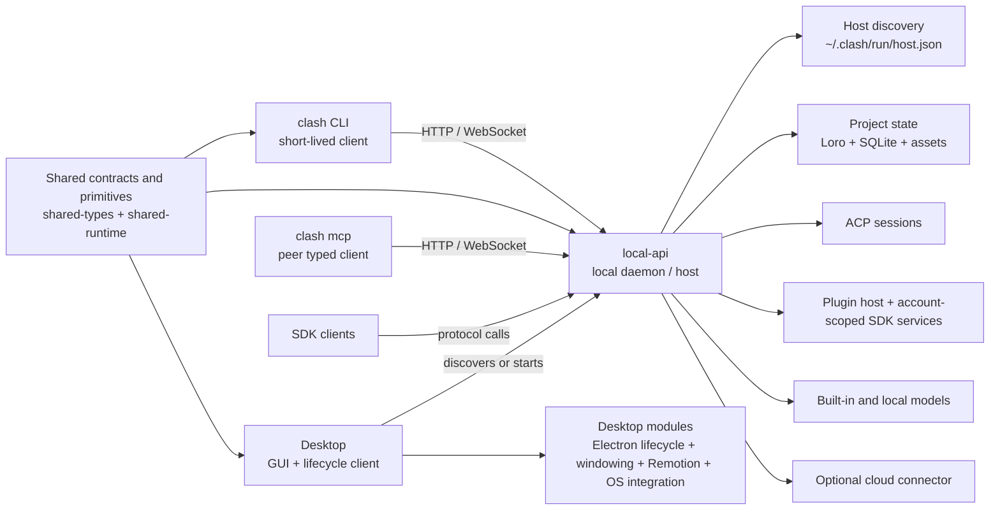
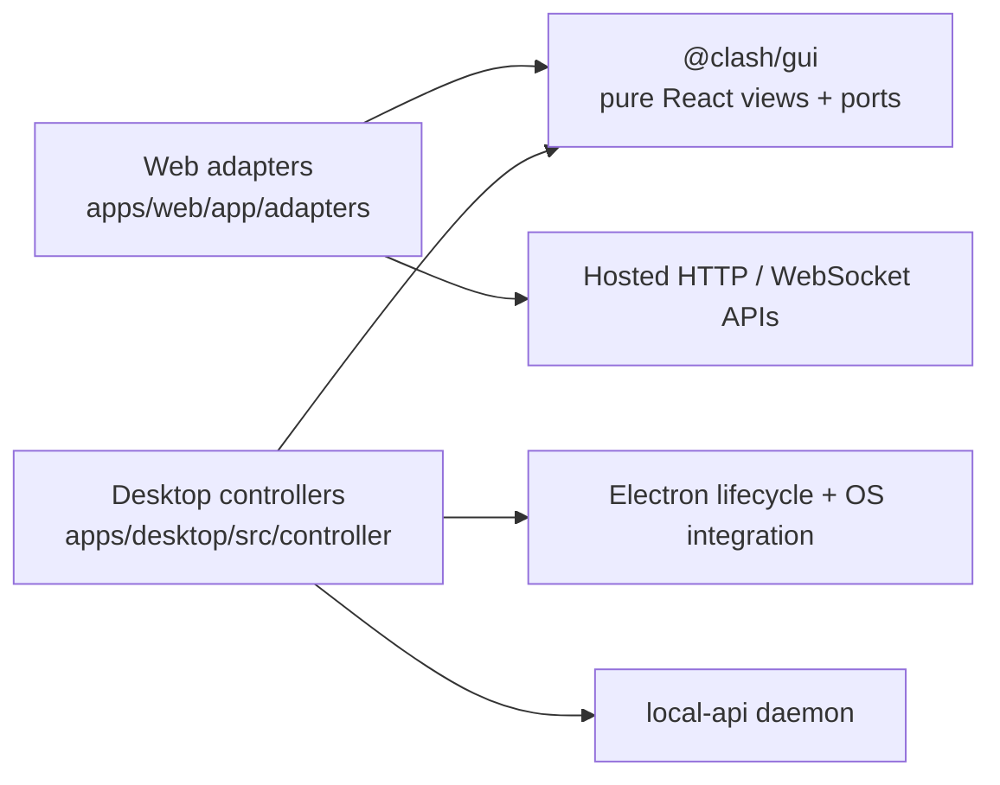
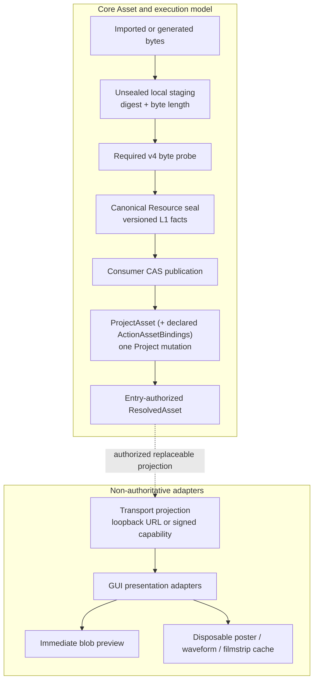

# Architecture

## The pieces



`local-api` is the daemon in the architectural sense: it owns long-lived local
runtime state and processes. It runs as a standalone machine process. The
headless `clash` npm package, Desktop, and an optional daemon-only installer may
all carry the same reusable host artifact. Whichever is installed first, they
coordinate one compatible host per `CLASH_HOME` and profile rather than
embedding or starting a second host in Electron.

## Distribution boundary

The public headless Node distribution is one unscoped package, `clash`. Its
executable is a small dispatcher:

```text
clash <ordinary args> ──▶ bundled CLI client
clash mcp             ──▶ bundled stdio MCP client
both                  ──▶ discover/start bundled local-api host
```

`packages/cli`, `packages/mcp-server`, and `apps/local-api` remain separate
source modules so their responsibilities stay testable, but they are private
npm build inputs rather than separate user-installed Node products. The
local-api executable is an internal `clash` package asset, not a second npm CLI.
This does not prevent a daemon-only native/service release: that release must
reuse the exact same host artifact, discovery protocol, data directory, and
singleton lifecycle. The package manifest's `clashRuntime` map is the stable
artifact contract used by Desktop and daemon-only packaging; they copy that
host artifact rather than rebuilding a second host entry from source.

## Component installation and updates (target, not current)

The current implementation provides compatible-host discovery, a shared lock,
and detached launch from the `clash` package or Desktop. It does **not** yet
provide incompatible-version drain/takeover, a canonical versioned runtime
store, an active-version pointer, an owner/reference registry, or unreferenced
runtime garbage collection. Until those pieces exist, installers must not
delete or overwrite files owned by another package manager.

`clash` is also the canonical component manager for the headless runtime,
Desktop, and daemon-only installation. What is unified is not the download
channel. npm, DMG/installer, a daemon-only archive, and Homebrew may all acquire
the bootstrap. They own only their bootstrap or App files; the manager owns the
installed runtime and service lifecycle.

Every channel invokes the same installer core and protocol. That core verifies
a signed release manifest, installs immutable payloads into a content-addressed
runtime store, and records active component/version state in the canonical
`~/.clash/components` registry. Install, update, uninstall, status, atomic
activation, rollback, and daemon takeover resolve through that registry. They
must not create competing updater databases or overwrite an active runtime in
place. The singleton daemon still uses the shared discovery, lock, drain, and
same-data-directory rules described above.

Desktop's independent installer therefore invokes the same core and records
the same component state. The manager/bootstrap itself updates according to its
acquisition source (for example npm or Homebrew), while it continues to manage
runtime and service payloads through the signed manifest. A future surface such
as `clash install desktop` is valid only when a real downloadable Desktop
artifact, signing/feed contract, atomic activation, and rollback path exist.
Until then, the CLI must not expose placeholder install/update commands.

## Process ownership and dependency direction

The runtime dependency direction is:

```text
clash CLI ──HTTP/WebSocket──▶ local-api
clash mcp ──HTTP/WebSocket──▶ local-api
Desktop   ──discover/start──▶ local-api
Desktop   ──imports─────────▶ shared contracts/runtime + Desktop modules
```

- **CLI is a client.** It discovers the active host, calls its API, and manages explicit working-tree
  projections. It does not own ACP sessions, plugin subprocesses, local persistence, or cloud
  replication.
- **MCP is a peer client.** `clash mcp` calls the local host protocol directly. Its current Project
  catalog covers Assets, Canvas, Timeline, and Director with the same semantics as the matching CLI
  operations. Host/project/component lifecycle commands and working-tree projection conveniences
  remain CLI-only by design. Canvas collection management and Text Revision history/restore are the
  remaining MCP Project-semantic gaps. Neither client invokes the other or owns another daemon,
  Project replica, or independently implemented business layer.
- **Desktop is a shell and lifecycle client.** It discovers or starts the packaged `local-api` and renders the product
  UI against that host. It also directly consumes shared contracts and runtime primitives plus
  Desktop-specific modules such as Electron lifecycle, window management, OS integration, and
  Remotion packaging. `local-api` is its host dependency, not its only dependency.
- **`local-api` is the authority.** It owns host discovery, the canonical local replica, SQLite,
  assets, ACP/session lifecycle, plugin execution, account-scoped SDK services, and optional cloud
  connectivity.
- **Shared packages contain contracts and portable primitives only.** Code genuinely needed by more
  than one consumer belongs in `shared-types`, `shared-runtime`, or another purpose-specific shared
  package; host implementation stays in `local-api`.

Consequently, `local-api` must never import `@clash/cli` implementation modules. The CLI also
does not import `local-api` source code: its arrow to the daemon is a protocol dependency, not a
package dependency. Desktop's direct shared and platform dependencies remain separate from this
host relationship. Desktop may also package the CLI executable for child agents, but that is a
resource packaging edge, not permission for `local-api` to call into CLI internals. The host may
place that injected executable on an agent session's `PATH`; when the agent invokes it, the new CLI
process still calls back into the host over its protocol like any other client.

Host lifecycle is symmetric across installers. A compatible host already
published in discovery is reused whether it was started by `clash` or Desktop.
Closing Desktop or an MCP session must not stop the shared daemon. The
implemented path does not start a second per-Desktop daemon. A future
incompatible host replacement must go through the shared lock and a graceful
drain/shutdown before a new runtime takes over the same data directory; direct
takeover is intentionally not implemented yet.

## GUI and business-controller layers

The target presentation boundary is platform-neutral and does not own product
I/O. `@clash/gui` already owns the shared interaction primitives and a small
set of pure views, while most product views still live in `@clash/web-ui` and
are being separated from their Web/local controller glue. The completed shape
has Web and Desktop supply different controllers around the same `@clash/gui`
views:



The GUI package may depend on browser-safe contracts and visual primitives. It receives data and
actions through props or typed ports; it must not call `fetch`, open a `WebSocket`, access browser
storage, import Electron or `local-api`, or import `node:*`. Hosted authentication, projects, assets,
sessions, sync, and persistence adapters belong to the Web application. Host lifecycle, ACP,
windowing, and local runtime wiring belong to Desktop controllers. Until the extraction from
`@clash/web-ui` is complete, this diagram is a boundary rule and migration target rather than a
claim that every product view already lives in `@clash/gui`. Web must share Desktop's GUI, not
Desktop business logic.

## Asset + Generator system

The native semantic model has two first-class concepts: Assets are durable
referenced facts, while a Generator is versioned Project state with one or more
named Actions that materialize new Assets. Actions are methods of a Generator
Definition, not independently mutable Project entities. Media uses the
ProjectAsset/Resource authority below; typed structured content uses immutable
[Document Asset revisions](/guide/document-assets). See
[Asset + Generator Model](/guide/asset-generator-model) for the native
Definition, revision, Action, Run, output, and migration contract.

The Generator v2 schemas, Project Loro authority, Local Run bridge, plugin ABI,
and first-party Codex ImageGen artifact are delivered. The Local Host HTTP
surface now lists/resolves Definitions, creates/reads Project Generators,
advances versioned heads by observed-head CAS, submits/reads Runs, and reads
Output Commits. A materialized COW revision rejects head advancement with an
explicit fork hint; the existing create route records `forkedFrom` lineage.
There is no separate fork route or Project Generator collection listing, and
CLI/MCP/GUI adapters are not yet wired. Canvas, Timeline, Director Stage, and
inline edit remain on their existing product models. ASR additionally has a
native first-party Generator path, while its existing Timeline and synchronous
endpoint consumers remain on the legacy model.

Typed Document contracts, the built-in registry, Project authority, Host body
service, and Local list/create/read/history/CAS/attachment routes are also
delivered. CLI/MCP/native file projection, standard-consumer wiring, and legacy
metadata migration are not. Native ASR publication is delivered, but Timeline
and other legacy ASR consumers are not migrated.

ASR migration is split deliberately. The strict `speech.transcribe` Broker/SDK
contract, reserved broker enforcement, `clash.asr` bundled package,
Generator/executor, server/runtime injection, and native Run-to-Document path
are delivered. Legacy route replacement, Timeline wiring, and consumer
migration are not delivered.

## Media Asset system

The canonical Local Host authority, resolver, and consumer-CAS implementation
described in this section is current. Every post-cutover Local publication that
introduces new bytes is fail-closed at the implemented `asset-inspection/v4`
boundary: unsealed bytes are probed before canonical Resource sealing, and
incomplete or unavailable inspection publishes no Asset or binding.
Cross-scope publication over an existing sealed Resource reopens it and requires
its complete current v4 receipt without staging the bytes again. The one-way
legacy Project materializer is a documented compatibility exception, not a
current product write path. Team OSS, Resource Registry, multi-device transfer,
and unified Cloud/Web execution paragraphs describe the required future Cloud
adapter; existing hosted compatibility execution is not that adapter or Asset
authority.

Global and Project Asset libraries have independent product lifecycles while
sharing immutable, content-addressed Resources underneath. Project Assets are
owned entries or pinned links with Project-scoped access and retention claims.
Canvas, Timeline, Director, prompts, generation, editing, and rendering express
all strong media usage through Action input/output bindings. The current Host
resolves those stable identities to an entry-authorized `ResolvedAsset`.
Replaceable transport adapters may then mint a loopback URL, signed capability,
or read-only file projection. A missing/expired transport projection never
authorizes fallback to a raw storage key, local path, vendor URL, or an
unauthorized generic media route.

Every canonical Project or Global import preassigns its Asset id before byte
transfer and reuses that id for an ambiguous retry; both multipart routes reject
a missing id. The Host first stages exact bytes under digest and byte length,
without assigning Resource kind or media-type authority. It then requires the
v4 byte probe, validates frozen kind/media-type assertions, derives
display-normalized dimensions, `rotationDegrees`, and complete audio stream
facts, and seals the canonical Resource before consumer-CAS publication.
Caller dimensions, duration, codecs, stream flags, and audio-layout hints never
fill or override Host facts. Generated and transformed outputs use the frozen
`(actionRunId, outputSlot)` instead of an import id; at-least-once producer
duplicates may differ, but the consumer retains one verified winner.
Upload URLs, multipart sessions, local blob previews, and object keys are
transport state and cannot become import identity or publication evidence.

Project Loro currently synchronizes Project Asset entries and Action bindings,
never blob bytes, storage keys, local paths, signed URLs, or transfer progress.



The adapter layer is outside the authority loop: its object URLs, decoded
poster frames, peaks, filmstrip samples, progress UI, and retry state are
disposable. Current Local derives all three from the authorized original-media
projection in frontend code; it does not request a backend representation.
They cannot become Resource or Asset identity, synchronized metadata, an
Action binding, or a condition for declaring a Durable Run complete. Code for
those concerns therefore lives behind presentation/cache/transport adapters
rather than in the Asset SDK authority ports or Durable engine.

A loose import publishes only its Project Asset. A generated output always
publishes the Project Asset and its complete output binding set atomically;
imports that declare Action bindings use that same one-mutation boundary.

The byte producer and every retryable processor may run at least once. Stable
consumer keys make the published facts singular: the probe registry uses
Resource plus recipe version, while durable Action output uses `actionRunId +
outputSlot`. Poster, waveform, and filmstrip caches are not consumers in that
protocol. The Local publisher stages and probes before it atomically writes the
Project Asset and output binding; a crash never requires calling the Provider
again once its result is checkpointed.

The future Cloud adapter will record stable Resource-to-OSS bindings in the
cloud Resource Registry; it must not introduce a second Project sync envelope
or put OSS keys in Loro. Its target behavior allows local-origin structure to
synchronize before silent OSS upload finishes, while other Hosts reject
byte-dependent work until the Resource is ready. A future Web-submitted native
Run and product projection may likewise synchronize early while its cloud owner
remains a private Task fact, but its output ProjectAsset and Output Commit may
appear only after verified OSS staging. Other devices will then download and
verify ready Resources asynchronously.

Execution follows the initiating surface rather than a device that later
observes synchronized state: Web will use the future cloud task runtime, while
Desktop, CLI, and MCP use the designated local-api Host. Only the Local adapter
of the shared Durable Run Engine is implemented today. It persists its private
six-phase Task through SQLite plus local CAS; the future Cloud adapter must
reuse that graph with Workflow state plus OSS staging. Attempt journals and
Provider tokens stay owner-private, and Project Loro never holds a transaction
open across an external request.

Native Generator execution does have a standalone Project Loro Action Run with
the four public states `pending`, `running`, `succeeded`, and `failed`. It pins
one Generator Revision, Action, semantic executor, invocation, and output
contract. Legacy Canvas, Timeline, Director, and Provider paths still project
through their existing node and `ActionAssetBinding` models even when they use
the same private Durable Run Engine; they have not thereby become native
Generator Runs.

See [Durable Run Protocol](/guide/durable-run-protocol) for the shared step
graph, checkpoint and idempotency rules, the native-Generator/legacy-product
split, owner-only recovery, and the future Cloud adapter ports.

Canonical Asset deletion is explicit and split into two lifecycles. The current
Local Host atomically checks Action bindings and changes the ProjectAsset to
`trashed` in Project Loro; that CRDT update is the complete user-visible delete
and remains undoable during the recovery window. Terminal Asset purge exists in
the shared authority/SDK but has no Local product command or scheduler yet. In
the future Cloud/physical-reclamation path, Registry reconciliation will release
a claim only after terminal purge, and a worker may remove OSS bytes only when
no claim remains. Cleanup failure may retain bytes but cannot change Project
state. Background orphan inference is never an Asset lifecycle mechanism.

See [Asset System: Product and Technical Design](/guide/asset-system) for the
complete product vocabulary, link rules, Action reference model, collaboration
protocol, deletion semantics, and migration plan.

## `clash-bridge` consolidation

`clash-bridge` was a historical standalone executable that combined a hosted reverse connection
with ACP sessions and plugin-host responsibilities. Those long-lived responsibilities overlap the
local daemon and therefore belong inside `local-api`; they are not a second local runtime.

The consolidated shape has no `clash-bridge` workspace package:

- ACP runtime, session management, plugin hosting, and the hosted connector live under `local-api`.
- Any `clash` command that configures or inspects this functionality remains a thin client of
  `local-api`.
- Local-only and cloud-connected operation use the same host, replica, and CLI protocol.

## Model catalog composition

The effective catalog a user sees is composed from three sources:

1. **Built-in model cards** — `MODEL_CARDS` in `@clash/shared-types`.
2. **Plugin cards** — cards exported by activated plugins.
3. **Plugin model bindings** — provider implementations exported by activated
   plugins and merged into existing cards.

Composition (`composeExecutablePluginModelCards`) merges plugin bindings into
each card's `providerImplementations`, so a third-party provider appears next
to first-party ones with the same mechanics (priority, overrides, credentials).

Provider selection per generation is routing over the composed card:
account-level model priorities, credential/OAuth availability, and
implementation `priority` decide the route. The catalog endpoint
(`GET /api/v1/models/catalog`) exposes the composed card, candidate providers,
and the selected route.

## Generation flow (plugin-backed provider)

```
UI/CLI submits task to local-api
  → host resolves route (card × provider implementation)
  → host binds the selected Provider account to the invocation
  → Durable Run Engine claims and checkpoints one submit or poll step
  → plugin host invokes the provider-executor endpoint once
     (bundled first-party module or supervised process/stdio package)
  → plugin reads account-scoped state through context.store
  → plugin performs exactly one Provider operation with its own fetch/Axios/client
     (one submit, or one status poll plus completed-result conversion)
  → accepted state is checkpointed; the Host schedules the next poll step
  → completed outputs are staged unsealed, v4-probed, and sealed as canonical Resources
  → Project Asset + output binding are idempotently published by actionRunId + outputSlot
  → typed store/reference/upload operations are audited by the host
```

The manifest declares only what the plugin contributes. Network and filesystem
access are ordinary runtime capabilities of the trusted plugin code; the
process realm is fault isolation, not a security sandbox. Provider traffic
recording and replay are test-runner instrumentation, not branches in plugin
business code. Provider plugins never own retry loops, total task lifetime,
restart recovery, or Project publication; those belong to the Host's durable
step graph.

## Kinds

`ModelKind = 'image' | 'video' | 'audio' | 'text'`. Transcription cards are
text-output cards identified by an exact audio input contract and an `asr_model`
runtime parameter; `asr` is a workflow/capability, not a fifth output kind. The
five local cards sit in the same registry and run on-device (see
[Local ASR](/guide/local-asr)). The native `clash.asr` Generator publishes a
`media.transcript@1` Document Asset; the existing endpoint and Timeline flow
have not yet migrated to it.
