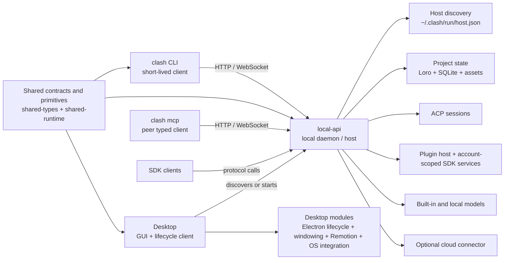
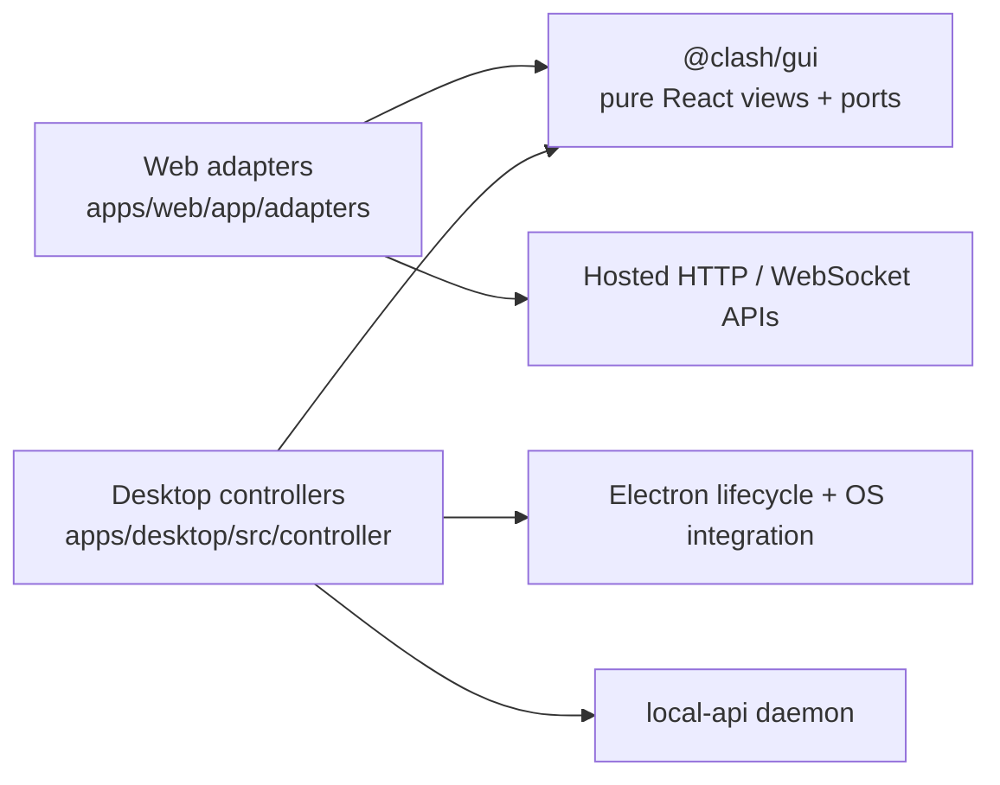

# Architecture

## The pieces



`local-api` is the daemon in the architectural sense: it owns long-lived local
runtime state and processes. It runs as a standalone machine process. The
headless `clash` npm package, Desktop, and an optional daemon-only installer may
all carry the same reusable host artifact. Whichever is installed first, they
coordinate one compatible host per `CLASH_HOME` and profile rather than
embedding or starting a second host in Electron.

## Distribution boundary

The public headless Node distribution is one unscoped package, `clash`. Its
executable is a small dispatcher:

```text
clash <ordinary args> ──▶ bundled CLI client
clash mcp             ──▶ bundled stdio MCP client
both                  ──▶ discover/start bundled local-api host
```

`packages/cli`, `packages/mcp-server`, and `apps/local-api` remain separate
source modules so their responsibilities stay testable, but they are private
npm build inputs rather than separate user-installed Node products. The
local-api executable is an internal `clash` package asset, not a second npm CLI.
This does not prevent a daemon-only native/service release: that release must
reuse the exact same host artifact, discovery protocol, data directory, and
singleton lifecycle. The package manifest's `clashRuntime` map is the stable
artifact contract used by Desktop and daemon-only packaging; they copy that
host artifact rather than rebuilding a second host entry from source.

## Component installation and updates (target, not current)

The current implementation provides compatible-host discovery, a shared lock,
and detached launch from the `clash` package or Desktop. It does **not** yet
provide incompatible-version drain/takeover, a canonical versioned runtime
store, an active-version pointer, an owner/reference registry, or unreferenced
runtime garbage collection. Until those pieces exist, installers must not
delete or overwrite files owned by another package manager.

`clash` is also the canonical component manager for the headless runtime,
Desktop, and daemon-only installation. What is unified is not the download
channel. npm, DMG/installer, a daemon-only archive, and Homebrew may all acquire
the bootstrap. They own only their bootstrap or App files; the manager owns the
installed runtime and service lifecycle.

Every channel invokes the same installer core and protocol. That core verifies
a signed release manifest, installs immutable payloads into a content-addressed
runtime store, and records active component/version state in the canonical
`~/.clash/components` registry. Install, update, uninstall, status, atomic
activation, rollback, and daemon takeover resolve through that registry. They
must not create competing updater databases or overwrite an active runtime in
place. The singleton daemon still uses the shared discovery, lock, drain, and
same-data-directory rules described above.

Desktop's independent installer therefore invokes the same core and records
the same component state. The manager/bootstrap itself updates according to its
acquisition source (for example npm or Homebrew), while it continues to manage
runtime and service payloads through the signed manifest. A future surface such
as `clash install desktop` is valid only when a real downloadable Desktop
artifact, signing/feed contract, atomic activation, and rollback path exist.
Until then, the CLI must not expose placeholder install/update commands.

## Process ownership and dependency direction

The runtime dependency direction is:

```text
clash CLI ──HTTP/WebSocket──▶ local-api
clash mcp ──HTTP/WebSocket──▶ local-api
Desktop   ──discover/start──▶ local-api
Desktop   ──imports─────────▶ shared contracts/runtime + Desktop modules
```

- **CLI is a client.** It discovers the active host, calls its API, and manages explicit working-tree
  projections. It does not own ACP sessions, plugin subprocesses, local persistence, or cloud
  replication.
- **MCP is a peer client.** `clash mcp` exposes the same capability catalog and semantics as the CLI,
  but calls the local host protocol directly. Agents may choose either surface; neither invokes the
  other or owns another daemon, Project replica, or independently implemented business layer.
- **Desktop is a shell and lifecycle client.** It discovers or starts the packaged `local-api` and renders the product
  UI against that host. It also directly consumes shared contracts and runtime primitives plus
  Desktop-specific modules such as Electron lifecycle, window management, OS integration, and
  Remotion packaging. `local-api` is its host dependency, not its only dependency.
- **`local-api` is the authority.** It owns host discovery, the canonical local replica, SQLite,
  assets, ACP/session lifecycle, plugin execution, account-scoped SDK services, and optional cloud
  connectivity.
- **Shared packages contain contracts and portable primitives only.** Code genuinely needed by more
  than one consumer belongs in `shared-types`, `shared-runtime`, or another purpose-specific shared
  package; host implementation stays in `local-api`.

Consequently, `local-api` must never import `@clash/cli` implementation modules. The CLI also
does not import `local-api` source code: its arrow to the daemon is a protocol dependency, not a
package dependency. Desktop's direct shared and platform dependencies remain separate from this
host relationship. Desktop may also package the CLI executable for child agents, but that is a
resource packaging edge, not permission for `local-api` to call into CLI internals. The host may
place that injected executable on an agent session's `PATH`; when the agent invokes it, the new CLI
process still calls back into the host over its protocol like any other client.

Host lifecycle is symmetric across installers. A compatible host already
published in discovery is reused whether it was started by `clash` or Desktop.
Closing Desktop or an MCP session must not stop the shared daemon. The
implemented path does not start a second per-Desktop daemon. A future
incompatible host replacement must go through the shared lock and a graceful
drain/shutdown before a new runtime takes over the same data directory; direct
takeover is intentionally not implemented yet.

## GUI and business-controller layers

Desktop presentation is platform-neutral and does not own product I/O. The shared renderer boundary
is `@clash/gui`; Web and Desktop supply different controllers around the same views:



The GUI package may depend on browser-safe contracts and visual primitives. It receives data and
actions through props or typed ports; it must not call `fetch`, open a `WebSocket`, access browser
storage, import Electron or `local-api`, or import `node:*`. Hosted authentication, projects, assets,
sessions, sync, and persistence adapters belong to the Web application. Host lifecycle, ACP,
windowing, and local runtime wiring belong to Desktop controllers. Thus Web shares Desktop's GUI,
not Desktop business logic.

## Asset system

Global and Project Asset libraries have independent product lifecycles while
sharing immutable, content-addressed Resources underneath. Project Assets are
owned entries or pinned links with Project-scoped access and retention claims.
Canvas, Timeline, Director, prompts, generation, editing, and rendering express
all strong media usage through Action input/output bindings. The current Host
resolves those stable identities to a URL or read-only file projection.

Project Loro synchronizes Project Asset entries and Action bindings, never blob
bytes, storage keys, local paths, signed URLs, or transfer progress. Team
Resource replication records stable Resource-to-OSS bindings in the cloud
Resource registry; there is no second Project sync envelope and OSS keys never
enter Loro. Local-origin nodes, metadata, ProjectAsset entries, and Action
bindings may synchronize before the silent OSS upload finishes, so collaborators
see a pending placeholder and other Hosts reject byte-dependent work until the
Resource is ready. A cloud-origin ActionRun and its placeholder node may also
appear immediately, but its output ProjectAsset and binding appear only after
the cloud runtime has written and verified the Resource in OSS. Other devices
download and verify ready Resources asynchronously.

Task execution follows the initiating surface rather than the device that later
observes synchronized state. Web submissions run in the cloud task runtime;
Desktop, CLI, and MCP submissions run in the designated local-api Host. A
shared Action is frozen into an ActionRevision and a single-owner ActionRun, so
Project sync cannot cause another cloud or local runtime to execute it again.
Both execution realms use the same Durable Run Engine and step graph. Local
steps persist through SQLite plus local CAS; cloud steps use Workflow state plus
OSS staging. An interrupted Provider submit attempt follows the shared retry
policy and may create duplicate upstream work when the first response was
ambiguous; this is an explicit availability trade-off. Once a Provider task
token is checkpointed, recovery only polls that task. Output publication and
Resource replication remain idempotent. Attempt journals and Provider tokens
stay owner-private; Project Loro carries only coarse ActionRun state and never
holds a transaction open across an external request.

Canonical Asset deletion is explicit and split into two lifecycles. Logical
deletion atomically checks Action bindings and changes the ProjectAsset to
`trashed` in Project Loro; that CRDT update is the complete user-visible delete
and remains undoable during the recovery window. Resource claims stay active
until a later terminal `purged` tombstone. Registry reconciliation then releases
the claim, and a physical-delete worker removes OSS bytes only when no claim
remains. Storage cleanup failure may retain bytes but cannot change Project
state. Background orphan inference is not an Asset lifecycle mechanism.

See [Asset System: Product and Technical Design](/guide/asset-system) for the
complete product vocabulary, link rules, Action reference model, collaboration
protocol, deletion semantics, and migration plan.

## `clash-bridge` consolidation

`clash-bridge` was a historical standalone executable that combined a hosted reverse connection
with ACP sessions and plugin-host responsibilities. Those long-lived responsibilities overlap the
local daemon and therefore belong inside `local-api`; they are not a second local runtime.

The consolidated shape has no `clash-bridge` workspace package:

- ACP runtime, session management, plugin hosting, and the hosted connector live under `local-api`.
- Any `clash` command that configures or inspects this functionality remains a thin client of
  `local-api`.
- Local-only and cloud-connected operation use the same host, replica, and CLI protocol.

## Model catalog composition

The effective catalog a user sees is composed from three sources:

1. **Built-in model cards** — `MODEL_CARDS` in `@clash/shared-types`.
2. **Plugin cards** — cards exported by activated plugins.
3. **Plugin model bindings** — provider implementations exported by activated
   plugins and merged into existing cards.

Composition (`composeExecutablePluginModelCards`) merges plugin bindings into
each card's `providerImplementations`, so a third-party provider appears next
to first-party ones with the same mechanics (priority, overrides, credentials).

Provider selection per generation is routing over the composed card:
account-level model priorities, credential/OAuth availability, and
implementation `priority` decide the route. The catalog endpoint
(`GET /api/v1/models/catalog`) exposes the composed card, candidate providers,
and the selected route.

## Generation flow (plugin-backed provider)

```
UI/CLI submits task to local-api
  → host resolves route (card × provider implementation)
  → host binds the selected Provider account to the invocation
  → plugin host invokes the plugin's provider-executor over stdio
  → plugin reads account-scoped state through context.store
  → plugin drives upstream HTTP with its own fetch/Axios/client
     (submit → poll → fetch file)
  → plugin returns outputs; host persists them as project assets
  → typed store/reference/upload operations are audited by the host
```

The manifest declares only what the plugin contributes. Network and filesystem
access are ordinary process capabilities; provider traffic recording and replay
are test-runner instrumentation, not branches in plugin business code.

## Kinds

`ModelKind = 'image' | 'video' | 'audio' | 'text' | 'asr'`. ASR is a
first-class kind: the five local ASR cards sit in the same registry and route
through the same composition as image/video/audio cards, with `providerId:
"local"` implementations that run on-device (see
[Local ASR](/guide/local-asr)).
