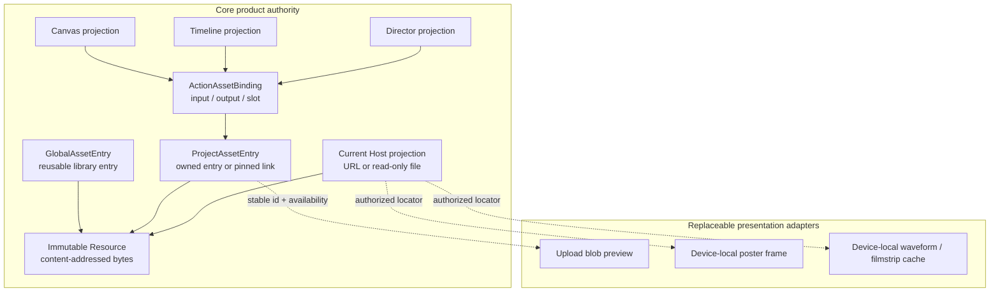
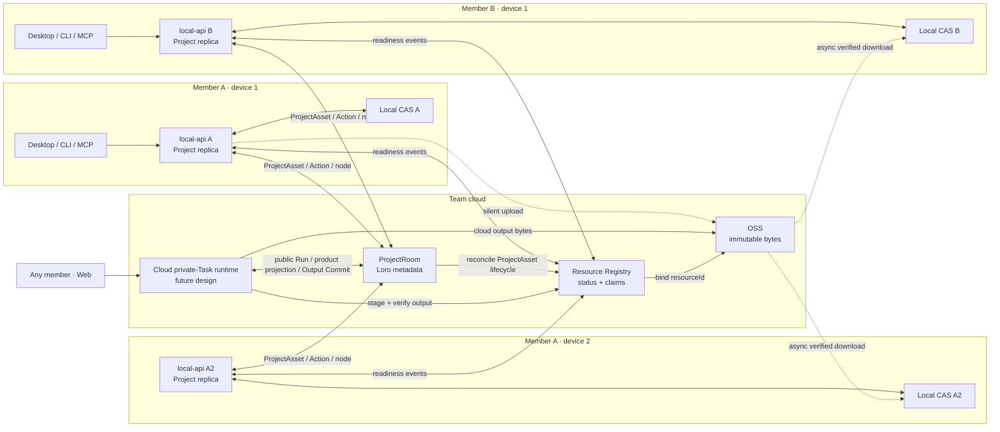
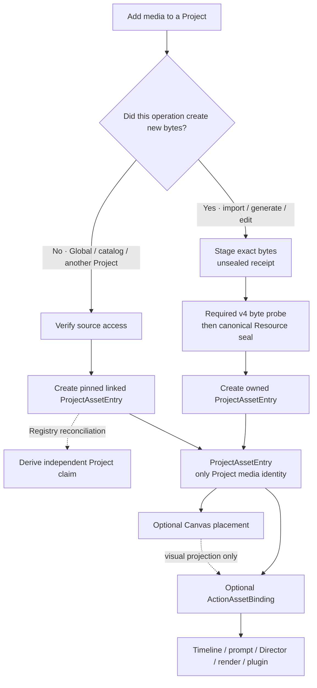
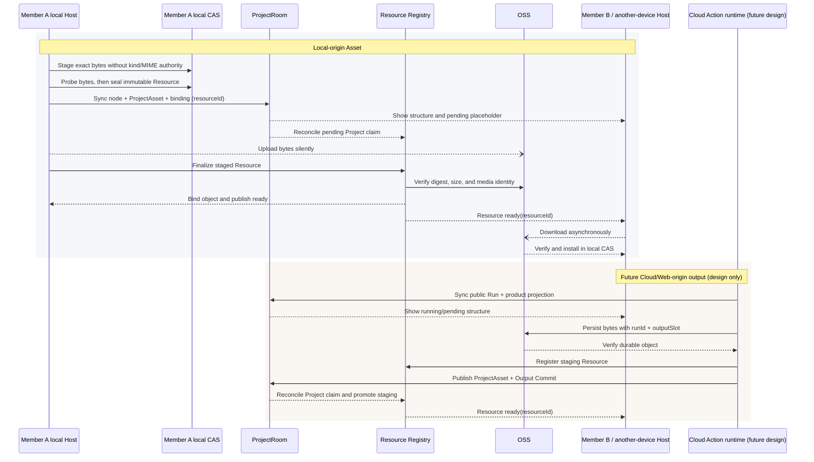
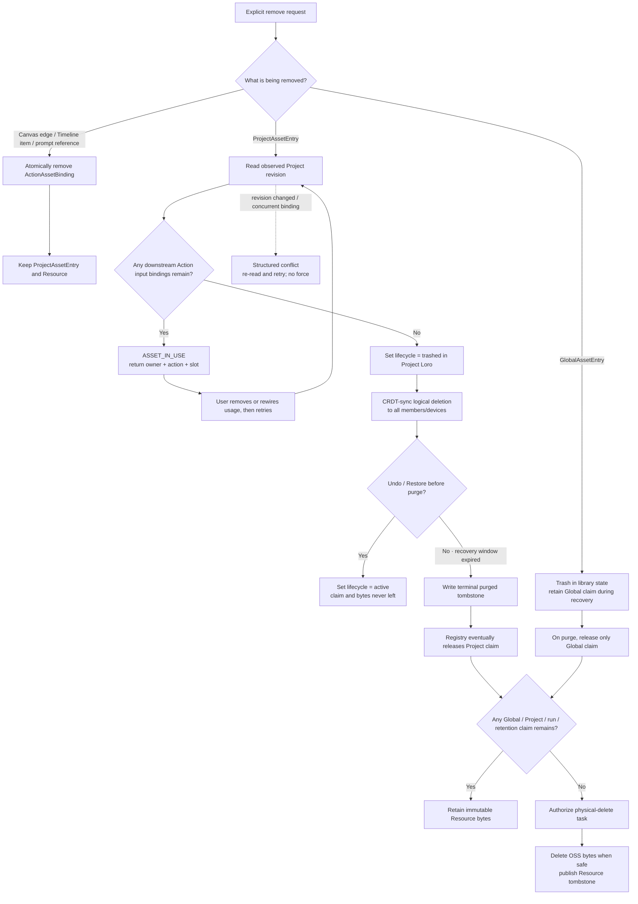
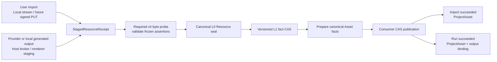
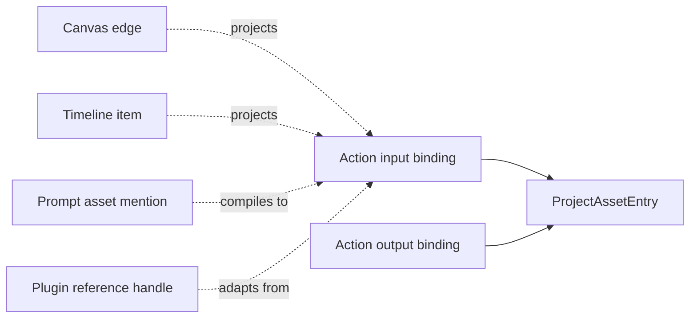

# Asset System: Product and Technical Design

> Status: the Local authority, resolver, Durable publication, and consumer-CAS
> cutover are implemented, including the fail-closed `asset-inspection/v4`
> staging/probe/seal boundary. Poster, waveform, and filmstrip generation are
> device-local frontend presentation concerns in this delivery; backend
> representations are deferred. Physical purge, Cloud replication, and hosted
> storage remain design-only in the current work.

This guide is the authority for **Media Asset and Resource** identity,
publication, binding, and lifecycle. Native Generator semantics live in
[Asset + Generator Model](/guide/asset-generator-model); typed structured
content lives in [Document Assets](/guide/document-assets). Legacy products
continue to use the `ActionAssetBinding` model documented here until their
explicit Generator migration.

The Local product now has one authority and one public read shape.
`@clash/shared-types` defines the storage-free `ProjectAssetEntry`, immutable
`Resource`, `GlobalAssetEntry`, `ActionAssetBinding`, and read-only
`ResolvedAsset` contracts. `@clash/asset-sdk` owns the semantic clients and the
only `ProjectAssetEntry -> ResolvedAsset` resolver. local-api supplies the
Project Loro authority, local Resource CAS, personal Global library, legacy
one-way materializer, and HTTP adapter. GUI, CLI, MCP, Timeline, Director,
project covers, executable plugins, and the Local Durable Run publisher consume
that Project-scoped contract.

The old Local `/api/v1/assets*` storage-row protocol is retired and returns
`410`; new Local writes do not update `asset_refs` or storage-shaped Asset rows.
Legacy rows remain readable only by the one-way materializer and storage doctor.
The hosted api-cf Asset rows are not migrated in this work because Cloud
execution, OSS binding, Project claims, and multi-device transfer are explicitly
design-only. The legacy hosted `/api/v1/assets*` raw-R2-key CRUD/probe router is
therefore absent rather than exposed as a second Asset authority. The internal
rows and probe helpers remain legacy inputs for hosted generation and Loro
compatibility only; they are not a public Asset protocol. They must converge on
the shared contracts before Cloud delivery is claimed. The old api-cf
`/api/v1/edits` executor was likewise removed rather than kept as a second
R2/D1, random-identity execution path; a future hosted edit must use the designed
Workflow/OSS consumer-CAS protocol.

This document defines one product model for media across Global Assets,
Project Assets, Canvas, Timeline, Director, CLI, MCP, executable plugins, local
storage, and team collaboration. It also defines the migration away from the
current mixture of storage rows, project references, Canvas fields, Timeline
rehydration, signed URLs, and plugin-specific handles.

## Executive summary

The system has five concepts, each with one responsibility:

1. **Resource** is immutable media content managed by a Host. It is stored in a
   content-addressed store and replicated independently from Project state.
2. **GlobalAssetEntry** is an entry in a reusable personal or Workspace
   library. Its lifecycle is independent from every Project.
3. **ProjectAssetEntry** is the Project-local asset identity. It either owns a
   Resource created in the Project or is a pinned logical link to a Resource
   admitted from another library.
4. **ActionAssetBinding** is the only authoritative product usage reference.
   Canvas, Timeline, Director, prompts, generation, editing, and rendering all
   express media inputs and outputs through Action bindings.
5. **AssetProjection** is how the current Host makes a Resource readable now:
   a loopback URL, cloud URL, or read-only workspace file. Projections are
   replaceable, device-local, and never identities.

Entry identities are scoped by their owning collection. A
`GlobalAssetEntry.id` and a `ProjectAssetEntry.id` are unrelated even when the
two strings happen to be identical. Only an explicit Host admission/publication
relation may connect them; GUI filtering must never infer that relation from id
equality.

The core Asset model deliberately stops at an authorized projection. Upload
spinners, browser `blob:` previews, poster fallbacks, waveform/filmstrip
decoding, hover frames, and delivery caches are a separate presentation plane.
They may fail, expire, or recompute without changing Resource identity,
Project/Global membership, Action bindings, lifecycle, or Durable Run success.
Presentation code may consume a stable entry id, availability, and an
authorized locator; it may not publish cache bytes or URLs as canonical
metadata, use them as consumer-CAS keys, or create an alternate Asset API.



The dotted presentation edges never point back into the core subgraph.

### Multi-member, multi-device synchronization

Every member and every device observes the same Project identities, but each
device has its own byte availability. Project metadata and Resource bytes use
two independent planes joined only by the stable `resourceId`.



`ProjectRoom` never carries bytes, OSS keys, signed URLs, local paths, or
transfer progress. The Resource Registry never becomes a second Project state
store: it only answers whether a stable Resource is admitted and available to
this Project. The same flow covers two devices owned by one person and devices
owned by different collaborators; Project membership gates both metadata and
Resource claims.

### Add, admit, and synchronize

The product first decides whether an operation created new bytes or admitted an
existing immutable Resource. Both paths converge on one ProjectAsset shape and
one Action-binding path.



For locally created bytes, publication is deliberately metadata-first. For
cloud-created bytes, structural state can still appear first, but OSS is the
cloud runtime's only durable media store.



This is an intentional availability trade-off. A local Host may use its CAS
copy immediately while collaborators wait for OSS readiness. A cloud runtime
has no durable local-only phase: it may synchronize the public Run and
product projection early, while ownership stays in its private Task. It
publishes a usable output Asset and Output Commit only after the bytes are
verified in OSS.

### Remove usage, Asset, and bytes

Removing a usage is different from removing a Project Asset, and removing a
Project Asset is different from deleting Resource bytes. No operation infers
deletion from apparent orphanhood.



Logical deletion and physical deletion are deliberately decoupled. The delete
operation completes when the Loro lifecycle becomes `trashed`; it neither
waits for Registry work nor releases the Resource claim. CRDT Undo or an
explicit Restore changes the lifecycle back to `active` during the configured
recovery window, so no upload or Registry round trip is required. Purge is the
later terminal transition that releases the claim and authorizes asynchronous
byte deletion only when no other claim remains.

The Local product currently ships the diagram through Trash and Restore. The
terminal `purged` state and its stale-CRDT protection are implemented in the
shared authority and Asset SDK, but no Local HTTP/CLI/MCP command or background
scheduler advances an Asset into that state yet. Claim release and physical
Resource deletion therefore remain delivery work; the diagram specifies their
required behavior rather than claiming a running cleanup worker.

An upload that finishes while the entry is trashed may make the retained
Resource available for Restore, but it cannot reactivate the ProjectAsset.
After purge, stale upload finalization cannot recreate the terminal entry. An
object written for a cloud output that never acquired a ProjectAsset remains a
staging Resource and is eligible for TTL cleanup.

The Project synchronizes ProjectAsset entries and Action bindings. It does not
synchronize bytes, object-storage keys, local paths, signed URLs, caches,
transfer progress, or operating-system symlinks.

Canonical Assets are never reclaimed by a background orphan scan. Only an
explicit logical delete may move an entry to Trash, and only a later explicit
or retention-triggered purge may release its claim. The Host proves that no
blocking reference remains before trashing; the physical-delete worker proves
that no claim remains before deleting bytes. Cache eviction, staging-file
cleanup, and processing an already-authorized delete queue are operational
cleanup, not Asset garbage collection.

## Product vocabulary

### Resource

A Resource is one immutable byte sequence. Image, video, audio, and model
Resources use the same lifecycle. The Resource identity is a platform-internal
stable key backed by a content digest; storage paths and object-store keys are
not part of that identity.

A future backend may materialize immutable derived representations such as a
video poster or low-resolution proxy, but that protocol is not part of the
current Local delivery. Current Local treats poster frames, waveform peaks,
Timeline filmstrips, and current-frame captures uniformly as device-local,
disposable frontend caches derived by decoding an entry-authorized original
media projection. They never enter Resource or ProjectAsset metadata, Action
bindings, Timeline Loro state, or Durable Run completion.

Canonical publication builds descriptive media facts from the required
versioned Host byte probe rather than trusting a filename, browser `File.type`,
Provider declaration, renderer assertion, or caller metadata. Current
`asset-inspection/v4` verifies image display dimensions and rotation; video
display dimensions, rotation, duration, frame rate, video codec, and explicit
`hasAudio`; audio duration and codec; sample rate, channel count, and channel
layout for audio streams; and supported glTF/GLB bytes. Width and height are
display-normalized: a 90° or 270° display rotation swaps coded width and height,
while `rotationDegrees` preserves the normalized `[0, 360)` display rotation.
The current v4 recipe accepts the quarter-turn display matrices that it can
normalize without inventing geometry; any other matrix fails closed instead of
publishing coded dimensions as display dimensions. SVG images require a
well-formed, DOCTYPE-free SVG XML document and are verified from their root
`width`/`height` or positive `viewBox` without executing document content.
Compatible caller MIME aliases (for example `audio/x-wav`) are normalized
before comparison, while the decoded Host media type is the sealed L0 fact.
Matroska/WebM family media is distinguished by the EBML `DocType` stored in the
bytes rather than by a filename or FFprobe's shared demuxer name. When FFprobe
omits a WAV channel layout, v4 may derive only mono/stereo from a verified
standard PCM/IEEE-float RIFF `fmt` chunk whose 1/2-channel count matches the
decoded stream; other unknown layouts fail closed. For still images, v4 also
reads the first decoded frame's display matrix so EXIF-oriented photos publish
display-normalized dimensions.
Headerless PCM is not a byte-self-describing Asset format and therefore cannot
produce canonical L1 facts from caller MIME parameters. Provider adapters must
wrap such output in a verified self-describing container before staging it.
`hasAudio: false` means a verified silent video; omission remains
legacy/unknown.

Digest, byte length, verified kind, and canonical media type are immutable
Resource facts. Inspection facts live in the versioned Host processing
registry. Neither is exposed with a Resource identity or local path through
`ResolvedAsset`. `originalName` is a display hint, not a byte-derived fact.
Every post-cutover Local publication that introduces new bytes requires a
complete v4 receipt; an unavailable inspector, failed decode, assertion
mismatch, or incomplete required fact leaves the staged bytes unsealed and
creates no entry or binding. A cross-scope admit or publish over an already
sealed Resource does not stage the bytes again: it reopens that Resource and
requires its complete current v4 receipt before mutating the destination entry.

### GlobalAssetEntry

A GlobalAssetEntry is a reusable library entry outside a Project. The initial
product can expose a personal library; the same contract can later support a
Workspace-owned library. Library ownership controls who may create a Project
link, not who may read an already-admitted Project Asset.

Trashing a GlobalAssetEntry hides that library membership but retains its
Resource claim during the configured recovery window. Purging it releases only
the Global claim. Neither transition may break a Project that previously
admitted the Resource.

```ts
type GlobalAssetEntry = Readonly<{
  id: string;
  kind: "image" | "video" | "audio" | "model";
  resourceId: string;
  lifecycle: ProjectAssetEntry["lifecycle"];
  name?: string;
  metadata: ProjectAssetMetadata;
  provenance?: ProjectAssetProvenance;
}>;
```

The library ID is authority context, not part of the entry or Resource identity. Global entries
never carry a Project ID, storage key, path, URL, or projection state.

The Local Host keeps cross-scope publication idempotent without merging those
identities. Publishing the same `(projectId, projectAssetId)` to the same
library derives one opaque Global-entry relation identity and retries return
that entry. The digest used for this Host relation contains scoped entry
identities only; it is not a `ResourceId` and is not exposed as storage
authority.

### ProjectAssetEntry

A ProjectAssetEntry is the only media identity that Canvas, Timeline, Director,
and Project Actions may reference. There are two origins:

```ts
type ProjectAssetSource =
  | Readonly<{ kind: "owned"; resourceId: string }>
  | Readonly<{
      kind: "linked";
      resourceId: string;
      origin:
        | Readonly<{
            scope: "global";
            libraryId: string;
            entryId: string;
          }>
        | Readonly<{
            scope: "project";
            projectId: string;
            entryId: string;
          }>
        | Readonly<{
            scope: "catalog";
            catalogId: string;
            entryId: string;
          }>;
    }>;

type ProjectAssetEntry = Readonly<{
  id: string;
  kind: "image" | "video" | "audio" | "model";
  source: ProjectAssetSource;
  lifecycle:
    | Readonly<{ state: "active" }>
    | Readonly<{
        state: "trashed";
        deleteOperationId: string;
        deletedAt: string;
        purgeAfter: string;
      }>
    | Readonly<{
        state: "purged";
        deleteOperationId: string;
        deletedAt: string;
        purgedAt: string;
      }>;
  name?: string;
  metadata: ProjectAssetMetadata;
  provenance?: ProjectAssetProvenance;
}>;
```

`ProjectAssetMetadata` is deliberately narrower than the transitional Asset-row
metadata. Its current byte-derived facts include display-normalized `width` and
`height`, `rotationDegrees`, duration, frame rate, video/audio codecs, explicit
audio presence, sample rate, channel count/layout, and canonical content type.
`originalName` is display metadata rather than a byte-derived fact. Metadata
cannot contain a URL, local path, blob key, object-store key, signed projection,
or transfer state. `ProjectAssetProvenance` carries sanitized product lineage
only; Provider task tokens and raw execution state remain owner-private.

`active -> trashed` is the synchronized logical delete. During the recovery
window, CRDT Undo and the explicit Restore command both produce the same
semantic `trashed -> active` operation. Ordinary metadata edits never mutate
the lifecycle register, so an offline stale edit cannot accidentally restore a
deleted entry. `purged` is a terminal tombstone retained after bytes disappear;
restoring it requires a new import or admission rather than replaying old CRDT
history.

The linked form is the synchronized product-level "soft link." It is not an
operating-system symlink and it does not have Unix symlink failure semantics.
It pins an immutable Resource and gives the Project its own access and
retention claim. Deleting or renaming the origin entry therefore cannot break
the Project.

An origin is a complete, storage-free collection identity. `entryId` is never
globally meaningful on its own: Global origins pair it with `libraryId`,
cross-Project origins with `projectId`, and catalog origins with `catalogId`.
URLs, paths, object keys, and projection locators are forbidden in every
variant. The new-publication schema rejects the former ownerless
`{ scope, entryId }` shape.

For snapshots written before this invariant, the Loro read boundary performs a
one-way semantic normalization only: an ownerless Global origin becomes
`libraryId: "personal"`, an ownerless Project origin receives the currently
opened Project ID, and an ownerless catalog origin becomes
`catalogId: "legacy"`. This private compatibility shape is not exported as a
publication contract and cannot pass `ProjectAssetEntrySchema` or the Asset SDK
write boundary. Current Local Global admission always persists the explicit
`libraryId: "personal"` identity.

### Legacy product ActionAssetBinding

Current Canvas, Timeline, Director, edit, and provider products own media usage
through `ActionAssetBinding`. This is the delivered compatibility authority for
those unmigrated surfaces, not the native Generator object model. Editable
legacy Actions, frozen revisions, and concrete execution identities are
distinct owners so synchronized state is never mistaken for a command that
every device should execute:

```ts
type ActionBindingOwner =
  | Readonly<{ kind: "draft"; actionId: string }>
  | Readonly<{
      kind: "revision";
      actionId: string;
      actionRevisionId: string;
    }>
  | Readonly<{
      kind: "run";
      actionId: string;
      actionRevisionId: string;
      actionRunId: string;
    }>;

type ActionAssetBinding = Readonly<{
  id: string;
  owner: ActionBindingOwner;
  direction: "input" | "output";
  slot: string;
  projectAssetId: string;
  role?: "primary" | "reference" | "source";
}>;
```

The slot is semantic and stable. Examples include `reference:0`,
`timeline:item:<item-id>`, `director:model:<node-id>`, and `render:output`.
Framework-specific locations can be derived from the owning Action and slot;
they are not separate authoritative references.

An editable legacy Action owns its current input bindings. Submission freezes
an ActionRevision and its exact input bindings. One owner-private execution
identity runs that revision on one designated Host and owns the resulting
output bindings. Rendered and generated outputs therefore remain reproducible
after the editable Action changes, and synchronization cannot cause another
Host to execute it again. Native Generator Actions instead pin a Generator
Revision in a four-state public Run and publish an Output Commit; see
[Asset + Generator Model](/guide/asset-generator-model).

The Local WebSocket mutation boundary treats Project Asset entries, binding
authority markers, immutable run/revision lineage, and output bindings as
Host-owned. A local GUI peer may edit draft inputs and may submit the exact
frozen Timeline inputs created with its matching pending render request; it
cannot fabricate, rewrite, or remove another run's input/output lineage. Host
HTTP, command, and Durable consumer mutations publish those facts through the
same Project replica.

### Resolved Asset view

All user-facing readers receive one read-only resolved shape from the current
Host. Global and Project list endpoints may add collection context, but the
Asset representation itself is defined once:

```ts
type ResolvedAsset = Readonly<{
  id: string;
  kind: "image" | "video" | "audio" | "model";
  name?: string;
  metadata: ProjectAssetMetadata;
  provenance?: ProjectAssetProvenance;
  lifecycle: ProjectAssetLifecycle;
  status: "uploading" | "ready" | "downloading" | "unavailable" | "failed";
  url?: string;
  thumbnailUrl?: string;
  progress?: number;
  error?: string;
}>;
```

`url` is the current Host's authorized original-media projection.
`thumbnailUrl` remains an optional, read-only compatibility projection for
legacy or remote readers; Current Local does not generate it, request a backend
poster for it, or treat its presence as evidence of a backend representation
protocol. A GUI may consume a supplied compatibility value, but its canonical
Local fallback derives a disposable poster from `url`. Neither field may expose
an R2 key, canonical local path, cache path, or storage implementation. Transfer
progress and errors are device-local and must not enter Project Loro.

## Product scopes

### Global Assets

Global Assets is a reusable library, not the parent storage directory of every
Project. Adding an entry to the library creates a Global claim on a Resource.
It does not add the entry to any Project. Removing it does not affect existing
Project links.

### Project Assets

Project Assets is an explicit, first-class collection in Project Loro. It is
the authority for which media identities the Project may use. SQLite may keep a
reverse index for queries, but an `asset_refs` row must not be the product
authority.

Every Action binding in the Project must point to an existing ProjectAssetEntry.
The Host enforces this invariant atomically.

### Canvas

Canvas is a visual projection of Actions, Asset placements, and their
relationships. A loose Project Asset placement does not create another media
identity. An edge into an Action projects an Action input binding; it must not
be a second source of truth.

Project membership already retains a loose placement's Resource. A strong
usage reference begins when an Action binds the Project Asset.

### Timeline

Timeline is an Action, not a special media reference subsystem.

- A Project-owned Timeline has a persistent Timeline Action.
- A Canvas-owned Timeline uses the corresponding Canvas Action.
- A Timeline item has a stable slot such as `timeline:item:<item-id>`; the Host
  writes that slot's ActionAssetBinding in the same Project mutation.
- The binding resolves to a ProjectAssetEntry.
- Rendering freezes a Timeline Action revision and produces an output binding.

Current Local writes persist `assetId` as the Project Asset identity and never
persist an external runtime `src`: the shared Project authority strips Host
projections and rejects a URL/path-only item. The item `assetId` and stable
`timeline:item:<item-id>` slot compile directly to the Action binding in the
same Project Loro mutation. `sourceNodeId` is only an optional live
Canvas-navigation hint; GUI, CLI, render, and deletion never treat it as media
identity or reference authority.

Director Stage state follows the same split. Models, environments, shots, and
reference packets persist Project Asset identities only. `sourceUrl`, packet
`src`/`previewUrl`, and Canvas `outputVideoSrc` projections are Host-runtime
data and are stripped before a Loro write.

### Built-in catalogs

The Timeline catalog and Director starter library are catalogs, not Global
Assets. Applying a pure preset, transition, effect, or caption style creates no
Project Asset. Applying a catalog item backed by media creates a linked
ProjectAssetEntry at first use, then binds that Project Asset to the Action.

### Text and production metadata

Descriptive media facts such as dimensions, duration, codecs, content type, and
display name belong to the Media Asset read model. Structured content such as a
timed transcript, description, or render-lineage record is a first-class typed
[Document Asset](/guide/document-assets), not another field on the media
Resource. A Document has a stable head over immutable, content-addressed
revisions, exact producer/source lineage, and revision-pinned attachment
relations to Project Assets, Generator Revisions, or Action Runs.

The native Document contracts, Project Loro authority, built-in kind registry,
attachment target/policy admission, plugin reference/output ABI, and native
Generator publication path are delivered. Local HTTP can list, create, read,
version, and attach Documents through the live Project authority. CLI/MCP/native
file projection and declared-consumer wiring are not. The native `clash.asr`
bundled Generator publishes timed transcripts through this Document authority;
the legacy transcription route, Timeline, and other ASR consumers are not yet
migrated. The
older `clash assets metadata` manifest/CAS flow and Local typed-metadata query
projection remain transitional compatibility systems; their Project
Asset/Action Revision address is not a native Document Asset identity and must
not be described as one.

## Exactly when a link is created

A Project Asset link is created only when immutable media crosses a durable
library boundary without producing new bytes.

| Source                    | Target             | Operation             | New bytes   | Project link              |
| ------------------------- | ------------------ | --------------------- | ----------- | ------------------------- |
| Local file                | Project            | Import                | Yes         | No; owned Project Asset   |
| Provider generation       | Project            | Create output         | Yes         | No; owned Project Asset   |
| Edit or transcode         | Project            | Copy-on-write output  | Yes         | No; owned Project Asset   |
| Global Asset              | Project            | Admit/link            | No          | Yes                       |
| Global Asset              | Canvas or Timeline | Admit, then bind      | No          | Yes                       |
| Project Asset             | Canvas or Timeline | Bind to Action        | No          | No                        |
| Canvas Action input       | Owned Timeline     | Reuse binding         | No          | No                        |
| Media-backed catalog item | Project            | Admit/link            | No          | Yes                       |
| External URL              | Project            | Fetch, verify, import | Yes locally | No live URL link          |
| Project A                 | Project B          | Admit with B claim    | No          | Yes in Project B          |
| Project Asset             | Global Assets      | Publish               | No          | No Project-dependent link |
| Linked Project Asset      | Edited result      | Fork                  | Yes         | New owned Project Asset   |

Publishing a Project Asset into Global Assets creates an independent
GlobalAssetEntry and Global claim over the same Resource. It must not create a
Global entry whose lifetime depends on the Project. Physical bytes remain
deduplicated.

Links pin immutable Resource content. A new version in the origin library does
not silently change a Project. An explicit refresh creates or adopts a new
Project Asset identity, followed by explicit Action rewiring.

## Business operations

### Import

Importing a local file into a Project:

1. requires the preassigned `projectAssetId` carried by the import command;
2. stages the exact bytes, computes their digest and byte length, and records an
   unsealed receipt with no kind or media-type authority;
3. runs `asset-inspection/v4` over those staged bytes and verifies the frozen
   Asset-kind and optional media-type assertions;
4. derives canonical display dimensions, rotation, duration, codecs, frame
   rate, stream presence, and audio layout where the kind requires them;
5. only after the probe succeeds, seals the canonical immutable Resource in the
   local content-addressed store;
6. creates an owned ProjectAssetEntry from the sealed Resource and v4 facts;
7. optionally publishes that entry and its Action binding in the same Project
   mutation;
8. optionally creates a read-only workspace projection.

It never adds the Asset to Global Assets implicitly.

There is deliberately no cross-store transaction spanning the immutable
Resource store and Project Loro. The operation is an at-least-once pipeline:
staging, probing, and canonical sealing are repeatable by stable Resource
identity, and the Project consumer publishes with its stable Project Asset or
`(actionRunId, outputSlot)` identity under CAS. A crash before the Project
mutation leaves reusable staged CAS bytes; a retry re-probes or reuses the
versioned result. A crash after the mutation rereads and verifies the committed
winner. It never creates a second Asset or binding.

### Unified Resource ingest and finalization

User imports, Provider outputs, edits, local model outputs, and Timeline renders
all converge on one Resource ingest/finalization protocol. They differ only in
how bytes reach staging and which stable consumer identity publishes the
result. They do not have separate L0/L1 metadata pipelines.

This is the implemented Local semantic protocol and the required contract for a
future Cloud adapter. Current Local import receives bytes through the
Project- or Global-scoped multipart route; current generated output receives a
durable Host staging receipt. A future Web or Cloud adapter may use an OSS
signed PUT and a durable ingest journal, but that Cloud transport is design-only
in this delivery.

The protocol layers are:

- **L0 Resource facts:** the verified byte sequence, digest, byte length, kind,
  and canonical media type. L0 is required before a Resource can be consumed
  by a new Asset publication.
- **L1 editable-media facts:** the byte-derived facts required for correct
  editing, such as display dimensions, duration, orientation, stream presence,
  frame-rate/codec facts, and audio layout where applicable. A specific
  operation may require only a subset, but a new publication cannot substitute
  invented defaults for a required fact.
- **L2/L3 presentation derivatives:** device-local poster frames, blob
  previews, waveforms, filmstrips, and hover frames, plus any future backend
  proxy/representation protocol. These are outside the current ingest protocol
  and never gate Resource finalization, Asset publication, or Durable Run
  success.

Aspect ratio is not a third stored fact. It is derived from normalized display
width and height. A generation request's `aspect_ratio` remains frozen Action
input, while the generated Resource's actual dimensions remain L1 output facts.

Current Local implements the complete boundary as
`unsealed staging -> required asset-inspection/v4 probe -> canonical Resource
seal -> versioned L1 receipt -> consumer CAS`. The staging receipt fixes the
digest and byte length but deliberately carries no Resource kind or media-type
authority. The v4 probe validates the frozen declarations, normalizes display
geometry and rotation, and records the required audio stream facts before the
Resource can be sealed or an Asset can be published.

If a declaration is wrong, that attempt fails without reserving the digest
under its kind or media type. A later command may retry the same staged bytes
with corrected frozen assertions and seal them only after successful probing.

Rows created by the pre-v4/private legacy `install` and `adopt` compatibility
wrappers are explicitly recorded as unverified, not as canonical L0 facts. On
first successful complete v4 probe, the Host promotes exactly one kind and
canonical media type with a SQLite compare-and-set; concurrent alternatives
must equal that winner or fail. A verified row is never reinterpreted. During
upgrade, an existing current-v4 receipt also promotes an old no-media-type row
before Project/Global registry resolution, so consumer validation never sees a
half-migrated Resource view.

Publication inputs belong to three non-interchangeable classes:

| Class                     | Examples                                                                                                                                                                                    | Authority rule                                                                                                            |
| ------------------------- | ------------------------------------------------------------------------------------------------------------------------------------------------------------------------------------------- | ------------------------------------------------------------------------------------------------------------------------- |
| Frozen command assertions | stable Project/Global Asset id or `(actionRunId, outputSlot)`, Asset kind, optional declared media type, and any internally declared expected digest/length                                 | A mismatch fails the command. Assertions are never silently corrected or used to fill decoded facts.                      |
| Caller media hints        | width, height, duration, rotation, codecs, `hasAudio`, sample rate, channel count/layout, waveform, or other producer/browser metadata                                                      | They never enter new publication authority, never fill a missing Host fact, and never override the probe. Host facts win. |
| Host facts                | staged digest/byte length, decoded canonical media type, display-normalized dimensions, `rotationDegrees`, duration, codecs, frame rate, stream presence, sample rate, channel count/layout | They are admitted only by the versioned byte probe and canonical seal. Missing required facts fail closed.                |

`name` and `originalName` are separately identified display metadata. They may
be retained for presentation, but they are not evidence about the bytes.



#### Stable identities and transport capabilities

Every byte-producing command fixes its public consumer identity before issuing
an upload capability or invoking a byte producer:

| Producer                           | Stable consumer identity          | Byte-transfer adapter                                                        |
| ---------------------------------- | --------------------------------- | ---------------------------------------------------------------------------- |
| User Project import                | preassigned `projectAssetId` UUID | Current Local multipart/stream; future Cloud upload slot and signed PUT      |
| User Global import                 | preassigned `globalAssetId` UUID  | Current Local multipart/stream; future Cloud upload slot and signed PUT      |
| Provider or local generated output | `(actionRunId, outputSlot)`       | Host Asset broker or Host-local durable staging                              |
| Edit, crop, or render output       | `(actionRunId, outputSlot)`       | Host-local durable staging or synchronous transform followed by consumer CAS |

For a user import, the command adapter generates the Asset id before the first
request, normally with `crypto.randomUUID()` and the
applicable opaque Asset-id prefix, and freezes it with that command snapshot.
Every retry sends that exact same `projectAssetId` or `globalAssetId`. The
public SDK and Host command inputs, as well as the Project and Global multipart
routes, require the id and reject an omitted or empty value; there is no
Host-generated import-id fallback. Generated output
does not allocate a fresh random Asset id on each attempt: the Host derives its
stable opaque output identity from `(actionRunId, outputSlot)`.

An Asset id names an entry in Project or Global authority. It is not the
content digest and is not used for byte deduplication. Resource CAS derives and
verifies its own digest from the uploaded or generated bytes.

The current import adapters use `crypto.randomUUID()`. A UUID v4 has 122 random
bits, so accidental collision is negligible at product scale; the authority
still treats an attempted duplicate as a CAS comparison rather than assuming
that equal ids imply equal facts. Canonical ids are never truncated to reduce
collision resistance. Agent and CLI reads return the full opaque id, and
subsequent writes echo that value exactly. A GUI or human-readable report may
display a short suffix beside the Asset name, but that abbreviation is not an
accepted mutation identity unless a Host resolver first expands it uniquely to
the full id and rejects ambiguity.

An upload slot, object key, ETag, or signed URL is replaceable private transport
state. A signed URL is a short-lived capability, not Resource or Asset
identity. Expiration therefore reissues a capability for the same preassigned
Asset id or generated-output tuple; it never creates a new Asset. The first
verified staging receipt is the winner. Reusing an identity with different
frozen command facts is always a conflict. For a user import, different bytes
also mean the caller changed the frozen file assertion and must use a new Asset
id. A replaceable generated or transform attempt may legitimately produce
different bytes under at-least-once execution; that is producer nondeterminism,
not permission for another public result. Its consumer CAS keeps the first
verified receipt, discards the loser, and makes every contender reread the same
winner.

The logical stages are:

```text
created -> uploading -> uploaded -> verifying -> probing -> publishing -> succeeded
```

`failed` records the stage and whether retry is allowed. Transient failure may
wait between attempts without changing the last completed stage. The public
status must not expose an object key, local path, Provider token, signed URL, or
private journal revision.

#### Client retry contract

The client does not coordinate these stages. It retains the complete command
and its preassigned `projectAssetId`/`globalAssetId`, or the existing
`(actionRunId, outputSlot)` for generated output. After a network error,
timeout, or retryable Host response, it replays that same high-level command.
There is no additional `operationId`, no client API for choosing whether to
retry L0, L1, probe, or publication, and the client does not inspect private
checkpoints before retrying.

The Host may repeat cheap pure work or reuse any verified checkpoint. Every
consumer is therefore required to implement at-least-once handling with CAS:

- repeated byte staging and canonical sealing converge on the same
  digest-addressed Resource;
- repeated probing converges on the same `(Resource, probe recipe version)`
  facts;
- repeated publication converges on the same Project/Global Asset or
  `(actionRunId, outputSlot)` winner.

For a user import, replay may repeat byte transfer when the Host cannot prove
that staging completed. For generated media, replay retries finalization under
the existing Durable Run identity; it must not create another Provider submit
or regenerate bytes that already have a durable staging receipt.

The client distinguishes only `succeeded`, `retryable failure`, and `terminal
failure`. A retryable failure replays the original command with the same Asset
id or generated-output tuple. Invalid input, lost authorization, or a CAS fact
conflict is terminal and is shown to the user. A materially changed user file
receives a new Asset id; a materially changed generated invocation receives a
new `actionRunId` or output declaration.

#### Failure and recovery contract

The following matrix is Host-internal recovery and diagnostic detail. It does
not add client-visible stage controls or require the GUI to select a recovery
path.

The owner persists each completed stage before starting the next side effect.
Automatic retries use bounded backoff and the same logical identity. They resume
from the last verified receipt; they do not re-upload bytes, re-run a Provider,
or repeat a transform when a later stage alone failed.

| Stage                                                | Representative failure                                                                                       | Classification                                                 | Required recovery                                                                                                                          | Publication consequence                                                                   |
| ---------------------------------------------------- | ------------------------------------------------------------------------------------------------------------ | -------------------------------------------------------------- | ------------------------------------------------------------------------------------------------------------------------------------------ | ----------------------------------------------------------------------------------------- |
| Begin/reserve identity                               | Lost response after command creation                                                                         | Unknown result                                                 | Read by the preassigned Asset id or generated-output tuple; return the existing winner or replay the same command                          | No duplicate Asset identity                                                               |
| Begin/reserve identity                               | Same identity reused with different project, kind, filename contract, output slot, or frozen Action revision | Permanent conflict                                             | Reject; genuinely different work requires a new Asset id or Action run                                                                     | Publish nothing; never suffix or silently replace the identity                            |
| Authorize upload                                     | Permission revoked                                                                                           | Permanent authorization failure until access changes           | Stop work; obtain current Project/library authorization before a new attempt                                                               | Publish nothing                                                                           |
| Authorize upload                                     | Signed URL or upload capability expires                                                                      | Transient transport failure                                    | Reissue a capability for the same upload slot/operation after rechecking authorization                                                     | Do not create a new Resource or Asset                                                     |
| Transfer bytes                                       | Timeout, disconnect, partial multipart upload, or process crash                                              | Transient                                                      | Resume/retry the same slot when supported; otherwise upload the same frozen bytes again under the same consumer identity                   | No probe or publication before a complete object exists                                   |
| Verify upload staging                                | Completion notification or HTTP response is lost                                                             | Unknown result                                                 | HEAD/read the staging object and verify its exact version, length, and checksum; do not assume success or blindly create another command   | Advance only after verification                                                           |
| Verify upload staging                                | Expected digest/length disagrees with uploaded bytes                                                         | Invalid attempt; permanent if the frozen input itself is wrong | Reject/quarantine that attempt. Re-upload is allowed only for the same frozen byte assertion; a different file requires a new operation    | Publish nothing from mismatched bytes                                                     |
| Select staging winner                                | Two at-least-once attempts finish with identical verified bytes                                              | Replay                                                         | CAS-select/reuse one receipt; losing staging is TTL-cleanable                                                                              | One logical Resource result                                                               |
| Select import staging winner                         | The same preassigned import Asset id carries different verified bytes                                        | Permanent frozen-input conflict                                | Keep the first verified winner and require a new Asset id for the changed file                                                             | Never overwrite the winner                                                                |
| Select generated/transform staging winner            | At-least-once attempts for one output tuple produce different verified bytes                                 | Producer nondeterminism / replay contention                    | CAS-select the first verified receipt; discard the losing candidate and reread the winner                                                  | One logical output; no second Asset and no overwrite                                      |
| Required v4 byte probe                               | Worker/ffprobe crash, timeout, resource exhaustion, or temporary decoder unavailability                      | Transient                                                      | Retry the versioned probe from the unsealed staging receipt                                                                                | No re-upload or Provider reinvocation                                                     |
| Required v4 byte probe                               | Bytes are corrupt, unsupported for the declared kind, or cannot supply a required L1 fact                    | Permanent unsupported-media failure                            | Fail the operation or require a different conversion/import; never invent dimensions, duration, orientation, stream, or audio-layout facts | Leave bytes unsealed; publish no entry or binding                                         |
| Required v4 byte probe                               | Browser/client media hints disagree with Host-derived facts                                                  | Diagnostic, not a conflict                                     | Ignore those hints for authority; Host facts win                                                                                           | Continue with Host facts                                                                  |
| Required v4 byte probe                               | A frozen required assertion such as kind, media type, or expected digest disagrees with Host facts           | Permanent fact conflict                                        | Reject the command; a materially different input uses a new Asset id or Action run                                                         | Leave bytes unsealed; publish nothing                                                     |
| Canonical L0 seal/register                           | Resource store or verifier is temporarily unavailable                                                        | Transient                                                      | Retry the canonical seal from the same staged bytes and verified v4 result                                                                 | No re-upload and no publication                                                           |
| Canonical L0 seal/register                           | Storage/database acknowledgement is lost after CAS seal                                                      | Unknown result                                                 | Read by verified digest and immutable facts; reuse the committed Resource when it matches                                                  | Do not upload or probe again                                                              |
| Prepare publication                                  | Process crashes after L0/L1 but before Project mutation                                                      | Transient                                                      | Reopen the verified Resource and cached versioned probe result                                                                             | Do not recompute earlier successful stages unnecessarily                                  |
| Consumer CAS publication                             | Project/SQLite/Loro write acknowledgement is lost                                                            | Unknown result                                                 | Read the target identity and compare the complete committed facts                                                                          | Matching winner is replay success; no second entry                                        |
| Consumer CAS publication                             | Same Asset identity already contains different Resource, metadata facts, lifecycle, or provenance            | Permanent CAS conflict                                         | Return a structured conflict and require the caller to read current state                                                                  | Never overwrite or merge incompatible facts                                               |
| Asset + binding publication                          | Entry or one binding collides                                                                                | Permanent atomic publication conflict                          | Reject the complete mutation                                                                                                               | Neither a partial Asset nor a partial binding set may appear                              |
| Public outcome checkpoint                            | Asset/binding committed but node or run acknowledgement was lost                                             | Transient reconciliation                                       | Re-read the consumer winner, checkpoint it, then publish only the coarse outcome for the same frozen revision                              | Never call the Provider/renderer again merely to repair status                            |
| Post-publication claim reconciliation (future Cloud) | Registry/OSS claim update fails                                                                              | Transient background failure                                   | Retain the staging lease and retry reconciliation from authoritative Project/Global membership                                             | Do not roll back or duplicate the published Asset; remote availability may remain pending |
| Final response                                       | Client disconnects after success                                                                             | Unknown result to client, committed to Host                    | Query by the same import/run identity and return the existing `ResolvedAsset`/run result                                                   | Never begin a new import or generation implicitly                                         |

A cancellation stops scheduling new work but cannot roll back an already
committed Resource or Project mutation. Unpublished staging may be reclaimed
only after its lease/TTL expires. Published Resources are governed by Asset
claims and explicit Trash/Purge rules, never by the staging cleanup clock.

User-import success and generated-output success share the same finalization
boundary but have different public receipts:

- an import succeeds only after its Project or Global Asset consumer CAS is
  committed and readable;
- a generated media run succeeds only after its Project Asset and complete
  output binding set are atomically committed and checkpointed;
- neither waits for poster, waveform, filmstrip, proxy, or future replication
  to another device.

### Link/admit

Selecting a Global, catalog, or permitted cross-Project Asset:

1. verifies access to the origin Resource;
2. obtains an idempotent, TTL-bound admission lease/access proof; this is not a Project claim;
3. creates a linked ProjectAssetEntry with a Project-local identity;
4. lets the Registry reconciler derive the durable Project claim from that authoritative entry;
5. returns the `projectAssetId` used by every downstream Action;
6. optionally binds it to the selected Action.

The pre-publication Registry call may verify or stage the immutable Resource, but it cannot commit
Project membership. A crash before the Loro write therefore leaves only reusable staging state or a
lease that expires. A crash after the Loro write is repaired by reconciliation. There is no
distributed transaction between Project Loro and the Resource Registry.

Admission is idempotent for the source relation. Repeating the same
`(targetProjectId, sourceLibraryId, globalAssetId)` returns the same linked
Project entry. The Local Host derives an opaque Project-entry relation identity
from that tuple and atomically publishes it through the Project authority. It
does not reuse the Global id, expose the Resource id, or ask the GUI to compare
the two collections.

The canonical admission path is now an identity-producing operation. A GUI
adapter may still use `ensureProjectReference` as an internal callback name,
but it returns the newly admitted Project Asset identity and is not a second
storage-row protocol:

```text
admitToProject(source) -> projectAssetId
bindActionInput(actionId, slot, projectAssetId)
```

### Place and use

Placing a Project Asset in Canvas creates a visual placement. Connecting it to
an Action creates or updates an Action input binding. Adding it to Timeline
creates a Timeline Action binding. Neither operation creates another Resource
or Project Asset.

### Generate and edit

Generation and editing are Actions. They bind immutable Project Assets as
inputs and create owned Project Assets as outputs. Editing a linked Asset is
copy-on-write: the origin link remains unchanged, the output is Project-owned,
and selected consumers are rewired explicitly.

One synchronous Local edit Apply owns one stable `actionRunId`; its only
declared output slot is `output`. The GUI creates that identity when the Apply
attempt starts and retains it while an unknown HTTP result can be retried. The
Host derives the opaque Project Asset identity from the unambiguous
`[actionRunId, "output"]` tuple, stages, probes, and seals the submitted bytes, and
publishes the Project entry plus source/output `ActionAssetBinding` facts in one
Project mutation.

Both browser rendering and the ffmpeg crop transform are at-least-once
computation. A lost response may cause the same transformation and CAS staging
to run again; it does not create a second logical output. Replaying the same
frozen invocation and Resource returns the existing winner. Reusing the run
identity with a different invocation revision or different bytes returns HTTP
`409` with `ACTION_ASSET_BINDING_ID_COLLISION` or
`PROJECT_ASSET_ID_COLLISION`. Synchronous edits do not add a second execution
journal: consumer CAS is the durable boundary, while generated outputs use the
shared Durable Run Engine before reaching the same publication boundary.

### Publish

Publishing to Global Assets creates an independent GlobalAssetEntry and claim
for an existing Resource. It does not move the Project entry and does not make
the Global entry depend on Project survival. Retrying one publication of the
same Project entry returns the same Global entry instead of adding another
library membership; a separate explicit import remains free to create another
Global entry over the same Resource.

### Read and flatten

Applications call the Host resolver and receive `ResolvedAsset`. The same
resolver backs Web, Desktop, CLI, MCP, renderers, and plugin capability
adapters.

An agent may request a read-only workspace projection such as
`assets/links/hero.mp4`. The Host resolves or downloads the Resource and creates
an OS symlink when supported, otherwise a read-only copy. The filesystem entry
is device-local, disposable, and never synchronized. Editing it does not edit
the Asset; an edited file must be imported as a new Resource.

## Action-level reference authority

Action bindings replace surface-specific reference authority.



The Host updates Action state and bindings in one Project transaction. Examples:

- removing a Timeline item removes its binding in the same transaction;
- reconnecting a Canvas edge changes the matching Action slot;
- parsing a prompt mention materializes a declared Action input binding;
- a plugin invocation receives capability handles derived from the frozen
  Action revision, never arbitrary storage URLs;
- an Action output creates a ProjectAssetEntry and output binding together.

A derived reverse index may record `projectAssetId -> actionId/bindingId` for
fast deletion checks and UI queries. It is rebuildable from Project state and
is not an independent authority.

## Explicit deletion; no Asset GC

Canonical Asset and Resource deletion is initiated only by explicit product
operations. There is no mark-and-sweep command that discovers apparently
orphaned Assets and deletes them later.

### Remove a usage

Removing a Canvas edge, Timeline item, prompt reference, or other Action input
removes that Action binding. It never removes the ProjectAssetEntry implicitly.

### Trash, restore, and purge a Project Asset

Logical deletion is a Project Loro operation. The Host atomically, within the
Project transaction:

1. reads the current Project revision;
2. queries every downstream Action input binding for the `projectAssetId`;
3. rejects with `ASSET_IN_USE` and structured references if any remain;
4. changes the ProjectAssetEntry lifecycle from `active` to `trashed`.

The resulting Loro update is the complete product-level delete. It synchronizes
through normal CRDT replication and does not wait for, or atomically commit
with, the Resource Registry. The Project claim remains active throughout the
configured recovery window.

CRDT Undo and the explicit Restore operation both change the lifecycle from
`trashed` back to `active`. A successful Restore cancels pending purge without
moving or uploading bytes. Once the recovery window expires, or when an
authorized user explicitly empties Trash, the target Host behavior is to write
the terminal `purged` tombstone. The Registry then asynchronously observes that
state and releases the Project claim. Only then may a physical-delete worker
act, and only if no other claim remains. This transition is implemented at the
shared authority/SDK layer but is not yet exposed by the Local product Host.

There is no force bypass. The user or agent must remove or rewire dependants and
retry against the new Project revision.

```ts
type AssetInUseError = Readonly<{
  code: "ASSET_IN_USE";
  projectAssetId: string;
  references: ReadonlyArray<ActionAssetBinding>;
}>;
```

The owner `actionId` is sufficient to derive presentation details such as action type. Those
details are not duplicated into the authoritative media reference.

Only `direction: "input"` is a downstream use that blocks logical deletion.
An output binding records how an Asset was produced; it remains useful lineage,
but it does not make the producing Action a consumer of its own output.

### Trash, restore, and purge a Global Asset

Trashing a GlobalAssetEntry retains its Global claim during the library's
recovery window. Purging it releases only that Global claim. Existing Projects
remain valid because admission created independent Project claims and pinned
ProjectAsset entries. The Local GUI, CLI, MCP, shared SDK, and Host expose Trash
and Restore; the terminal purge primitive exists below the transport boundary
but has no product command or scheduler yet.

Global lifecycle delivery is at-least-once and the library authority is the CAS
consumer. Trash owns a stable `deleteOperationId`: repeating that logical
operation returns the same trashed fact, while a different operation cannot
replace an existing trash. A read of a trashed Global Asset gives trusted client
glue the operation it observed; Restore must present that operation back to the
Host. The authority compares it inside the SQLite write transaction, so
`trash(op1) -> restore(op1) -> trash(op2)` rejects a stale `restore(op1)`.
Repeating the successful `restore(op1)` is safe until a newer trash exists. The
operation is carried internally by GUI, CLI, MCP, and SDK glue; it is not a
public force/version flag.

| HTTP | Code                           | Meaning / recovery                                      |
| ---- | ------------------------------ | ------------------------------------------------------- |
| 400  | `INVALID_GLOBAL_ASSET_TRASH`   | Missing stable trash operation; fix the trusted client. |
| 400  | `INVALID_GLOBAL_ASSET_RESTORE` | Missing observed delete operation; read before restore. |
| 404  | `GLOBAL_ASSET_NOT_FOUND`       | The library entry does not exist.                       |
| 409  | `GLOBAL_ASSET_FACT_MISMATCH`   | Competing trash or stale restore; read current state.   |

### Physical Resource deletion

Physical deletion is an asynchronous storage consequence of an earlier
explicit purge, not part of logical deletion and not an inferred orphan scan.
It succeeds only when the authoritative claim registry reports no Global,
Project, execution, recovery, or retention claim. The worker writes a Resource
tombstone, rechecks that the zero-claim observation is still current, and then
deletes the OSS object. Failure or delay leaves extra bytes but never changes
the already-synchronized product state.

The recovery window and the advertised CRDT Undo horizon are the same product
contract. After physical deletion, replaying old Project history cannot restore
the purged entry; the user must import or admit the media again.

### Delete a Project

Project deletion trashes the Project and retains its Asset claims during the
Project recovery window. Restoring the Project therefore requires no claim or
byte reconstruction. Purging the Project writes terminal Asset tombstones and
asynchronously releases its claims. Resources retained by Global Assets or
another Project survive.

That paragraph is the required collaborative Project deletion protocol. The
current `/api/v1/projects/:id/purge` operation is deliberately narrower: it
purges only the machine's local Project recovery point and replica after its
recovery window. It does not mutate a hosted ProjectRoom, publish terminal Asset
tombstones to collaborators, or release cloud Registry claims, and must not be
presented as a shared-Project purge. A future hosted purge must publish and
replicate those tombstones before any replica or claim is reclaimed.

### Operational cleanup that remains

The following are not Asset GC:

- TTL cleanup of incomplete upload staging files that never became Resources;
- LRU eviction of downloadable device caches;
- client-owned recomputation or eviction of frontend poster, filmstrip, and
  waveform caches;
- processing a physical-delete queue produced by a successful explicit purge.

None may infer that a canonical Asset is unreferenced and authorize deletion.

## Team collaboration and replication

Project state and media bytes use different replication planes.

### Execution follows the initiating surface

> Delivery status: Local execution is implemented. Every Cloud/Web execution,
> Workflow, OSS-staging, and hosted publication flow in this section is target
> design only; there is no Cloud Durable Run adapter in the current product.
> Native Generator v2 has a delivered standalone Project Loro Action Run with
> the four public states `pending`, `running`, `succeeded`, and `failed`. Legacy
> Canvas, Timeline, Director, and Provider execution still projects through its
> existing node/endpoint state and `ActionAssetBinding`; those product surfaces
> have not been migrated to native Generator Runs. A Cloud owner/adapter remains
> design only.

Project synchronization does not move task execution between machines. The
surface that submits a run fixes its execution realm:

| Submitting surface | Execution owner                       |
| ------------------ | ------------------------------------- |
| Web                | Cloud task runtime (future design)    |
| Desktop            | The local `local-api` Host            |
| CLI                | The discovered local `local-api` Host |
| MCP                | The discovered local `local-api` Host |

In the native model a Generator is shared, versioned Project state. Each
immutable Generator Revision pins state and persistent inputs, and its
Definition exposes one or more named Actions. An Action is a materialization
method, not shared mutable Project state. A native Action Run pins one Generator
Revision, Action, semantic executor, invocation, and output contract:

```ts
type ActionRun = Readonly<{
  actionRunId: string;
  generatorRevision: {
    generatorId: string;
    generatorRevisionId: string;
  };
  actionId: string;
  status: "pending" | "running" | "succeeded" | "failed";
}>;
```

Runtime realm and owner are intentionally absent from this semantic shape.
They live in the owner-private Durable Task. See
[Asset + Generator Model](/guide/asset-generator-model) for the exact contract
and product migration status.

For every new Local Canvas execution, `actionRunId` is scoped to that immutable
revision rather than to the mutable node:

```text
project:<projectId>:node:<nodeId>:revision:<ActionRevision sha256 hex>
```

Provider, Host-local, and custom executable-plugin paths all derive this ID
from the same finalized frozen executor candidate. Its semantic payload
includes the exact executor/plugin binding and endpoint, output kind, prompt,
model/custom parameters, and ordered resolved input handles (slot, index, kind,
and Project Asset ID). Host account routing, actor/task/attempt identity,
coarse node status, display-only names, locators, and derived presentation
metadata are excluded. The separate Canvas projection fingerprint includes the
current resolved mention targets, so rewiring an authored mention creates a
new run even if its mention node ID and prompt spelling stay unchanged.

An older revision never owns the mutable node merely because it has the same
node ID. It can finish at-least-once work and publish its immutable
ProjectAsset/ActionAssetBinding through `(actionRunId, outputSlot)` consumer
CAS, while node status/result projection is allowed only when its frozen
fingerprint still equals the current authored revision. The new revision starts
without waiting for the old run to become terminal. Pre-cutover base-key runs
(`project:<projectId>:node:<nodeId>` and `local-custom-*`) remain restart inputs
only: Local recovery advances and consumer-publishes them, but they lack enough
frozen evidence to project any current Canvas outcome or reserve the node.

Only the designated execution owner may advance a private Task or attach output
commits. Receiving a native Generator Run through Project sync is never an
instruction to execute it. Native Generator Runs synchronize their coarse
four-state projection; legacy Canvas execution still synchronizes only its node
and `ActionAssetBinding`. There is no automatic cloud fallback for a local run
and no automatic local takeover of a future cloud run. A deliberate
regeneration creates a new Run identity.

The executing Host selects the Provider account from its own account scope and
available plugin set. Credentials, private account identifiers, process state,
and provider polling details are not Project state. A Web submission is
disabled when the cloud runtime lacks a required plugin/provider; a local
submission is disabled when that local Host lacks it.

Before execution, the owner resolves every frozen Action input:

- the future cloud runtime reads Resources through Project claims in team storage;
- a local Host changes the current Canvas node status to `generating` before
  input admission, then uses its CAS and downloads any missing admitted Resource.

Input admission has no separate synchronized `preparing` state. Its detailed
steps remain in the owner-private journal. Current collaborators see a native
Generator Run as `running`; legacy Canvas collaborators see the node's
`generating` projection.

A future cloud run may publish its native Generator Run and product projection,
then write the output to an idempotent staging Resource keyed by
`actionRunId + outputSlot`. After verification it publishes the owned
ProjectAsset entry and output commit. The Registry derives the Project
claim from that Loro state and promotes the staging Resource. A local run writes
outputs to local CAS immediately, publishes the stable ProjectAsset identity
and output binding through the metadata-first sequence below, then uploads
silently. Other devices never poll or resume a run they do not own; today they
observe either the native Generator Run and Output Commit or a legacy Canvas
node and `ActionAssetBinding`, according to the initiating product surface. The
owning local Host persists Provider task state so restart recovery and polling
remain local to that Host.

### Restart and finalization recovery

Native Generator Runs expose exactly four Project states:

```text
pending -> running -> succeeded
   \          \----> failed
    \--------------> failed
```

The private Durable Task uses exactly
`queued -> submitting -> polling -> finalizing -> succeeded|failed`.
`finalizing` is intentionally private: it means the executor result is
checkpointed but required output publication is incomplete. The Local adapter
uses that graph now; a future Cloud adapter must reuse it and replace only the
durability ports. local-api persists Tasks in SQLite and local CAS, while the
future Cloud adapter would use Workflow state and OSS staging. Provider task
tokens, polling cursors, local paths, staging details, retries, and raw failures
remain owner-private and never enter Project Loro. Legacy products continue to
map the same private phases onto their existing public node/endpoint states.

The shared runner applies normal durable-step retry semantics. One attempt calls
the Provider submit operation once. A network error, timeout, or process crash
fails that attempt; the runner may start another attempt according to the
configured retry policy. If the upstream accepted work but its task token was
not checkpointed before the interruption, a retry can create duplicate upstream
work. The product deliberately accepts that availability-versus-duplication
trade-off. Providers do not own this retry policy. When an upstream supports an
idempotency key, every attempt reuses the stable `actionRunId + outputSlot`
identity to reduce duplication, but Provider support is not required by the
private Durable Task contract.

The ambiguity boundary is narrow and explicit:

```text
durably start attempt
  -> send Provider request
  -> [ambiguous until task token or result is durable]
  -> checkpoint task token/result
```

No transaction remains open across the Provider request, and Project Loro is
not a transaction coordinator. Native Generator Project Loro synchronizes the
four-state Run and immutable Output Commits. Legacy Canvas state synchronizes
node status and published `ActionAssetBinding` lineage. Neither carries an
execution owner, private Task phases, or raw diagnostics. Attempt numbers,
retry scheduling, transport errors, Provider task tokens, and polling cursors
live only in the owner's durable step journal. Therefore a slow or retried
Provider request never blocks CRDT merge or requires a compensating Project
mutation.

Before the request is sent, retry is unambiguous. After the task token or result
is checkpointed, recovery is also unambiguous and never submits again. Only an
interruption inside the bracketed interval may cause another submit attempt and
duplicate upstream work; that is the deliberately accepted product trade-off.

On restart, the owner resumes rather than repeats work:

- a submit attempt interrupted before a task token or result checkpoint follows
  the durable step's retry policy; only exhaustion of that policy fails the run;
- once a Provider task token is durable, every later attempt polls that existing
  task and never submits it again. If its nominal deadline passed while the
  owner was offline, recovery performs one status poll before deciding that the
  task has timed out;
- a Provider result already present in local CAS or OSS staging resumes at
  `finalizing`; it publishes only the missing ProjectAsset and output binding;
- a local run whose ProjectAsset is already published is `succeeded`; unfinished
  silent OSS upload belongs to the independent Resource replicator, which also
  resumes from durable state after restart;
- a cloud run is not `succeeded` until its output is verified in OSS staging and
  its ProjectAsset and binding are published;
- finalization uses `actionRunId + outputSlot` idempotency, so retries cannot
  duplicate the Project output even when ambiguous Provider submission produced
  more than one upstream task;
- only an unrecoverable missing result or an exhausted configurable recovery
  lifetime changes the run to `failed`. “Continue finalizing” retries persistence
  and publication; an intentional regeneration creates a new native Run or
  legacy execution identity.

The product may show “retrying”, “saving output”, or “recovering” while a run is
active, and a separate pending/unavailable projection while Resource replication
catches up. A final failure means the configured durable-step attempts or total
run lifetime were exhausted, not merely that one network call failed.

Concurrent future cloud and local submissions of the same native Action create
different Runs, private Tasks, and immutable outputs. They do not overwrite one
another. Product state may explicitly select a preferred run/output; "latest
response wins" is not an Asset identity rule.

### Creator device

When a member creates a new Project Asset, the local Host commits it to the
local replica immediately so the creator can work without waiting for the
network. The ProjectAssetEntry contains only the stable `resourceId`; it never
contains the local path or the future OSS object key.

Local-origin publication is metadata-first:

1. install the bytes in local CAS under `resourceId`;
2. create the local ProjectAssetEntry and Action update using that stable ID;
3. synchronize the ProjectAssetEntry, Action binding, node, and run state
   through ordinary Loro sync so collaborators can see the structure and a
   pending Asset immediately;
4. upload the immutable bytes silently to OSS;
5. verify digest, size, and media identity;
6. record `resourceId -> OSS object` in the cloud Resource registry;
7. reconcile the Project access/retention claim from the synchronized
   ProjectAssetEntry and publish Resource readiness.

There is no separate Project sync envelope, no OSS key inside Loro, and no
second Loro mutation merely to attach an OSS URL. The ProjectAssetEntry already
points to `resourceId`; the Resource registry independently changes that
Resource from pending to ready and emits an availability event. Other Hosts
then resolve or download it. Upload progress may be reported by the Resource
registry but remains outside Project state.

This policy deliberately trades temporary remote unavailability for immediate
collaboration visibility. A collaborator may see the Action, node, metadata,
and Asset placeholder before the bytes are usable. Operations on another Host
that require those bytes remain disabled or return `RESOURCE_NOT_READY` until
the registry reports ready. The creator can continue using the local CAS copy.

If upload fails, the creator keeps a usable local Project state with a
device-local copy while collaborators see an unavailable/retrying projection.
The owning Host retries upload after restart. A retry reuses `resourceId`, so
an OSS object uploaded before a crash can be verified and rebound without
duplicating logical media. Product UI must expose the persistent failure rather
than silently pretending that the Asset is ready.

### Cloud-origin output (future design)

A future Web submission may create a native Generator Run and a cloud-owned
private Task; legacy products may retain their own product projection during
migration. The semantic Run does not store the cloud realm. Its public
`pending`/`running` state may synchronize immediately, but the cloud runtime
does not publish an output ProjectAssetEntry and Output Commit until it has
written and verified the Resource in OSS staging. It uses
`actionRunId + outputSlot` as the idempotency identity, so retry finds the same
logical output rather than creating another one. There is no usable local-only
output to justify an earlier Asset reference.

Publishing the ProjectAsset and creating its storage claim are not a distributed
transaction. Project Loro remains authoritative: the Resource reconciler derives
the claim from the published entry. A crash before publication leaves only a
staging Resource, which retry may reuse and TTL cleanup may eventually remove.
A crash after publication is repaired by reconciliation while the staging lease
keeps the verified object from premature deletion. No commit receipt or
storage-specific state appears in the Project contract.

This gives the two execution realms intentionally different publication
timing while preserving the same final ProjectAsset and Action binding shapes:

| Origin     | Structural state | Output Asset publication                            |
| ---------- | ---------------- | --------------------------------------------------- |
| Local Host | Sync immediately | May precede silent OSS upload; remote shows pending |
| Cloud/Web  | Sync immediately | After OSS staging write and verification            |

### Other devices

Another device receives the stable ProjectAssetEntry and Action bindings. Its
Host checks the local Resource store and, when missing, downloads the Resource
asynchronously from team storage, verifies it, and atomically installs it. The
resolved Asset progresses from `downloading` to `ready`; Project sync does not
carry byte or progress payloads.

### Permissions

Project admission converts the creator's source access into a Project-scoped
claim. Collaborators resolve the Resource through Project permission, not the
creator's Global library or user-owned Asset row. Removing the creator from the
team or deleting the source library entry cannot break the Project.

Possessing a `resourceId`, an OSS key, a signed projection, or a synchronized
ProjectAsset payload is never authority. `ProjectRoom` admits Project mutations
under current membership and role; the Resource Registry serves or accepts a
Resource only for an admitted Project claim or a short-lived staging/upload
lease. The future cloud Action owner additionally needs Action execute
permission and a hosted Provider account grant. The physical-delete worker is
authorized only by a terminal Asset purge plus a current zero-claim result; it
cannot infer authority from apparent orphanhood.

### Cloud design responsibility and failure matrix

This table is target design, not a statement that the Cloud adapter exists. It
makes the owner, synchronized fact, private state, failure projection, and
authorization boundary explicit for every cross-device media transition.

| Transition                           | Responsible component                       | Synchronized product fact                                                                               | Private/replaceable state                                     | Failure and recovery                                                                                                                                   | Authorization                                                            |
| ------------------------------------ | ------------------------------------------- | ------------------------------------------------------------------------------------------------------- | ------------------------------------------------------------- | ------------------------------------------------------------------------------------------------------------------------------------------------------ | ------------------------------------------------------------------------ |
| Local-origin create                  | Creating Local Host                         | `ProjectAssetEntry`, optional Action binding/node                                                       | Local CAS installation                                        | Local use continues; remote projection stays `uploading`/`unavailable`                                                                                 | Project edit permission on the local mutation                            |
| Local-origin upload                  | Resource replicator on the creating Host    | No second Loro mutation; Registry later emits readiness                                                 | Multipart/upload cursor, OSS object key, retries              | Resume by `resourceId`; verify an already-written object after restart                                                                                 | Project claim candidate plus scoped upload lease                         |
| Cloud/Web Action output              | Cloud private Task owner                    | Public Run/product projection may appear early; Project Asset/Output Commit only after OSS verification | Workflow journal, Provider state, staging key                 | Resume staging/publication by `actionRunId + outputSlot`; unpublished staging expires by TTL                                                           | Project execute permission, Provider account grant, declared output slot |
| Deferred Cloud poster representation | Future representation Workflow owner        | No Project mutation; Asset identity and readiness stay unchanged                                        | Recipe claim, OSS staging receipt, attempts                   | Generate at least once; CAS-publish one verified `(sourceResourceId, recipeVersion)` mapping; retry missing/corrupt mappings and expire losing staging | Readable source claim plus permission for the entry-scoped resolver      |
| Project claim reconciliation         | Resource Registry reconciler                | ProjectAsset lifecycle remains authoritative                                                            | Claim cursor and staging lease                                | Retry reconciliation; published Asset may remain pending, but is never duplicated                                                                      | Admitted Project state from `ProjectRoom`                                |
| Peer/other-device download           | Receiving Local Host replicator             | No Loro mutation                                                                                        | Signed read projection, download cursor, local progress/cache | Retry and verify before atomic CAS install; report `downloading`, `unavailable`, or `failed` locally                                                   | Current Project membership plus active Project claim                     |
| Logical Trash/Restore                | Project authority through `ProjectRoom`     | `active <-> trashed` lifecycle                                                                          | UI/transport receipts only                                    | CRDT synchronization/Undo; Registry and bytes remain unchanged                                                                                         | Project Asset mutation permission and reference/CAS checks               |
| Terminal purge                       | Project authority, then Registry reconciler | Terminal `purged` tombstone                                                                             | Claim-release work item                                       | Retry release without changing the tombstone                                                                                                           | Authorized purge after the recovery window                               |
| Physical byte deletion               | Resource deletion worker                    | Resource tombstone/readiness only; never Project state                                                  | Delete queue and object key                                   | Retry indefinitely or retain extra bytes; never resurrect or alter Assets                                                                              | Current zero-claim proof plus authorized delete item                     |

The Web client never uploads into a Local Host or appoints one by observing
sync. A Web-submitted generation is owned by the future Cloud runtime; a
Desktop/CLI/MCP generation is owned by its selected Local Host. Likewise, an
offline peer may download a ready Resource later, but it cannot resume the
creator's upload or either realm's private Task from synchronized Project
state.

In this future Cloud design, the representation registry is private
infrastructure, not another Asset collection. A recipe claim is valid only
while at least one readable source claim exists. Serving a poster always begins
with an authorized Project
or library entry and then resolves the mapping; a caller cannot authorize a
read by presenting the source Resource id, representation Resource id, recipe,
or OSS key. Generation writes to OSS staging, verifies the representation
digest and declared media recipe, and conditionally inserts the mapping. A
crash after staging but before insertion is resumed from the Workflow journal;
a duplicate worker may lose the conditional insert and must delete or let TTL
reclaim only its unreferenced staging object.

Derived bytes do not keep a deleted source alive forever. During logical
Trash/Restore, the normal source claim and its representation reachability stay
intact throughout the recovery window. Terminal purge releases the entry's
source claim first; reconciliation then removes a representation reachability
claim only after no remaining Project/library source claim can authorize it.
Physical deletion checks zero claims independently for the original and each
derived Resource. Failure may retain extra source or poster bytes, but it may
never remove a still-authorized representation, resurrect an Asset, or change
Project Loro state.

### Offline and concurrency

- Existing local Resources remain usable offline.
- New local Project structure may synchronize before Resource admission;
  byte-dependent work on other Hosts waits for Resource readiness while the
  owning local Host retries upload.
- Concurrent edits create distinct immutable output Resources and Project
  Assets; they never overwrite the same media body.
- Concurrent Action rewiring is resolved in Project Loro. Materialized Action
  revisions continue to pin their original inputs.
- Logical delete uses Project CAS plus the lifecycle register. A concurrent new
  input binding either makes the local delete fail its observation check or,
  after two valid offline operations merge, wins over a non-terminal
  `trashed` state so the Host restores the Asset and does not leave a dangling
  Action input. This reference-wins reconciliation is narrowly scoped to the
  concurrent delete/bind race; it cannot reactivate a terminal `purged` Asset.
  Without such a concurrent input, only CRDT Undo or an explicit Restore may
  change `trashed` back to `active` before purge.

## Previews, thumbnails, and Project covers

Consumers never guess whether a URL is original media or a cover.
`ResolvedAsset.url` is playable/readable original media. Its optional
`thumbnailUrl` is only a read-only legacy/remote compatibility input; it does
not imply that Current Local has a backend poster task, representation registry,
or thumbnail endpoint. Current Local asks the Host only for the authorized
original-media projection and lets frontend presentation adapters decode it.

- Poster frames, Timeline filmstrips, current-frame captures, and waveform
  peaks are device-local, disposable frontend caches.
- A legacy/remote `thumbnailUrl` may be displayed when already supplied, but
  Current Local does not request one and falls back to frontend frame decoding.
- A legacy inline waveform may still be read for migration, but every new Asset
  publication and Timeline save strips it rather than synchronizing sampled
  display data.
- A canonical Project Asset component never uses a projected URL as cache
  identity. Browser caches use a scoped, opaque Project/Asset key. A legacy
  URL-only Remotion input may still derive a disposable, query-stripped cache
  key when no Project Asset identity exists; that compatibility fallback is
  neither synchronized nor accepted as Asset/reference authority.

Current Local delivery uses one Host-private Resource processing registry in
`local.sqlite`. The required current `asset-inspection/v4` probe stores its
byte-derived media facts under
`(sourceResourceId, probeRecipeVersion)`; empty, caller-only, partial, or failed
probe results are never cached as ready. It validates decoded media type and
the complete per-kind fact set, records display-normalized width/height with
`rotationDegrees`, and records sample rate, channel count, and channel layout
for every verified audio stream. It also records explicit audio presence,
including `hasAudio: false` for a verified silent video. Competing at-least-once
probes conditionally insert one row; a loser must compare all candidate facts
with the CAS winner and reports a conflict instead of accepting different
facts. This registry currently stores probe facts only. It does not store
poster, waveform, or filmstrip mappings, and public Local `ResolvedAsset` reads
do not depend on such mappings. Paths, Resource identities, recipes, and
registry rows remain Host-private and are never written to Project Loro.

The current Local model probe admits only glTF 2 (`.glb` or `.gltf`), whose
header/JSON is verified from bytes. FBX, OBJ, BVH, and USDZ are not advertised as
supported imports until a byte-verifying canonical probe exists for them.

Poster, waveform, and filmstrip behavior intentionally stops at the device
boundary in this delivery. Timeline first uses a legacy waveform only while
reading an old Project; otherwise frontend adapters derive a poster frame,
peaks, or sampled frames by decoding the authorized original-media projection.
They keep results in component-lifetime or bounded LRU/TTL device caches and may
evict and recompute them. None has a backend identity, publication receipt,
Project binding, synchronized URL, or Durable step in the current Local
product. A decode failure affects only presentation and never changes the
original Asset's ready state. The shared read schema retains legacy `waveform`,
while the Asset SDK's separate publication metadata schema rejects it for every
new Project or Global entry.

There is no generic `/thumbnails/<storage-key>` API. The former api-cf and
standalone sync-worker route was unauthenticated, treated an object key as
authority, and could fall back to returning the original video; it has been
removed together with the Web gateway carve-out. Cloud preview delivery must
enter through an authenticated Asset-entry resolver and must never restore that
raw-key fallback. Current Local likewise has no Project/Global thumbnail route.
Any future backend derivation protocol is a separate design task and cannot be
inferred from the legacy `thumbnailUrl` compatibility field.

A Project cover is product state, not an arbitrary aggregation of recent URLs.
It should reference stable `projectAssetId` values plus a layout. A deterministic
default may be generated from Project Assets, but the API returns stable Asset
references and the current frontend derives their visual presentation from
authorized original-media projections. It never stores or synchronizes signed
URLs, poster frames, or cache locators.

## Client and plugin boundaries

### Web and Desktop

Web and Desktop consume the same `ResolvedAsset` contract through different
Host controllers. Pure GUI components receive the object through typed ports
and do not construct URLs or know storage topology.

### CLI and MCP

CLI and MCP are peer clients of local-api. Their currently implemented,
equivalent Asset surface includes:

- list or read a Project Asset;
- import local bytes into a Project;
- list Action references;
- trash or restore a Project Asset with structured conflict reporting;
- list or read personal Global Assets and import local bytes into that library;
- admit a Global Asset into a Project; and
- publish a Project Asset into the personal Global library.

Both peers use the same Host SDK operations and return the same storage-neutral
resolved shapes. The CLI additionally offers a local workspace-file projection
and Canvas copy-on-write replacement; MCP does not expose those filesystem
conveniences. Terminal purge is still below the Local HTTP/SDK transport
boundary and is not exposed by either peer.

The CLI may create a workspace file projection. MCP normally returns the same
resolved descriptor or asks the Host for an invocation-scoped readable handle;
it does not spawn the CLI.

### Executable plugins

Plugins declare contributions only. The Host freezes either a native Generator
Run or a legacy Action revision and injects capabilities for its exact input
references. `context.reference` resolves Media, text, or Document references;
`context.upload` and `context.document` return typed outputs for Host-owned
publication.

The capability handle is a security and Host-endpoint adapter, not a second
business Asset model. Provider code never receives storage keys or selects an
account scope. Traffic recording remains endpoint instrumentation outside
plugin business logic. The same ABI is used by bundled modules and process/stdio
packages; the latter is fault isolation, not a security sandbox.

Local and future Cloud Hosts expose that adapter through the permanently named
Asset delivery `v0` contract. Upload returns only
`{ assetId, uri, kind, mediaType? }` for Media; a Document pins its exact Asset,
revision, kind, and schema version. Reference resolution returns `bytes`,
`provider-url`, `text`, or `document`. Cloud storage changes how the Host
satisfies one of those forms, not the handle shape or protocol name. There is no
`v1` alias and the retired `url + reach` dialect is never a compatibility path. See
[SDK Context: Typed references](/plugins/sdk-context#typed-references-asset-delivery-v0).

### Renderers

Preview and local render currently resolve ProjectAsset entries through the
same Host/storage abstraction. They do not rewrite storage keys into private
route dialects. A local render freezes the Timeline Action revision and its
input bindings before execution. Its stable `actionRunId` and
`render:output` slot enter the shared Local Durable Run journal; Remotion may be
invoked at least once after a crash, but the Host-local output receipt uses
consumer CAS and retains exactly one Resource winner. Only the subsequent
atomic Project Asset + ActionAssetBinding publication checkpoint changes the
render node to `completed`. Built-in `local-acp` and `local-tts` generation use
the same graph and restart path rather than synchronous generation loops.
Hosted render must adopt this same resolver in the future Cloud adapter; that
cutover is design-only here.

The GUI boundary is `ProjectedMedia` plus the shared Asset presentation
helpers. It accepts only a URL projected by the current Host (`http(s)`,
runtime-supported `blob`/`data`/`file`, or an explicit application route) and
renders no media element for a bare object key. Remotion uses the equivalent
`resolveProjectedMediaUrl` boundary. The retired browser signer hook, its
storage-key fallback, the duplicate legacy InteractiveCanvas, and the
unreachable Timeline video renderer were removed; no canonical Project UI or
renderer calls `/assets/sign` or manufactures `/api/assets/view/<key>`.

## Storage and authority

The logical data ownership is:

| State                        | Authority                               | Replication             |
| ---------------------------- | --------------------------------------- | ----------------------- |
| ProjectAsset entries         | Project Loro                            | Project sync            |
| Actions and bindings         | Project Loro                            | Project sync            |
| GlobalAsset entries          | Library service/local library replica   | Account/Workspace sync  |
| Resource bytes               | Host CAS and team Resource storage      | Resource replicator     |
| Resource claims              | Registry projection of admitted entries | Registry reconciliation |
| Resolved URLs and paths      | Current Host                            | Never synchronized      |
| Transfer progress and caches | Current device                          | Never synchronized      |
| Reverse indexes              | SQLite/D1 derived index                 | Rebuildable             |

The repository's no-foreign-key rule remains in force. Application-level
transactions, Project CAS, claim checks, and tombstones enforce integrity.
Indexes may accelerate checks but cannot replace the authoritative Project or
claim state.

## API and SDK surface

Every caller uses the same semantic Asset operations. The Local Host's
canonical HTTP adapter is Project-scoped and returns `ResolvedAsset` for every
product read or lifecycle result:

```text
GET    /api/v1/projects/:projectId/assets
POST   /api/v1/projects/:projectId/assets/batch
POST   /api/v1/projects/:projectId/assets/import-file
POST   /api/v1/projects/:projectId/assets/admit
GET    /api/v1/projects/:projectId/assets/:assetId
GET    /api/v1/projects/:projectId/assets/:assetId/media
GET    /api/v1/projects/:projectId/assets/:assetId/references
DELETE /api/v1/projects/:projectId/assets/:assetId
POST   /api/v1/projects/:projectId/assets/:assetId/restore

GET    /api/v1/libraries/personal/assets
POST   /api/v1/libraries/personal/assets/import-file
POST   /api/v1/libraries/personal/assets/publish
GET    /api/v1/libraries/personal/assets/:assetId
GET    /api/v1/libraries/personal/assets/:assetId/media
DELETE /api/v1/libraries/personal/assets/:assetId
POST   /api/v1/libraries/personal/assets/:assetId/restore
```

There is no JSON import route that accepts a local path, `localBlobKey`, object
key, digest assertion, or storage row. Importing bytes always uses the one
multipart `import-file` path. Every multipart request carries its already-fixed
`projectAssetId` or `globalAssetId`; the route rejects omission instead of
minting an identity after receipt. A command adapter allocates that id before
calling the public SDK or Host client, and retries replay the same snapshot. The
Host then stages, probes, and seals the bytes before publishing the entry. The
corresponding SDK vocabulary is:

```text
readResolvedAsset(scope, entryId)
importProjectAsset(projectId, projectAssetId, file)
admitProjectAsset(projectId, sourceEntry)
importGlobalAsset(libraryId, globalAssetId, file)
publishGlobalAsset(projectAssetId, libraryId)
bindActionAsset(actionId, slot, projectAssetId)
unbindActionAsset(actionId, bindingId)
listProjectAssetReferences(projectAssetId)
trashProjectAsset(projectAssetId, observedProjectRevision)
restoreProjectAsset(projectAssetId, observedProjectRevision)
purgeProjectAsset(projectAssetId, observedProjectRevision)
trashGlobalAsset(globalAssetId, stableDeleteOperationId)
restoreGlobalAsset(globalAssetId, observedDeleteOperationId)
purgeGlobalAsset(globalAssetId)
projectAssetToWorkspace(projectAssetId, name?)
```

Bare `/upload`, `/assets/sign`, and `/assets/sign-batch` are retired in
local-api and api-cf; the duplicate anonymous `/upload` and raw `/assets/*`
routes were also removed from the legacy loro-sync worker. Cloud upload is a
future Resource-replicator/OSS design responsibility, not a deployed generic
blob API. Every canonical Local product media import uses the Project- or
Global-scoped `import-file` operation above and returns `ResolvedAsset`.
The shared runtime capability table therefore advertises hosted Asset upload
as `disabled`; `remote` is not a selectable capability until that design is
implemented.

The hosted `/api/v1/assets*` raw-key metadata CRUD/probe surface is also
retired. api-cf internal generation and Loro compatibility code may read or
write legacy D1 rows while that infrastructure is migrated, but no public route
accepts an R2 key, creates an owner-oriented row, or mutates a cover key.

The hosted `/api/tasks/*` Workflow endpoint remains a compatibility transport
for api-cf and the retired sync-worker path. Its legacy task payload may contain
storage-shaped result fields, so it is explicitly not an Asset read contract
and has no canonical GUI, CLI, or MCP caller. The former public `clash tasks
status/wait` adapter is retired. Local clients observe the child Project node
returned by `canvas execute` and resolve its Project Asset through the same Host
Asset contract as every other reader. A future Cloud task surface must return
the shared Action/Asset result rather than exposing that compatibility payload.

api-cf temporarily retains `GET /assets/<opaque-locator>?exp=...&sig=...` only
as a capability delivery transport for existing internal render/Provider and
hosted compatibility consumers. No public endpoint mints that capability from
a caller-supplied key: an already-authorized product service must mint it. The
locator and signature are replaceable projection state, never Asset identity,
authority, canonical metadata, synchronized state, or a Durable Run success
condition. Local Project/Global reads use their entry-scoped `/media` routes
instead of this transport.
The authenticated legacy Project-card projection may carry that short-lived
URL for presentation compatibility, but its response no longer exposes the
underlying storage key.

Batch read returns the same resolved shape. Byte serving, signing, upload slots,
and plugin broker calls are internal protocol adapters rather than alternate
business APIs. Read observations are carried in an internal Host receipt header
and recorded by CLI/MCP clients; a receipt, storage key, or local path is never
added to `ResolvedAsset`.

### Implemented SDK boundary

`@clash/asset-sdk` owns the Host-neutral semantic boundary:

- `resolveProjectAsset` is the only `ProjectAssetEntry -> ResolvedAsset` resolver;
- `createProjectAssetHttpClient` is the one browser-safe Project HTTP transport. It owns Project
  route construction, auth headers, opaque read receipts, multipart import, Global-to-Project
  admission, and response validation;
- `createPersonalGlobalAssetHttpClient` is the matching browser-safe personal-library transport. It
  owns list/read/import, Project-to-Global publish, trash/restore, and the same `ResolvedAsset`
  response validation;
- `createAssetClient` exposes read, list, create-owned, admit-linked, trash, restore, and logical
  purge plus bind, explicit unbind, and stable reference listing;
- `ProjectAssetAuthorityPort` owns Project Loro reads and mutations, including implicit
  observation/CAS checks inside the adapter. Its `trashIfUnreferenced` operation must list bindings
  and write the trashed lifecycle in one Project-authority transaction;
- `ResourceRegistryPort` verifies or stages immutable Resources but never commits a durable Project
  claim; and
- `ResourceProjectionPort` supplies replaceable read-only URLs for the current Host.

`createGlobalAssetClient` exposes the same host-neutral library-entry lifecycle over a
`GlobalAssetAuthorityPort`. The SDK does not supply a Global store or claim implementation.

The SDK validates every adapter result against the shared-types schemas. It accepts no URL, path,
object key, storage key, or force/CAS-bypass mutation input. Its atomic boundary ends at the
Project authority adapter. Registry staging and later claim reconciliation are idempotent external
steps, not part of a cross-system transaction. local-api implements this boundary. The Web hook
adds only React caching over the shared HTTP client; shared-runtime adds only cwd/Host discovery
and result envelopes; GUI, CLI, and MCP Global-library/admit/publish flows use the same SDK
transports and Host connection discovery. api-cf remains the future Cloud adapter.

## Delivery status and deliberate gaps

The Local authority foundation is implemented; the product cutover status is:

- Project membership and lifecycle live in the Project Loro `projectAssets`
  authority collection, not `asset_refs`.
- immutable bytes, digest, and byte length live in the local Resource CAS;
  versioned L1 inspection facts live in the Host-private processing registry,
  and storage keys never enter synchronized identity;
- Project/Global import, edit, Provider/local generation, and Timeline render
  share one unsealed-staging, required-v4-probe, canonical-seal,
  metadata-preparation, and consumer-CAS publication path. A missing inspector,
  failed probe, assertion mismatch, or incomplete required fact leaves no new
  entry or binding;
- Project and Global multipart import require their preassigned stable Asset id.
  Equal-id/equal-command/equal-byte replay returns the same entry; an equal id
  with different frozen facts or bytes conflicts;
- caller dimensions, duration, rotation, codecs, stream/audio flags, and other
  media hints do not enter authority. Host v4 facts win, including normalized
  display dimensions, `rotationDegrees`, `sampleRate`, `channelCount`, and
  `channelLayout`;
- the personal Global library has its own authority and admits pinned links into
  Projects without merging the two lifecycles;
- the Local personal library performs one fail-closed, one-way migration of the
  current user's legacy `assets` plus `asset_library_refs` membership before any
  canonical personal-library read or write. It verifies the original bytes and
  declared digest/length, stages them through the required v4 inspection path,
  and commits every `GlobalAssetEntry` plus the completion marker in one SQLite
  transaction. Missing bytes, failed inspection, or an identity/fact collision
  writes neither an entry nor the marker; after success the Host never rescans
  the legacy membership table;
- Action inputs and outputs use the Project Loro `actionAssetBindings`
  collection. Legacy fields are materialized once before the authority marker;
  they are never rescanned as a live index after cutover. Timeline and Director
  mutations now update their draft input bindings directly in the same Loro
  transaction, including owner attach/detach and terminal unbind semantics;
- Local durable Task state lives in the owner-private SQLite journal. Native
  Generator execution additionally publishes a standalone four-state Project
  Loro Run and Output Commits. Legacy Canvas, Timeline, Director, and Provider
  products still project status and lineage through their existing nodes,
  endpoints, and `ActionAssetBinding`;
- the Local Generator HTTP surface lists/resolves Definitions, creates/reads
  Project Generators, advances a versioned head by CAS, returns an explicit COW
  hint for a materialized revision, submits/reads Runs, and reads Output
  Commits. Explicit COW uses the existing create route with `forkedFrom`;
  Project Generator collection listing, a standalone fork route, and
  CLI/MCP/GUI clients remain deferred;
- imports, generation, edits, Director output, Timeline/render output, covers,
  GUI, CLI, MCP, and executable-plugin Asset capabilities resolve through the
  same Project Asset service and `ResolvedAsset` shape;
- deleting an active Project Asset checks authoritative Action bindings and
  returns structured `ASSET_IN_USE`; there is no orphan-GC product command;
- deletion is logical and CRDT-visible; physical Resource reclamation is a
  separate claim/recovery-window concern; and
- legacy Local `/api/v1/assets*` routes return `410`; hosted
  `/api/v1/assets*` and bare raw-key routes are absent (`404`); Local legacy
  tables are migration input only and receive no new product writes, while
  hosted internal rows remain compatibility infrastructure rather than a
  public Asset authority.

Canvas editable inputs now use the same direct authority model as Timeline and
Director. Node and edge insert/update/delete, prompt/reference edits, source
Asset rewiring, and the GUI's record-level mutation path all call the shared
Canvas binding compiler in the same Loro mutation. The legacy materializer
uses that compiler only before the authority marker; there is no periodic
post-marker field scanner.

The following are intentionally **not implemented** in this work:

- a synchronized ActionRevision attachment authority. The storage-free typed
  target and Local query projection accept ActionRevision addresses, while the
  current durable CLI authoring loop owns only Project-Asset attachment
  manifests and out-of-line bodies;
- hosted api-cf migration from owner-oriented Asset rows to Project permission
  and Project claims;
- OSS upload/finalization and the Cloud Resource Registry;
- ProjectRoom claim reconciliation and Resource readiness events;
- verified multi-device download and per-device availability projection;
- migration of legacy Canvas, Timeline, Director Stage, inline-edit, and ASR
  product surfaces to native Generator revisions, four-state Runs, and Output
  Commits;
- native Generator CLI/MCP/GUI adapters and working-tree projection;
- Cloud/Web Durable Run staging and publication; and
- asynchronous physical deletion after every Project/library claim and undo
  window has expired.

Those are deferred collaboration and Cloud delivery items, not alternate Local
APIs. The design in this document fixes their required identities, state
transitions, collaboration rules, and failure behavior so they can be
implemented without creating a second Asset model.

## Migration plan

The project is not deployed, so migration should favor one clean authority over
long-lived compatibility layers. Short dual-read phases are acceptable only to
verify conversion; new writes must move to the target authority as soon as a
phase lands.

### Phase 1: contracts and vocabulary

- **Complete for Local.** Define `GlobalAssetEntry`, `ProjectAssetEntry`, `ActionAssetBinding`, and
  `ResolvedAsset` once in shared-types.
- Reserve `Resource` for immutable media and `Projection` for Host-local access.
- Rename operating-system link output to `WorkspaceAssetProjection` so it is
  never confused with a synchronized Project Asset link.
- Stop adding storage keys or URL dialects to product contracts.

### Phase 2: Project Asset authority

- **Complete for Local (2A):** define the storage-free Project Asset contract, add the dedicated
  `projectAssets` Loro collection and monotonic authority-version facts, and provide shared
  lifecycle operations whose whole `purged` tombstone cannot be reactivated or field-spliced by a
  stale concurrent Restore/Trash.
- **Complete for Local (SDK core):** provide the shared resolver and semantic client ports in
  `@clash/asset-sdk`; local-api supplies the authority, Registry, projection, and HTTP adapters.
- **Complete for Local (2B):** convert current `asset_refs` and discovered Canvas/Timeline Assets into
  ProjectAsset entries in one materialization pass. Before the authority marker is written,
  readers may verify legacy and converted views; after it is written, Project Loro is the only
  membership authority and legacy rows cannot receive product writes.
- **Complete for Local (2C):** imports and Provider output finalization first
  stage exact bytes without kind/media-type authority, require the v4 byte
  probe, and only then seal the immutable Resource and create the ProjectAsset
  entry. A plugin upload creates an unsealed staging receipt; it does not
  publish a half-finished Project Asset by itself.
- **Complete for Local (2D):** Project reads and capability checks resolve ProjectAsset first.
  Legacy SQLite reference tables remain read-only migration/doctor input, not a derived authority.
  The hosted D1 conversion is part of the future Cloud adapter.

The migration boundary is intentionally one-way. A short pre-marker dual-read may validate the
conversion, but there is no long-lived dual-write mode. `ProjectAssetEntry.id` is scoped by
`projectId`: a valid legacy Asset ID is preserved verbatim as that Project's entry ID when it maps
unambiguously to one legacy Asset inside the Project. The same literal ID may therefore exist in
several Project documents. It is not deterministically rewritten merely because several Projects
referenced the old row. If one Project contains genuinely different legacy Assets with the same ID,
materialization stops with `PROJECT_ASSET_ID_COLLISION`; it does not invent suffixes that existing
Canvas/Timeline references could not distinguish. Every reference is rewritten in the same Loro
materialization commit.

The one-way legacy Project materializer is a compatibility exception to the
post-cutover publication protocol, not a second product write path. It verifies
the legacy bytes, digest, and byte length, but records the legacy kind/media
declaration as an explicitly unverified compatibility Resource row until a
complete v4 probe promotes one canonical L0 winner. It may preserve read-only
legacy media metadata (including an inline waveform) in the migrated entry.
That preserved metadata is not evidence of a v4-derived fact; new product
writes never use this path, and ordinary reads may only add Host-private
current-v4 enrichment without rewriting the migrated authority. If the later
verified L0 winner contradicts that old Project entry, the old entry fails
closed for doctor/repair; it cannot override or poison the Resource winner.

A pre-v4 plugin or Durable output receipt may point at an already sealed Local
Resource even though the run has not reached its publication checkpoint. On
restart, the Host may recover that receipt only after reopening and re-verifying
the sealed CAS bytes and matching every persisted kind, media-type, digest, and
available length assertion. It copies those exact bytes back into unsealed
staging and resumes at the current v4 boundary; the compatibility step never
publishes an Asset or binding directly. Incomplete or conflicting receipts fail
closed.

`ResourceId` is never derived from a legacy Asset ID, URL, path, R2 key, or local blob key. If the
legacy row already names a canonical Registry Resource, migration preserves that ID only after the
Registry verifies its immutable facts. Otherwise a verified legacy SHA-256 content hash produces
`sha256:<lowercase-hex>`. If no verified digest exists, the materializer must read the bytes and
compute SHA-256 plus byte length before writing any Project entry. Inaccessible bytes produce
`RESOURCE_DIGEST_UNAVAILABLE`; a declared hash that disagrees with the bytes produces
`RESOURCE_DIGEST_MISMATCH`; incompatible kind facts for one digest produce
`RESOURCE_KIND_CONFLICT`. All are structured migration conflicts handled by doctor/repair. No
conflict may invent a Resource or silently fall back to `asset_refs` after cutover.

### Phase 3: Action bindings

- **Complete for Local (contracts/authority core):** canonical owner and binding schemas, the Project Loro
  `actionAssetBindings` collection, active-target validation, stable reverse listing, terminal
  explicit unbind, and atomic trash-if-unreferenced helper/SDK port.
- **Complete for the one-way Local migration boundary:** materialize existing Canvas, Timeline,
  prompt, generation, edit, Director, and render usage before writing the authority marker. The
  Host does not continuously reconstruct bindings from legacy fields after that marker.
- **Complete for Timeline and Director editable inputs:** their shared mutation functions create,
  update, unbind, and re-home draft bindings atomically with state/ownership changes.
- **Complete for Canvas editable inputs:** node, prompt, edge, source-Asset, rewiring, and deletion
  mutations compile the complete draft input set and replace its bindings in the same Project
  mutation. Removing and later re-adding a use receives a fresh binding identity. The one-way
  materializer uses the same compiler before the authority marker; it is not a post-marker index.
- **Complete for synchronous Local edit outputs:** the GUI retains one
  `actionRunId` for an ambiguous Apply retry; both client-rendered outputs and
  ffmpeg crop use slot `output`; the Host derives one stable Project Asset id
  and atomically CAS-publishes the entry plus frozen input/output bindings.
  Identical replay returns the winner and conflicting bytes or invocation
  facts return structured `409`.
- **Complete for Local generation and Timeline render outputs:** Provider
  plugins, built-in `local-acp` / `local-tts`, mock development executors, and
  Remotion Timeline render all enter the shared SQLite Durable Run journal and
  step graph. Host-local media attempts stage into Resource CAS under
  `(actionRunId, outputSlot)` before one atomic Project Asset + output-binding
  publication; restart recovery needs no client resubmission. Timeline keeps
  its frozen Action revision/input bindings and uses `render:output`.
- Raw `reference*Urls` and `reference*R2Keys` are not a second migration authority. An external URL
  must be fetched, verified, and imported as a Project Asset before it can become an Action input;
  execution must not fall back to storage-shaped node fields after cutover.
- Give every standalone Timeline a persistent Timeline Action.
- Preserve the delivered editable Action/immutable ActionRevision/single-owner
  execution split for legacy products until each is explicitly migrated to a
  native Generator Revision, Run, and Output Commit.
- Move Canvas Action inputs, Timeline items, prompt mentions, Director inputs,
  generation references, edits, and renders to Action bindings.
- **Complete for Local Timeline:** items persist one Project Asset identity in
  `assetId`; their stable item slot compiles directly to the draft Action input
  binding. GUI, CLI, and render paths read that binding instead of compatibility
  reference collections or runtime asset identities.
- Build and verify the derived reverse index.
- Remove the remaining legacy `asset_node_refs` store after every pre-cutover
  Project has passed the one-way authority materializer.

### Phase 4: library links and claims

- **Complete for the Local personal library:** separate Global and Project entry stores.
- **Complete for the one-way Local personal-library migration:** materialize the current user's
  legacy `asset_library_refs` membership into stable-id `GlobalAssetEntry` facts only after exact
  bytes pass digest/length validation and the shared v4 inspection boundary. The entry batch and
  migration marker commit atomically; failure remains retryable and legacy rows never become a live
  read or write authority.
- **Complete for Local:** implement `admitToProject` as an identity-producing operation.
- **Designed for Cloud:** give admitted Project links an independent Project permission/retention claim.
- **Complete for Local:** implement Project-to-Global publish as a new independent library entry over
  the same Resource.
- **Future:** make hosted catalog-backed media use the same admission path.

### Phase 5: one resolver and one projection path

- **Complete for Local:** return `ResolvedAsset` from local controllers and move
  preview, Canvas, Timeline, local render, CLI, and MCP to the shared resolver.
- **Complete for new Local writes:** poster frames, waveform peaks, and
  Timeline filmstrips are all scoped, disposable frontend caches derived from
  an entry-authorized original-media projection. Current Local has no backend
  poster request/publication path. Legacy `thumbnailUrl` and inline waveform
  data are read-only compatibility inputs and are never new authority writes.
- **Deferred:** any Local or Cloud backend representation registry, derivation
  task, recipe, staging contract, and reclamation policy for poster, waveform,
  or filmstrip bytes.
- **Complete for the retired hosted compatibility path:** remove the public
  `/thumbnails/<storage-key>` route from api-cf, the Web gateway, and the legacy
  standalone sync worker. No storage key now authorizes preview or original-media reads.
- **Complete for raw transport retirement:** remove Local raw upload/read/sign
  routes, api-cf's anonymous upload and public caller-key signing routes, the
  Web upload carve-out/R2 binding, and the legacy sync worker's duplicate R2
  routes/binding. The remaining api-cf signed GET is capability delivery only;
  hosted upload remains disabled and design-only.
- **Complete for Local:** adapt plugin capability handles from frozen Action bindings.
- **Complete for Local product paths:** delete storage-row URL dialects and duplicate
  identity resolvers. Device-local derived preview caches remain caches, never authorities.
- **Future Cloud adapter:** migrate hosted controllers and hosted render to the same resolver.

### Phase 6: team Resource replication

**Design complete; implementation intentionally deferred.**

- Add Resource upload/verification and Project claim admission.
- Derive Project claims by reconciling synchronized ProjectAsset lifecycle;
  never make Registry claim creation a second Project membership write.
- Synchronize local-origin Project structure and stable Resource references
  immediately, then upload bytes silently and publish readiness through the
  Resource registry.
- Keep byte-dependent operations on other Hosts disabled until the Resource is
  ready, and surface persistent upload failure explicitly.
- For cloud-origin native Generator output, synchronize the four-state Run and
  any product projection immediately, but publish ProjectAsset entries and
  Output Commits only after an idempotent OSS staging write and verification.
  Promote staging through ProjectAsset-to-Registry reconciliation; expire
  unpublished staging by TTL.
- Keep OSS object references in the cloud Resource registry, never Project
  Loro; do not introduce a second Project sync envelope.
- Add asynchronous verified download and local availability projection.
- Resolve collaborators through Project permission rather than creator
  ownership.
- Select a cloud-owned private Task for Web submissions and a discovered
  local-Host Task for Desktop/CLI/MCP submissions, without persisting realm in
  the semantic Run.
- Implement one shared Durable Run Engine and step graph with a local
  SQLite/CAS adapter and a cloud Workflow/OSS adapter. Keep retry policy in the
  runner, checkpoint accepted task tokens, resume polling and finalization, and
  reject execution by non-owning Hosts.

### Phase 7: explicit deletion

- **Complete for Local:** implement Action-reference reverse lookup and structured `ASSET_IN_USE`.
- **Complete for Local product behavior:** add `active -> trashed`, CRDT Undo/Restore, reference checks,
  and stale-write rejection.
- **Complete in shared authority/SDK, not yet exposed by the Local Host:** terminal `purged`
  Project/Global tombstones and their no-resurrection semantics. A later product command or scheduler
  must invoke this transition after the recovery window.
- **Designed for Cloud/physical reclamation:** keep Resource claims throughout the recovery window; only purge releases a
  claim and authorizes asynchronous physical deletion when all claims are gone.
- **Complete for Local:** replace Asset GC commands and routes with explicit logical delete/restore operations.
- **Complete for Local:** remove implicit Project membership deletion from Canvas node deletion.
- **Future physical worker:** retain only staging cleanup, cache eviction, and authorized delete-queue
  processing.

### Phase 8: product surfaces

- **Complete for Local:** expose a real personal Global Assets route backed by the canonical
  personal-library endpoint. The GUI imports image/video/audio files without requiring a Project,
  keeps active entries that are unavailable on this device in the library, and presents logically
  trashed entries in a separate recovery surface.
- **Complete for Local:** present Project Assets as one explicit collection rather than mixing media,
  text revisions, and catalogs under one ambiguous label. Active-but-unavailable entries remain
  selectable Project members, while logically trashed entries leave the active collection and appear
  in a separate Project recovery surface.
- **Complete in the Local Host/GUI:** add Global-to-Project admit and Project-to-Global publish. The
  GUI updates its Project and Global collections from the returned canonical `ResolvedAsset`; it does
  not manufacture a client-side URL, storage identity, lifecycle, or availability state. Both Host
  operations are retry-idempotent over an explicit scoped source tuple. The GUI treats equal literal
  ids from different scopes as independent and never hides or skips an operation by comparing them.
- **Covered by Local product tests:** the Global surface verifies direct import, the distinction
  between device unavailability and Trash, and recovery; the Project navigator verifies the same
  lifecycle/availability split and its Trash/Restore actions. Route and Host-client tests separately
  verify lifecycle-required decoding, observed-CAS mutation, and structured `ASSET_IN_USE` delivery.
- **Complete in both CLI and MCP:** Project list/read/import, reference inspection,
  logical delete/restore, personal Global list/read/import, Global-to-Project
  admission, and Project-to-Global publication. Workspace projection is
  intentionally CLI-only today. Terminal purge remains the explicit Local
  transport gap described in Phase 7.
- **Complete for Local:** make Project cover selection stable and ProjectAsset-based.

## Acceptance invariants

The current work is accepted when every **Local** invariant below is backed by
implementation and tests, and every **Cloud design** invariant has an explicit
owner, state transition, and failure path in this document. Cloud-design items
do not claim deployed Cloud behavior.

1. **Local:** Canvas, Timeline, Director, prompts, plugins, and renderers reference media
   through ActionAssetBinding.
2. **Local:** Canvas and Timeline never persist URL, local path, storage key, or transfer
   state.
3. **Local:** A Global Asset admitted to a Project survives Global removal and creator
   departure.
4. **Local:** Editing a linked Asset produces a new owned Project Asset.
5. **Local:** Retried Global admission or Project publication returns one target entry, while equal
   literal ids in Project and Global collections remain independent.
6. **Local:** Deleting a Canvas node or Timeline item never removes Project membership.
7. **Local:** Removing a Project Asset reports every blocking Action reference and has no
   force bypass.
8. **Local:** No background process may infer Asset orphanhood and delete canonical media.
9. **Local:** Logical deletion completes through Project Loro alone; CRDT Undo/Restore
   works throughout the recovery window without Registry or OSS writes.
10. **Cloud design:** Physical deletion is asynchronous after terminal purge, and its failure can
    retain extra bytes but cannot change synchronized product state.
11. **Cloud design:** Another device can receive a Project Asset, download it asynchronously, and
    expose the same resolved shape with a different local URL.
12. **Local:** Desktop, CLI, MCP, plugins, preview, and local render consume one
    Host resolver and one Asset read contract. **Cloud design:** Web and hosted
    render must use the same contract.
13. **Local:** Global and Project entries have independent logical lifecycles while their
    immutable Resources remain physically deduplicated.
14. **Cloud design:** A Web submission has one cloud private-Task owner; a Desktop, CLI, or MCP
    submission has one designated local Host Task owner. Project sync never
    appoints a second owner, and realm is absent from the semantic Run.
15. **Local + Cloud design:** Local and cloud use the same durable step graph and retry policy. An
    ambiguous interrupted submit may be attempted again as an explicit product
    trade-off; once a task token is checkpointed, recovery only polls that task,
    and output finalization remains idempotent.
16. **Cloud design:** Local-origin nodes and Asset metadata may synchronize before OSS readiness;
    a Web-submitted native Run and product projection may also synchronize
    early while cloud ownership stays private Task state. Its ProjectAsset and
    Output Commit appear only after OSS verification. Both realms converge to
    the same ProjectAsset contract without synchronizing OSS keys.
17. **Local + Cloud design:** Plugin Asset delivery is always `v0`: one
    Media handle `{ assetId, uri, kind, mediaType? }`, exact Document reference,
    and `bytes | provider-url | text | document` resolution. Cloud must not add
    a `v1` alias, `url + reach` fallback, or storage-specific handle.
18. **Local:** Every post-cutover Project or Global publication that introduces
    new bytes starts from unsealed staging, derives canonical media facts from
    bytes under the required `asset-inspection/v4` receipt, and seals the
    Resource before the entry mutation. Cross-scope admit/publish over an
    existing Resource reopens it and requires the complete current v4 receipt
    instead of staging the bytes again. Caller waveform or media hints cannot
    become authority facts; Host display-normalized dimensions,
    `rotationDegrees`, sample rate, channel count, and channel layout win. An
    unavailable or failed probe leaves no entry or binding, and a failed
    kind/media-type assertion cannot poison that digest before a corrected
    retry. The documented one-way legacy Project materializer is the only
    compatibility exception and is not a post-cutover product write path.
19. **Local:** Poster frames are scoped, disposable frontend caches decoded from
    the entry-authorized original-media projection. Current Local neither
    requests nor CAS-publishes a backend poster; legacy/remote `thumbnailUrl`
    remains an optional read-only compatibility input only.
20. **Local:** Waveform peaks and Timeline filmstrips follow the same frontend
    presentation-cache rule as poster frames. New Project Asset and Timeline
    state never synchronizes those samples, URLs, blobs, or cache keys, and
    their availability never gates Durable Run success.
