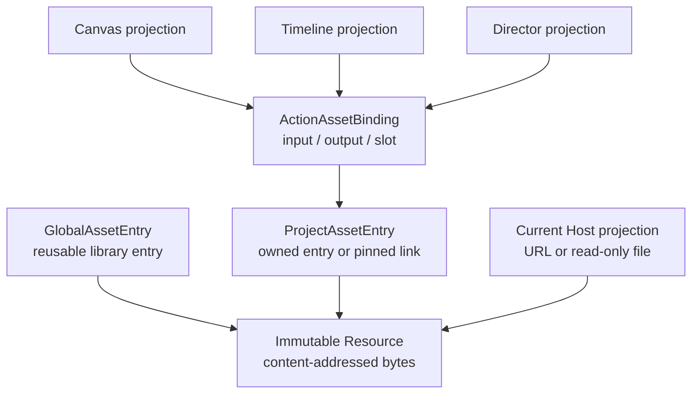
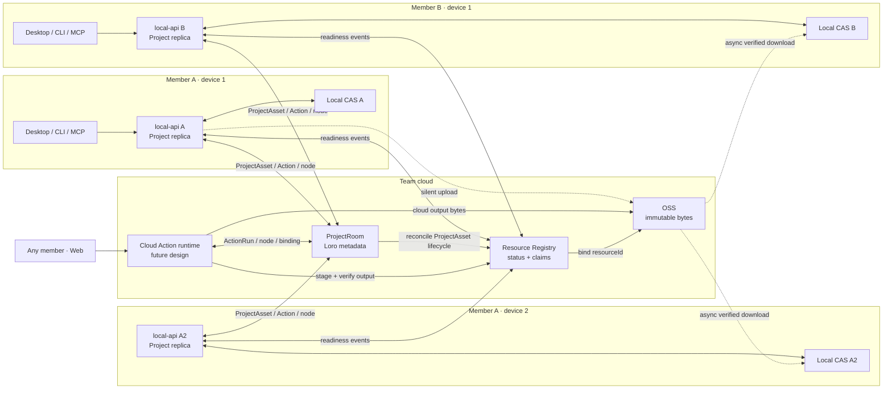
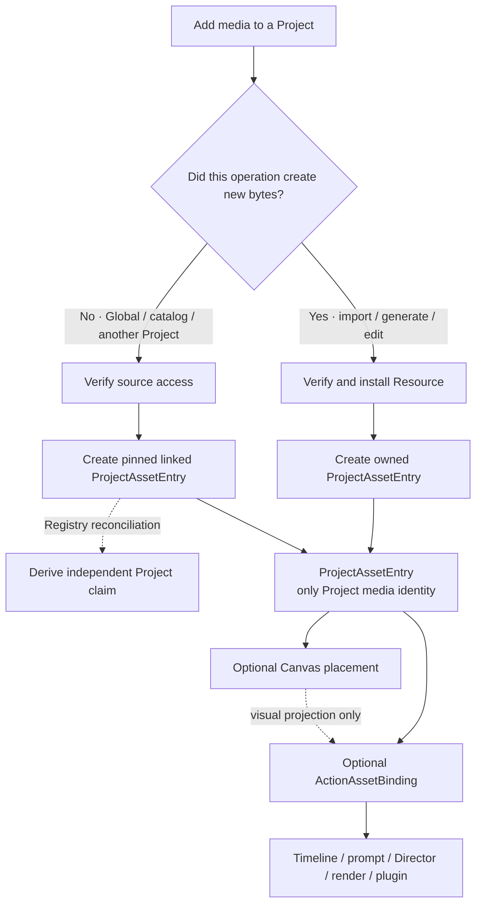
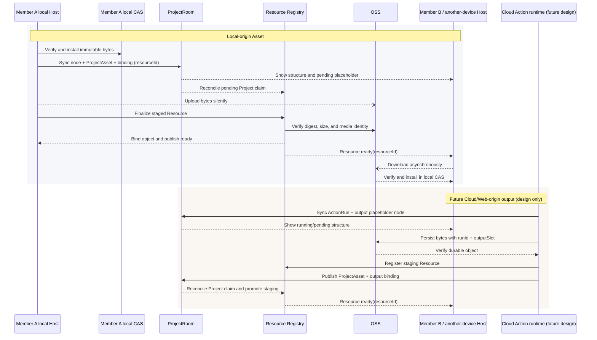
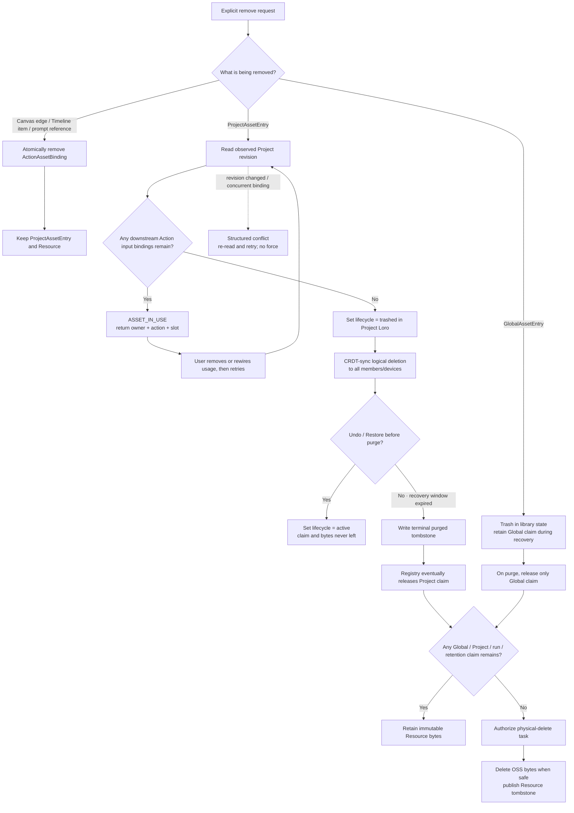
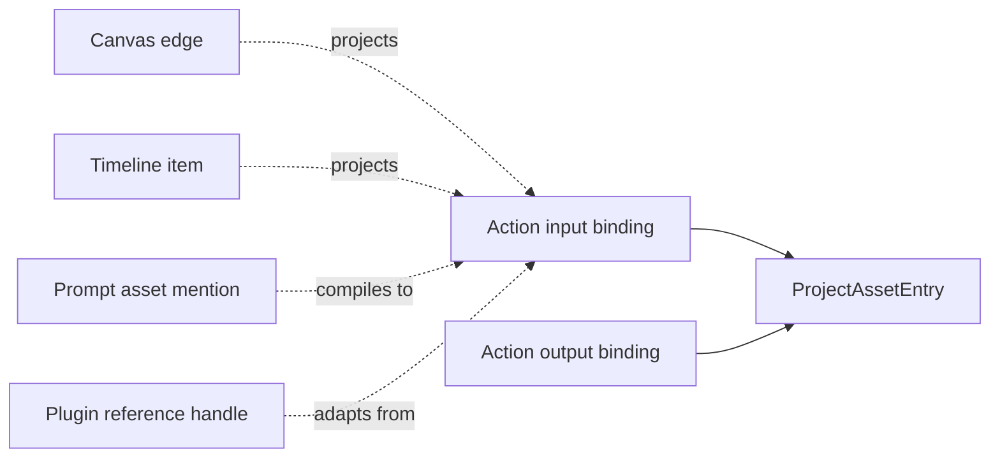

# Asset System: Product and Technical Design

> Status: implemented for the Local Host except for the explicitly listed Local
> purge delivery gap; Cloud replication and hosted storage are design-only
> in the current work.

The Local product now has one authority and one public read shape.
`@clash/shared-types` defines the storage-free `ProjectAssetEntry`, immutable
`Resource`, `GlobalAssetEntry`, `ActionAssetBinding`, and read-only
`ResolvedAsset` contracts. `@clash/asset-sdk` owns the semantic clients and the
only `ProjectAssetEntry -> ResolvedAsset` resolver. local-api supplies the
Project Loro authority, local Resource CAS, personal Global library, legacy
one-way materializer, and HTTP adapter. GUI, CLI, MCP, Timeline, Director,
project covers, executable plugins, and the Local Durable Run publisher consume
that Project-scoped contract.

The old Local `/api/v1/assets*` storage-row protocol is retired and returns
`410`; new Local writes do not update `asset_refs` or storage-shaped Asset rows.
Legacy rows remain readable only by the one-way materializer and storage doctor.
The hosted api-cf Asset rows are not migrated in this work because Cloud
execution, OSS binding, Project claims, and multi-device transfer are explicitly
design-only. They must converge on the same contracts before Cloud delivery is
claimed.

This document defines one product model for media across Global Assets,
Project Assets, Canvas, Timeline, Director, CLI, MCP, executable plugins, local
storage, and team collaboration. It also defines the migration away from the
current mixture of storage rows, project references, Canvas fields, Timeline
rehydration, signed URLs, and plugin-specific handles.

## Executive summary

The system has five concepts, each with one responsibility:

1. **Resource** is immutable media content managed by a Host. It is stored in a
   content-addressed store and replicated independently from Project state.
2. **GlobalAssetEntry** is an entry in a reusable personal or Workspace
   library. Its lifecycle is independent from every Project.
3. **ProjectAssetEntry** is the Project-local asset identity. It either owns a
   Resource created in the Project or is a pinned logical link to a Resource
   admitted from another library.
4. **ActionAssetBinding** is the only authoritative product usage reference.
   Canvas, Timeline, Director, prompts, generation, editing, and rendering all
   express media inputs and outputs through Action bindings.
5. **AssetProjection** is how the current Host makes a Resource readable now:
   a loopback URL, cloud URL, or read-only workspace file. Projections are
   replaceable, device-local, and never identities.



### Multi-member, multi-device synchronization

Every member and every device observes the same Project identities, but each
device has its own byte availability. Project metadata and Resource bytes use
two independent planes joined only by the stable `resourceId`.



`ProjectRoom` never carries bytes, OSS keys, signed URLs, local paths, or
transfer progress. The Resource Registry never becomes a second Project state
store: it only answers whether a stable Resource is admitted and available to
this Project. The same flow covers two devices owned by one person and devices
owned by different collaborators; Project membership gates both metadata and
Resource claims.

### Add, admit, and synchronize

The product first decides whether an operation created new bytes or admitted an
existing immutable Resource. Both paths converge on one ProjectAsset shape and
one Action-binding path.



For locally created bytes, publication is deliberately metadata-first. For
cloud-created bytes, structural state can still appear first, but OSS is the
cloud runtime's only durable media store.



This is an intentional availability trade-off. A local Host may use its CAS
copy immediately while collaborators wait for OSS readiness. A cloud runtime
has no durable local-only phase: it may synchronize the ActionRun and
placeholder node early, but it publishes a usable output Asset only after the
bytes are verified in OSS.

### Remove usage, Asset, and bytes

Removing a usage is different from removing a Project Asset, and removing a
Project Asset is different from deleting Resource bytes. No operation infers
deletion from apparent orphanhood.



Logical deletion and physical deletion are deliberately decoupled. The delete
operation completes when the Loro lifecycle becomes `trashed`; it neither
waits for Registry work nor releases the Resource claim. CRDT Undo or an
explicit Restore changes the lifecycle back to `active` during the configured
recovery window, so no upload or Registry round trip is required. Purge is the
later terminal transition that releases the claim and authorizes asynchronous
byte deletion only when no other claim remains.

The Local product currently ships the diagram through Trash and Restore. The
terminal `purged` state and its stale-CRDT protection are implemented in the
shared authority and Asset SDK, but no Local HTTP/CLI/MCP command or background
scheduler advances an Asset into that state yet. Claim release and physical
Resource deletion therefore remain delivery work; the diagram specifies their
required behavior rather than claiming a running cleanup worker.

An upload that finishes while the entry is trashed may make the retained
Resource available for Restore, but it cannot reactivate the ProjectAsset.
After purge, stale upload finalization cannot recreate the terminal entry. An
object written for a cloud output that never acquired a ProjectAsset remains a
staging Resource and is eligible for TTL cleanup.

The Project synchronizes ProjectAsset entries and Action bindings. It does not
synchronize bytes, object-storage keys, local paths, signed URLs, caches,
transfer progress, or operating-system symlinks.

Canonical Assets are never reclaimed by a background orphan scan. Only an
explicit logical delete may move an entry to Trash, and only a later explicit
or retention-triggered purge may release its claim. The Host proves that no
blocking reference remains before trashing; the physical-delete worker proves
that no claim remains before deleting bytes. Cache eviction, staging-file
cleanup, and processing an already-authorized delete queue are operational
cleanup, not Asset garbage collection.

## Product vocabulary

### Resource

A Resource is one immutable byte sequence. Image, video, audio, and model
Resources use the same lifecycle. The Resource identity is a platform-internal
stable key backed by a content digest; storage paths and object-store keys are
not part of that identity.

A Resource may have immutable derived representations such as a video poster
or a low-resolution preview. They are Resource representations, not alternate
Asset identities. A waveform or filmstrip may remain a regenerable local cache
unless the product explicitly promotes it to a durable representation.

### GlobalAssetEntry

A GlobalAssetEntry is a reusable library entry outside a Project. The initial
product can expose a personal library; the same contract can later support a
Workspace-owned library. Library ownership controls who may create a Project
link, not who may read an already-admitted Project Asset.

Trashing a GlobalAssetEntry hides that library membership but retains its
Resource claim during the configured recovery window. Purging it releases only
the Global claim. Neither transition may break a Project that previously
admitted the Resource.

```ts
type GlobalAssetEntry = Readonly<{
  id: string;
  kind: "image" | "video" | "audio" | "model";
  resourceId: string;
  lifecycle: ProjectAssetEntry["lifecycle"];
  name?: string;
  metadata: ProjectAssetMetadata;
  provenance?: ProjectAssetProvenance;
}>;
```

The library ID is authority context, not part of the entry or Resource identity. Global entries
never carry a Project ID, storage key, path, URL, or projection state.

### ProjectAssetEntry

A ProjectAssetEntry is the only media identity that Canvas, Timeline, Director,
and Project Actions may reference. There are two origins:

```ts
type ProjectAssetSource =
  | Readonly<{ kind: "owned"; resourceId: string }>
  | Readonly<{
      kind: "linked";
      resourceId: string;
      origin: Readonly<{
        scope: "global" | "catalog" | "project";
        entryId: string;
      }>;
    }>;

type ProjectAssetEntry = Readonly<{
  id: string;
  kind: "image" | "video" | "audio" | "model";
  source: ProjectAssetSource;
  lifecycle:
    | Readonly<{ state: "active" }>
    | Readonly<{
        state: "trashed";
        deleteOperationId: string;
        deletedAt: string;
        purgeAfter: string;
      }>
    | Readonly<{
        state: "purged";
        deleteOperationId: string;
        deletedAt: string;
        purgedAt: string;
      }>;
  name?: string;
  metadata: ProjectAssetMetadata;
  provenance?: ProjectAssetProvenance;
}>;
```

`ProjectAssetMetadata` is deliberately narrower than the transitional Asset-row metadata. It may
contain descriptive media facts such as dimensions, duration, codecs, content type, and original
name. It cannot contain a URL, local path, blob key, object-store key, signed projection, or
transfer state. `ProjectAssetProvenance` carries sanitized product lineage only; Provider task
tokens and raw execution state remain owner-private.

`active -> trashed` is the synchronized logical delete. During the recovery
window, CRDT Undo and the explicit Restore command both produce the same
semantic `trashed -> active` operation. Ordinary metadata edits never mutate
the lifecycle register, so an offline stale edit cannot accidentally restore a
deleted entry. `purged` is a terminal tombstone retained after bytes disappear;
restoring it requires a new import or admission rather than replaying old CRDT
history.

The linked form is the synchronized product-level "soft link." It is not an
operating-system symlink and it does not have Unix symlink failure semantics.
It pins an immutable Resource and gives the Project its own access and
retention claim. Deleting or renaming the origin entry therefore cannot break
the Project.

### ActionAssetBinding

Actions own all media usage references. Editable Actions, frozen revisions,
and concrete runs are distinct owners so a synchronized Action is never
mistaken for a command that every device should execute:

```ts
type ActionBindingOwner =
  | Readonly<{ kind: "draft"; actionId: string }>
  | Readonly<{
      kind: "revision";
      actionId: string;
      actionRevisionId: string;
    }>
  | Readonly<{
      kind: "run";
      actionId: string;
      actionRevisionId: string;
      actionRunId: string;
    }>;

type ActionAssetBinding = Readonly<{
  id: string;
  owner: ActionBindingOwner;
  direction: "input" | "output";
  slot: string;
  projectAssetId: string;
  role?: "primary" | "reference" | "source";
}>;
```

The slot is semantic and stable. Examples include `reference:0`,
`timeline:item:<item-id>`, `director:model:<node-id>`, and `render:output`.
Framework-specific locations can be derived from the owning Action and slot;
they are not separate authoritative references.

An editable Action owns its current input bindings. Submission freezes an
ActionRevision and its exact input bindings. One ActionRun executes that
revision on one designated execution Host and owns the resulting output
bindings. Rendered and generated outputs therefore remain reproducible after
the editable Action changes, and synchronization cannot cause another Host to
execute the run again.

### Resolved Asset view

All user-facing readers receive one read-only resolved shape from the current
Host. Global and Project list endpoints may add collection context, but the
Asset representation itself is defined once:

```ts
type ResolvedAsset = Readonly<{
  id: string;
  kind: "image" | "video" | "audio" | "model";
  name?: string;
  metadata: ProjectAssetMetadata;
  provenance?: ProjectAssetProvenance;
  lifecycle: ProjectAssetLifecycle;
  status: "uploading" | "ready" | "downloading" | "unavailable" | "failed";
  url?: string;
  thumbnailUrl?: string;
  progress?: number;
  error?: string;
}>;
```

`url` and `thumbnailUrl` are current-Host projections. The object must never
expose an R2 key, canonical local path, cache path, or storage implementation.
Transfer progress and errors are device-local and must not enter Project Loro.

## Product scopes

### Global Assets

Global Assets is a reusable library, not the parent storage directory of every
Project. Adding an entry to the library creates a Global claim on a Resource.
It does not add the entry to any Project. Removing it does not affect existing
Project links.

### Project Assets

Project Assets is an explicit, first-class collection in Project Loro. It is
the authority for which media identities the Project may use. SQLite may keep a
reverse index for queries, but an `asset_refs` row must not be the product
authority.

Every Action binding in the Project must point to an existing ProjectAssetEntry.
The Host enforces this invariant atomically.

### Canvas

Canvas is a visual projection of Actions, Asset placements, and their
relationships. A loose Project Asset placement does not create another media
identity. An edge into an Action projects an Action input binding; it must not
be a second source of truth.

Project membership already retains a loose placement's Resource. A strong
usage reference begins when an Action binds the Project Asset.

### Timeline

Timeline is an Action, not a special media reference subsystem.

- A Project-owned Timeline has a persistent Timeline Action.
- A Canvas-owned Timeline uses the corresponding Canvas Action.
- A Timeline item has a stable slot such as `timeline:item:<item-id>`; the Host
  writes that slot's ActionAssetBinding in the same Project mutation.
- The binding resolves to a ProjectAssetEntry.
- Rendering freezes a Timeline Action revision and produces an output binding.

Current Local writes persist `assetId` as the Project Asset identity and never
persist an external runtime `src`: the shared Project authority strips Host
projections and rejects a URL/path-only item. The item `assetId` and stable
`timeline:item:<item-id>` slot compile directly to the Action binding in the
same Project Loro mutation. `sourceNodeId` is only an optional live
Canvas-navigation hint; GUI, CLI, render, and deletion never treat it as media
identity or reference authority.

Director Stage state follows the same split. Models, environments, shots, and
reference packets persist Project Asset identities only. `sourceUrl`, packet
`src`/`previewUrl`, and Canvas `outputVideoSrc` projections are Host-runtime
data and are stripped before a Loro write.

### Built-in catalogs

The Timeline catalog and Director starter library are catalogs, not Global
Assets. Applying a pure preset, transition, effect, or caption style creates no
Project Asset. Applying a catalog item backed by media creates a linked
ProjectAssetEntry at first use, then binds that Project Asset to the Action.

### Text and production metadata

Text revisions are not media Assets. They retain their own immutable revision
model and Action bindings where media is referenced.

Descriptive Asset metadata such as dimensions, duration, codecs, content type,
and a display name belongs to the Asset read model. Extensible production
metadata such as transcripts, word grids, render lineage documents, or
analysis bodies is a separate typed attachment system. An attachment can be
addressed from an Asset or Action revision without being confused with the
Resource's media bytes or URL.

## Exactly when a link is created

A Project Asset link is created only when immutable media crosses a durable
library boundary without producing new bytes.

| Source                    | Target             | Operation             | New bytes   | Project link              |
| ------------------------- | ------------------ | --------------------- | ----------- | ------------------------- |
| Local file                | Project            | Import                | Yes         | No; owned Project Asset   |
| Provider generation       | Project            | Create output         | Yes         | No; owned Project Asset   |
| Edit or transcode         | Project            | Copy-on-write output  | Yes         | No; owned Project Asset   |
| Global Asset              | Project            | Admit/link            | No          | Yes                       |
| Global Asset              | Canvas or Timeline | Admit, then bind      | No          | Yes                       |
| Project Asset             | Canvas or Timeline | Bind to Action        | No          | No                        |
| Canvas Action input       | Owned Timeline     | Reuse binding         | No          | No                        |
| Media-backed catalog item | Project            | Admit/link            | No          | Yes                       |
| External URL              | Project            | Fetch, verify, import | Yes locally | No live URL link          |
| Project A                 | Project B          | Admit with B claim    | No          | Yes in Project B          |
| Project Asset             | Global Assets      | Publish               | No          | No Project-dependent link |
| Linked Project Asset      | Edited result      | Fork                  | Yes         | New owned Project Asset   |

Publishing a Project Asset into Global Assets creates an independent
GlobalAssetEntry and Global claim over the same Resource. It must not create a
Global entry whose lifetime depends on the Project. Physical bytes remain
deduplicated.

Links pin immutable Resource content. A new version in the origin library does
not silently change a Project. An explicit refresh creates or adopts a new
Project Asset identity, followed by explicit Action rewiring.

## Business operations

### Import

Importing a local file into a Project:

1. hashes and verifies the file;
2. installs an immutable Resource in the local content-addressed store;
3. creates an owned ProjectAssetEntry;
4. optionally binds it to the target Action;
5. optionally creates a read-only workspace projection.

It never adds the Asset to Global Assets implicitly.

### Link/admit

Selecting a Global, catalog, or permitted cross-Project Asset:

1. verifies access to the origin Resource;
2. obtains an idempotent, TTL-bound admission lease/access proof; this is not a Project claim;
3. creates a linked ProjectAssetEntry with a Project-local identity;
4. lets the Registry reconciler derive the durable Project claim from that authoritative entry;
5. returns the `projectAssetId` used by every downstream Action;
6. optionally binds it to the selected Action.

The pre-publication Registry call may verify or stage the immutable Resource, but it cannot commit
Project membership. A crash before the Loro write therefore leaves only reusable staging state or a
lease that expires. A crash after the Loro write is repaired by reconciliation. There is no
distributed transaction between Project Loro and the Resource Registry.

The canonical admission path is now an identity-producing operation. A GUI
adapter may still use `ensureProjectReference` as an internal callback name,
but it returns the newly admitted Project Asset identity and is not a second
storage-row protocol:

```text
admitToProject(source) -> projectAssetId
bindActionInput(actionId, slot, projectAssetId)
```

### Place and use

Placing a Project Asset in Canvas creates a visual placement. Connecting it to
an Action creates or updates an Action input binding. Adding it to Timeline
creates a Timeline Action binding. Neither operation creates another Resource
or Project Asset.

### Generate and edit

Generation and editing are Actions. They bind immutable Project Assets as
inputs and create owned Project Assets as outputs. Editing a linked Asset is
copy-on-write: the origin link remains unchanged, the output is Project-owned,
and selected consumers are rewired explicitly.

### Publish

Publishing to Global Assets creates an independent GlobalAssetEntry and claim
for an existing Resource. It does not move the Project entry and does not make
the Global entry depend on Project survival.

### Read and flatten

Applications call the Host resolver and receive `ResolvedAsset`. The same
resolver backs Web, Desktop, CLI, MCP, renderers, and plugin capability
adapters.

An agent may request a read-only workspace projection such as
`assets/links/hero.mp4`. The Host resolves or downloads the Resource and creates
an OS symlink when supported, otherwise a read-only copy. The filesystem entry
is device-local, disposable, and never synchronized. Editing it does not edit
the Asset; an edited file must be imported as a new Resource.

## Action-level reference authority

Action bindings replace surface-specific reference authority.



The Host updates Action state and bindings in one Project transaction. Examples:

- removing a Timeline item removes its binding in the same transaction;
- reconnecting a Canvas edge changes the matching Action slot;
- parsing a prompt mention materializes a declared Action input binding;
- a plugin invocation receives capability handles derived from the frozen
  Action revision, never arbitrary storage URLs;
- an Action output creates a ProjectAssetEntry and output binding together.

A derived reverse index may record `projectAssetId -> actionId/bindingId` for
fast deletion checks and UI queries. It is rebuildable from Project state and
is not an independent authority.

## Explicit deletion; no Asset GC

Canonical Asset and Resource deletion is initiated only by explicit product
operations. There is no mark-and-sweep command that discovers apparently
orphaned Assets and deletes them later.

### Remove a usage

Removing a Canvas edge, Timeline item, prompt reference, or other Action input
removes that Action binding. It never removes the ProjectAssetEntry implicitly.

### Trash, restore, and purge a Project Asset

Logical deletion is a Project Loro operation. The Host atomically, within the
Project transaction:

1. reads the current Project revision;
2. queries every downstream Action input binding for the `projectAssetId`;
3. rejects with `ASSET_IN_USE` and structured references if any remain;
4. changes the ProjectAssetEntry lifecycle from `active` to `trashed`.

The resulting Loro update is the complete product-level delete. It synchronizes
through normal CRDT replication and does not wait for, or atomically commit
with, the Resource Registry. The Project claim remains active throughout the
configured recovery window.

CRDT Undo and the explicit Restore operation both change the lifecycle from
`trashed` back to `active`. A successful Restore cancels pending purge without
moving or uploading bytes. Once the recovery window expires, or when an
authorized user explicitly empties Trash, the target Host behavior is to write
the terminal `purged` tombstone. The Registry then asynchronously observes that
state and releases the Project claim. Only then may a physical-delete worker
act, and only if no other claim remains. This transition is implemented at the
shared authority/SDK layer but is not yet exposed by the Local product Host.

There is no force bypass. The user or agent must remove or rewire dependants and
retry against the new Project revision.

```ts
type AssetInUseError = Readonly<{
  code: "ASSET_IN_USE";
  projectAssetId: string;
  references: ReadonlyArray<ActionAssetBinding>;
}>;
```

The owner `actionId` is sufficient to derive presentation details such as action type. Those
details are not duplicated into the authoritative media reference.

Only `direction: "input"` is a downstream use that blocks logical deletion.
An output binding records how an Asset was produced; it remains useful lineage,
but it does not make the producing Action a consumer of its own output.

### Trash, restore, and purge a Global Asset

Trashing a GlobalAssetEntry retains its Global claim during the library's
recovery window. Purging it releases only that Global claim. Existing Projects
remain valid because admission created independent Project claims and pinned
ProjectAsset entries. The Local GUI and Host currently expose Trash and Restore;
the terminal purge primitive exists below the transport boundary but has no
product command or scheduler yet.

### Physical Resource deletion

Physical deletion is an asynchronous storage consequence of an earlier
explicit purge, not part of logical deletion and not an inferred orphan scan.
It succeeds only when the authoritative claim registry reports no Global,
Project, execution, recovery, or retention claim. The worker writes a Resource
tombstone, rechecks that the zero-claim observation is still current, and then
deletes the OSS object. Failure or delay leaves extra bytes but never changes
the already-synchronized product state.

The recovery window and the advertised CRDT Undo horizon are the same product
contract. After physical deletion, replaying old Project history cannot restore
the purged entry; the user must import or admit the media again.

### Delete a Project

Project deletion trashes the Project and retains its Asset claims during the
Project recovery window. Restoring the Project therefore requires no claim or
byte reconstruction. Purging the Project writes terminal Asset tombstones and
asynchronously releases its claims. Resources retained by Global Assets or
another Project survive.

That paragraph is the required collaborative Project deletion protocol. The
current `/api/v1/projects/:id/purge` operation is deliberately narrower: it
purges only the machine's local Project recovery point and replica after its
recovery window. It does not mutate a hosted ProjectRoom, publish terminal Asset
tombstones to collaborators, or release cloud Registry claims, and must not be
presented as a shared-Project purge. A future hosted purge must publish and
replicate those tombstones before any replica or claim is reclaimed.

### Operational cleanup that remains

The following are not Asset GC:

- TTL cleanup of incomplete upload staging files that never became Resources;
- LRU eviction of downloadable device caches;
- regeneration or eviction of local thumbnails, filmstrips, and waveforms;
- processing a physical-delete queue produced by a successful explicit purge.

None may infer that a canonical Asset is unreferenced and authorize deletion.

## Team collaboration and replication

Project state and media bytes use different replication planes.

### Execution follows the initiating surface

> Delivery status: Local execution is implemented. Every Cloud/Web execution,
> Workflow, OSS-staging, and hosted publication flow in this section is target
> design only; there is no Cloud Durable Run adapter in the current product.
> Local currently has no standalone Project Loro `ActionRun` entity. The
> five-state coarse model below is the unified public design contract; current
> Local execution projects progress/outcome onto the Canvas node and records
> immutable input/output lineage in `ActionAssetBinding`. A synchronized Cloud
> `ActionRun` entity is design only.

Project synchronization does not move task execution between machines. The
surface that submits a run fixes its execution realm:

| Submitting surface | Execution owner                       |
| ------------------ | ------------------------------------- |
| Web                | Cloud task runtime (future design)    |
| Desktop            | The local `local-api` Host            |
| CLI                | The discovered local `local-api` Host |
| MCP                | The discovered local `local-api` Host |

An Action is shared editable Project state. An ActionRevision is an immutable
snapshot of its parameters and input bindings. The unified public design models
an ActionRun as a one-time execution owned by exactly one cloud or local
runtime:

```ts
type ActionRun = Readonly<{
  id: string;
  actionId: string;
  actionRevisionId: string;
  execution:
    Readonly<{ realm: "cloud" }> | Readonly<{ realm: "local"; hostId: string }>;
  requestedBy: string;
  status: "queued" | "running" | "finalizing" | "succeeded" | "failed";
}>;
```

Only the designated execution owner may advance the run or attach output
bindings. In the future entity design, receiving an ActionRun through Project
sync is never an instruction to execute it. Current Local sync carries the
Canvas node and `ActionAssetBinding`, not that standalone entity. There is no
automatic cloud fallback for a local run and no automatic local takeover of a
cloud run. A deliberate retry creates a new owner-private run identity.

The executing Host selects the Provider account from its own account scope and
available plugin set. Credentials, private account identifiers, process state,
and provider polling details are not Project state. A Web submission is
disabled when the cloud runtime lacks a required plugin/provider; a local
submission is disabled when that local Host lacks it.

Before execution, the owner resolves every frozen Action input:

- the future cloud runtime reads Resources through Project claims in team storage;
- a local Host changes the current Canvas node status to `generating` before
  input admission, then uses its CAS and downloads any missing admitted Resource.

Input admission has no separate synchronized `preparing` state. Its detailed
steps remain in the owner-private journal. Current collaborators see the Canvas
node's `generating` projection; a future standalone `ActionRun` entity would
use coarse `running`.

A cloud run may publish its ActionRun and output placeholder node immediately,
then writes the output to an idempotent staging Resource keyed by
`actionRunId + outputSlot`. After verification it publishes the owned
ProjectAsset entry and run output binding. The Registry derives the Project
claim from that Loro state and promotes the staging Resource. A local run writes
outputs to local CAS immediately, publishes the stable ProjectAsset identity
and output binding through the metadata-first sequence below, then uploads
silently. Other devices never poll or resume a run they do not own; today they
observe synchronized Canvas node status and `ActionAssetBinding` outputs. A
future Cloud path may additionally synchronize the standalone coarse run
entity. The owning local Host persists Provider task state so restart recovery
and polling remain local to that Host.

### Restart and finalization recovery

The unified public `ActionRun` design contract has one coarse Project status
model:

```text
queued -> running -> finalizing -> succeeded
   \         \          \----------> failed
    \---------\--------------------> failed
```

This is not a standalone Local collaboration entity yet. Current Local code
projects the corresponding product outcome through Canvas node
`pending/generating/completed/failed` plus `ActionAssetBinding`. The shared
Durable Run Engine uses
`queued -> submitting -> polling -> finalizing -> succeeded|failed`; `running`
is the coarse product status that covers input admission and multiple private
Provider attempts. `finalizing` means the Provider result is checkpointed, but
every required output has not yet been durably installed and published. The
Local adapter uses that shared engine now; a future Cloud adapter must reuse the
same graph and change only the step storage ports. local-api persists steps in
SQLite and local CAS, while the future Cloud adapter uses Workflow state and
OSS staging. Provider task tokens, polling cursors, local paths, and staging
details remain owner-private and never enter Project Loro.

The shared runner applies normal durable-step retry semantics. One attempt calls
the Provider submit operation once. A network error, timeout, or process crash
fails that attempt; the runner may start another attempt according to the
configured retry policy. If the upstream accepted work but its task token was
not checkpointed before the interruption, a retry can create duplicate upstream
work. The product deliberately accepts that availability-versus-duplication
trade-off. Providers do not own this retry policy. When an upstream supports an
idempotency key, every attempt reuses the stable `actionRunId + outputSlot`
identity to reduce duplication, but Provider support is not required by the
ActionRun contract.

The ambiguity boundary is narrow and explicit:

```text
durably start attempt
  -> send Provider request
  -> [ambiguous until task token or result is durable]
  -> checkpoint task token/result
```

No transaction remains open across the Provider request, and Project Loro is
not a transaction coordinator. Current Local Project Loro synchronizes Canvas
node status and published `ActionAssetBinding` lineage; the binding carries the
run and Action revision identities. It does not yet carry an execution owner or
the standalone coarse `queued/running/finalizing/succeeded/failed` entity. Those
fields belong to the future public `ActionRun` design. Attempt numbers, retry
scheduling, transport errors, Provider task tokens, and polling cursors live
only in the owner's durable step journal. Therefore a slow or retried Provider
request never blocks CRDT merge or requires a compensating Project mutation.

Before the request is sent, retry is unambiguous. After the task token or result
is checkpointed, recovery is also unambiguous and never submits again. Only an
interruption inside the bracketed interval may cause another submit attempt and
duplicate upstream work; that is the deliberately accepted product trade-off.

On restart, the owner resumes rather than repeats work:

- a submit attempt interrupted before a task token or result checkpoint follows
  the durable step's retry policy; only exhaustion of that policy fails the run;
- once a Provider task token is durable, every later attempt polls that existing
  task and never submits it again. If its nominal deadline passed while the
  owner was offline, recovery performs one status poll before deciding that the
  task has timed out;
- a Provider result already present in local CAS or OSS staging resumes at
  `finalizing`; it publishes only the missing ProjectAsset and output binding;
- a local run whose ProjectAsset is already published is `succeeded`; unfinished
  silent OSS upload belongs to the independent Resource replicator, which also
  resumes from durable state after restart;
- a cloud run is not `succeeded` until its output is verified in OSS staging and
  its ProjectAsset and binding are published;
- finalization uses `actionRunId + outputSlot` idempotency, so retries cannot
  duplicate the Project output even when ambiguous Provider submission produced
  more than one upstream task;
- only an unrecoverable missing result or an exhausted configurable recovery
  lifetime changes the run to `failed`. “Continue finalizing” retries persistence
  and publication; an intentional regeneration creates a new ActionRun.

The product may show “retrying”, “saving output”, or “recovering” while a run is
active, and a separate pending/unavailable projection while Resource replication
catches up. A final failure means the configured durable-step attempts or total
run lifetime were exhausted, not merely that one network call failed.

Concurrent cloud and local submissions of the same Action create different
ActionRuns and immutable outputs. They do not overwrite one another. Product
state may explicitly select a preferred run/output; "latest response wins" is
not an Asset identity rule.

### Creator device

When a member creates a new Project Asset, the local Host commits it to the
local replica immediately so the creator can work without waiting for the
network. The ProjectAssetEntry contains only the stable `resourceId`; it never
contains the local path or the future OSS object key.

Local-origin publication is metadata-first:

1. install the bytes in local CAS under `resourceId`;
2. create the local ProjectAssetEntry and Action update using that stable ID;
3. synchronize the ProjectAssetEntry, Action binding, node, and run state
   through ordinary Loro sync so collaborators can see the structure and a
   pending Asset immediately;
4. upload the immutable bytes silently to OSS;
5. verify digest, size, and media identity;
6. record `resourceId -> OSS object` in the cloud Resource registry;
7. reconcile the Project access/retention claim from the synchronized
   ProjectAssetEntry and publish Resource readiness.

There is no separate Project sync envelope, no OSS key inside Loro, and no
second Loro mutation merely to attach an OSS URL. The ProjectAssetEntry already
points to `resourceId`; the Resource registry independently changes that
Resource from pending to ready and emits an availability event. Other Hosts
then resolve or download it. Upload progress may be reported by the Resource
registry but remains outside Project state.

This policy deliberately trades temporary remote unavailability for immediate
collaboration visibility. A collaborator may see the Action, node, metadata,
and Asset placeholder before the bytes are usable. Operations on another Host
that require those bytes remain disabled or return `RESOURCE_NOT_READY` until
the registry reports ready. The creator can continue using the local CAS copy.

If upload fails, the creator keeps a usable local Project state with a
device-local copy while collaborators see an unavailable/retrying projection.
The owning Host retries upload after restart. A retry reuses `resourceId`, so
an OSS object uploaded before a crash can be verified and rebound without
duplicating logical media. Product UI must expose the persistent failure rather
than silently pretending that the Asset is ready.

### Cloud-origin output (future design)

A Web-submitted ActionRun executes in the cloud, where OSS is the only durable
media store. The Action, node, frozen revision, and running status may
synchronize immediately, but the cloud runtime does not publish an output
ProjectAssetEntry or output binding until it has written and verified the
Resource in OSS staging. It uses `actionRunId + outputSlot` as the idempotency
identity, so retry finds the same logical output rather than creating another
one. There is no usable local-only output to justify an earlier Asset reference.

Publishing the ProjectAsset and creating its storage claim are not a distributed
transaction. Project Loro remains authoritative: the Resource reconciler derives
the claim from the published entry. A crash before publication leaves only a
staging Resource, which retry may reuse and TTL cleanup may eventually remove.
A crash after publication is repaired by reconciliation while the staging lease
keeps the verified object from premature deletion. No commit receipt or
storage-specific state appears in the Project contract.

This gives the two execution realms intentionally different publication
timing while preserving the same final ProjectAsset and Action binding shapes:

| Origin     | Structural state | Output Asset publication                            |
| ---------- | ---------------- | --------------------------------------------------- |
| Local Host | Sync immediately | May precede silent OSS upload; remote shows pending |
| Cloud/Web  | Sync immediately | After OSS staging write and verification            |

### Other devices

Another device receives the stable ProjectAssetEntry and Action bindings. Its
Host checks the local Resource store and, when missing, downloads the Resource
asynchronously from team storage, verifies it, and atomically installs it. The
resolved Asset progresses from `downloading` to `ready`; Project sync does not
carry byte or progress payloads.

### Permissions

Project admission converts the creator's source access into a Project-scoped
claim. Collaborators resolve the Resource through Project permission, not the
creator's Global library or user-owned Asset row. Removing the creator from the
team or deleting the source library entry cannot break the Project.

### Offline and concurrency

- Existing local Resources remain usable offline.
- New local Project structure may synchronize before Resource admission;
  byte-dependent work on other Hosts waits for Resource readiness while the
  owning local Host retries upload.
- Concurrent edits create distinct immutable output Resources and Project
  Assets; they never overwrite the same media body.
- Concurrent Action rewiring is resolved in Project Loro. Materialized Action
  revisions continue to pin their original inputs.
- Logical delete uses Project CAS plus the lifecycle register. A concurrent new
  input binding either makes the local delete fail its observation check or,
  after two valid offline operations merge, wins over a non-terminal
  `trashed` state so the Host restores the Asset and does not leave a dangling
  Action input. This reference-wins reconciliation is narrowly scoped to the
  concurrent delete/bind race; it cannot reactivate a terminal `purged` Asset.
  Without such a concurrent input, only CRDT Undo or an explicit Restore may
  change `trashed` back to `active` before purge.

## Previews, thumbnails, and Project covers

Consumers never guess whether a URL is original media or a cover.
`ResolvedAsset.url` is playable/readable original media and
`thumbnailUrl` is a visual preview. The Host chooses or generates each
projection.

- A durable video poster is an immutable Resource representation.
- Timeline filmstrips and current-frame captures are local derived caches by
  default.
- Waveforms may be compact descriptive metadata or a derived representation;
  there is one resolver either way.
- Preview cache keys are Resource/version based, not ad hoc component keys.

A Project cover is product state, not an arbitrary aggregation of recent URLs.
It should reference stable `projectAssetId` values plus a layout. A deterministic
default may be generated from Project Assets, but the API returns stable Asset
references and the current Host resolves their preview URLs. It never stores or
synchronizes signed URLs.

## Client and plugin boundaries

### Web and Desktop

Web and Desktop consume the same `ResolvedAsset` contract through different
Host controllers. Pure GUI components receive the object through typed ports
and do not construct URLs or know storage topology.

### CLI and MCP

CLI and MCP are peer clients of local-api. Their currently implemented,
equivalent Asset surface includes:

- list or read a Project Asset;
- import local bytes into a Project;
- list Action references;
- trash or restore a Project Asset with structured conflict reporting;
- list or read personal Global Assets and import local bytes into that library;
- admit a Global Asset into a Project; and
- publish a Project Asset into the personal Global library.

Both peers use the same Host SDK operations and return the same storage-neutral
resolved shapes. The CLI additionally offers a local workspace-file projection
and Canvas copy-on-write replacement; MCP does not expose those filesystem
conveniences. Terminal purge is still below the Local HTTP/SDK transport
boundary and is not exposed by either peer.

The CLI may create a workspace file projection. MCP normally returns the same
resolved descriptor or asks the Host for an invocation-scoped readable handle;
it does not spawn the CLI.

### Executable plugins

Plugins declare contributions only. The Host freezes an Action revision and
injects capability handles for its input bindings. `context.reference` resolves
those handles and `context.upload` turns plugin outputs into owned Project
Assets plus Action output bindings.

The capability handle is a security and process-boundary adapter, not a second
business Asset model. Provider code never receives storage keys or selects an
account scope. Traffic recording remains process instrumentation outside
plugin business logic.

### Renderers

Preview and local render currently resolve ProjectAsset entries through the
same Host/storage abstraction. They do not rewrite storage keys into private
route dialects. A local render freezes the Timeline Action revision and its
resolved input manifest before execution. Hosted render must adopt this same
resolver in the future Cloud adapter; that cutover is design-only here.

## Storage and authority

The logical data ownership is:

| State                        | Authority                               | Replication             |
| ---------------------------- | --------------------------------------- | ----------------------- |
| ProjectAsset entries         | Project Loro                            | Project sync            |
| Actions and bindings         | Project Loro                            | Project sync            |
| GlobalAsset entries          | Library service/local library replica   | Account/Workspace sync  |
| Resource bytes               | Host CAS and team Resource storage      | Resource replicator     |
| Resource claims              | Registry projection of admitted entries | Registry reconciliation |
| Resolved URLs and paths      | Current Host                            | Never synchronized      |
| Transfer progress and caches | Current device                          | Never synchronized      |
| Reverse indexes              | SQLite/D1 derived index                 | Rebuildable             |

The repository's no-foreign-key rule remains in force. Application-level
transactions, Project CAS, claim checks, and tombstones enforce integrity.
Indexes may accelerate checks but cannot replace the authoritative Project or
claim state.

## API and SDK surface

Every caller uses the same semantic Asset operations. The Local Host's
canonical HTTP adapter is Project-scoped and returns `ResolvedAsset` for every
product read or lifecycle result:

```text
GET    /api/v1/projects/:projectId/assets
POST   /api/v1/projects/:projectId/assets/batch
POST   /api/v1/projects/:projectId/assets/import-file
POST   /api/v1/projects/:projectId/assets/admit
GET    /api/v1/projects/:projectId/assets/:assetId
GET    /api/v1/projects/:projectId/assets/:assetId/media
GET    /api/v1/projects/:projectId/assets/:assetId/references
DELETE /api/v1/projects/:projectId/assets/:assetId
POST   /api/v1/projects/:projectId/assets/:assetId/restore

GET    /api/v1/libraries/personal/assets
POST   /api/v1/libraries/personal/assets/import-file
POST   /api/v1/libraries/personal/assets/publish
GET    /api/v1/libraries/personal/assets/:assetId
GET    /api/v1/libraries/personal/assets/:assetId/media
DELETE /api/v1/libraries/personal/assets/:assetId
POST   /api/v1/libraries/personal/assets/:assetId/restore
```

There is no JSON import route that accepts a local path, `localBlobKey`, object
key, digest assertion, or storage row. Importing bytes always uses the one
multipart `import-file` path; the Host verifies and installs them before
publishing the entry. The corresponding SDK vocabulary is:

```text
readResolvedAsset(scope, entryId)
importProjectAsset(projectId, file)
admitProjectAsset(projectId, sourceEntry)
publishGlobalAsset(projectAssetId, libraryId)
bindActionAsset(actionId, slot, projectAssetId)
unbindActionAsset(actionId, bindingId)
listProjectAssetReferences(projectAssetId)
trashProjectAsset(projectAssetId, observedProjectRevision)
restoreProjectAsset(projectAssetId, observedProjectRevision)
purgeProjectAsset(projectAssetId, observedProjectRevision)
trashGlobalAsset(globalAssetId)
restoreGlobalAsset(globalAssetId)
purgeGlobalAsset(globalAssetId)
projectAssetToWorkspace(projectAssetId, name?)
```

`/upload`, `/assets/sign`, and `/assets/sign-batch` are generic blob transport
compatibility surfaces, not Project Asset APIs. They may still serve
non-Project attachment/embed flows or project an existing opaque blob key, but
their `storageKey` is never a Project Asset identity and cannot create or bind
one. Every product media import uses the Project-scoped `import-file` operation
above and returns `ResolvedAsset`.

Batch read returns the same resolved shape. Byte serving, signing, upload slots,
and plugin broker calls are internal protocol adapters rather than alternate
business APIs. Read observations are carried in an internal Host receipt header
and recorded by CLI/MCP clients; a receipt, storage key, or local path is never
added to `ResolvedAsset`.

### Implemented SDK boundary

`@clash/asset-sdk` owns the Host-neutral semantic boundary:

- `resolveProjectAsset` is the only `ProjectAssetEntry -> ResolvedAsset` resolver;
- `createProjectAssetHttpClient` is the one browser-safe Project HTTP transport. It owns Project
  route construction, auth headers, opaque read receipts, multipart import, Global-to-Project
  admission, and response validation;
- `createPersonalGlobalAssetHttpClient` is the matching browser-safe personal-library transport. It
  owns list/read/import, Project-to-Global publish, trash/restore, and the same `ResolvedAsset`
  response validation;
- `createAssetClient` exposes read, list, create-owned, admit-linked, trash, restore, and logical
  purge plus bind, explicit unbind, and stable reference listing;
- `ProjectAssetAuthorityPort` owns Project Loro reads and mutations, including implicit
  observation/CAS checks inside the adapter. Its `trashIfUnreferenced` operation must list bindings
  and write the trashed lifecycle in one Project-authority transaction;
- `ResourceRegistryPort` verifies or stages immutable Resources but never commits a durable Project
  claim; and
- `ResourceProjectionPort` supplies replaceable read-only URLs for the current Host.

`createGlobalAssetClient` exposes the same host-neutral library-entry lifecycle over a
`GlobalAssetAuthorityPort`. The SDK does not supply a Global store or claim implementation.

The SDK validates every adapter result against the shared-types schemas. It accepts no URL, path,
object key, storage key, or force/CAS-bypass mutation input. Its atomic boundary ends at the
Project authority adapter. Registry staging and later claim reconciliation are idempotent external
steps, not part of a cross-system transaction. local-api implements this boundary. The Web hook
adds only React caching over the shared HTTP client; shared-runtime adds only cwd/Host discovery
and result envelopes; GUI, CLI, and MCP Global-library/admit/publish flows use the same SDK
transports and Host connection discovery. api-cf remains the future Cloud adapter.

## Delivery status and deliberate gaps

The Local authority foundation is implemented; the product cutover status is:

- Project membership and lifecycle live in the Project Loro `projectAssets`
  authority collection, not `asset_refs`.
- immutable bytes and verification facts live in the local Resource CAS;
  storage keys never enter synchronized identity;
- the personal Global library has its own authority and admits pinned links into
  Projects without merging the two lifecycles;
- Action inputs and outputs use the Project Loro `actionAssetBindings`
  collection. Legacy fields are materialized once before the authority marker;
  they are never rescanned as a live index after cutover. Timeline and Director
  mutations now update their draft input bindings directly in the same Loro
  transaction, including owner attach/detach and terminal unbind semantics;
- Local durable execution state lives in the owner-private SQLite journal. No
  standalone Project Loro `ActionRun` entity is delivered; Local currently
  projects product-visible status through Canvas nodes and lineage through
  `ActionAssetBinding`;
- imports, generation, edits, Director output, Timeline/render output, covers,
  GUI, CLI, MCP, and executable-plugin Asset capabilities resolve through the
  same Project Asset service and `ResolvedAsset` shape;
- deleting an active Project Asset checks authoritative Action bindings and
  returns structured `ASSET_IN_USE`; there is no orphan-GC product command;
- deletion is logical and CRDT-visible; physical Resource reclamation is a
  separate claim/recovery-window concern; and
- legacy Local routes return `410`, while legacy tables are migration input
  only and receive no new product writes.

Canvas editable inputs now use the same direct authority model as Timeline and
Director. Node and edge insert/update/delete, prompt/reference edits, source
Asset rewiring, and the GUI's record-level mutation path all call the shared
Canvas binding compiler in the same Loro mutation. The legacy materializer
uses that compiler only before the authority marker; there is no periodic
post-marker field scanner.

The following are intentionally **not implemented** in this work:

- hosted api-cf migration from owner-oriented Asset rows to Project permission
  and Project claims;
- OSS upload/finalization and the Cloud Resource Registry;
- ProjectRoom claim reconciliation and Resource readiness events;
- verified multi-device download and per-device availability projection;
- the standalone Project Loro `ActionRun` entity and its five-state coarse
  collaboration projection; this remains a unified Local/Cloud design contract;
- Cloud/Web Durable Run staging and publication; and
- asynchronous physical deletion after every Project/library claim and undo
  window has expired.

Those are deferred collaboration and Cloud delivery items, not alternate Local
APIs. The design in this document fixes their required identities, state
transitions, collaboration rules, and failure behavior so they can be
implemented without creating a second Asset model.

## Migration plan

The project is not deployed, so migration should favor one clean authority over
long-lived compatibility layers. Short dual-read phases are acceptable only to
verify conversion; new writes must move to the target authority as soon as a
phase lands.

### Phase 1: contracts and vocabulary

- **Complete for Local.** Define `GlobalAssetEntry`, `ProjectAssetEntry`, `ActionAssetBinding`, and
  `ResolvedAsset` once in shared-types.
- Reserve `Resource` for immutable media and `Projection` for Host-local access.
- Rename operating-system link output to `WorkspaceAssetProjection` so it is
  never confused with a synchronized Project Asset link.
- Stop adding storage keys or URL dialects to product contracts.

### Phase 2: Project Asset authority

- **Complete for Local (2A):** define the storage-free Project Asset contract, add the dedicated
  `projectAssets` Loro collection and monotonic authority-version facts, and provide shared
  lifecycle operations whose whole `purged` tombstone cannot be reactivated or field-spliced by a
  stale concurrent Restore/Trash.
- **Complete for Local (SDK core):** provide the shared resolver and semantic client ports in
  `@clash/asset-sdk`; local-api supplies the authority, Registry, projection, and HTTP adapters.
- **Complete for Local (2B):** convert current `asset_refs` and discovered Canvas/Timeline Assets into
  ProjectAsset entries in one materialization pass. Before the authority marker is written,
  readers may verify legacy and converted views; after it is written, Project Loro is the only
  membership authority and legacy rows cannot receive product writes.
- **Complete for Local (2C):** imports and Provider output finalization install the immutable Resource
  first, then create the ProjectAsset entry. A plugin upload stages a Resource; it does not publish
  a half-finished Project Asset by itself.
- **Complete for Local (2D):** Project reads and capability checks resolve ProjectAsset first.
  Legacy SQLite reference tables remain read-only migration/doctor input, not a derived authority.
  The hosted D1 conversion is part of the future Cloud adapter.

The migration boundary is intentionally one-way. A short pre-marker dual-read may validate the
conversion, but there is no long-lived dual-write mode. `ProjectAssetEntry.id` is scoped by
`projectId`: a valid legacy Asset ID is preserved verbatim as that Project's entry ID when it maps
unambiguously to one legacy Asset inside the Project. The same literal ID may therefore exist in
several Project documents. It is not deterministically rewritten merely because several Projects
referenced the old row. If one Project contains genuinely different legacy Assets with the same ID,
materialization stops with `PROJECT_ASSET_ID_COLLISION`; it does not invent suffixes that existing
Canvas/Timeline references could not distinguish. Every reference is rewritten in the same Loro
materialization commit.

`ResourceId` is never derived from a legacy Asset ID, URL, path, R2 key, or local blob key. If the
legacy row already names a canonical Registry Resource, migration preserves that ID only after the
Registry verifies its immutable facts. Otherwise a verified legacy SHA-256 content hash produces
`sha256:<lowercase-hex>`. If no verified digest exists, the materializer must read the bytes and
compute SHA-256 plus byte length before writing any Project entry. Inaccessible bytes produce
`RESOURCE_DIGEST_UNAVAILABLE`; a declared hash that disagrees with the bytes produces
`RESOURCE_DIGEST_MISMATCH`; incompatible kind facts for one digest produce
`RESOURCE_KIND_CONFLICT`. All are structured migration conflicts handled by doctor/repair. No
conflict may invent a Resource or silently fall back to `asset_refs` after cutover.

### Phase 3: Action bindings

- **Complete for Local (contracts/authority core):** canonical owner and binding schemas, the Project Loro
  `actionAssetBindings` collection, active-target validation, stable reverse listing, terminal
  explicit unbind, and atomic trash-if-unreferenced helper/SDK port.
- **Complete for the one-way Local migration boundary:** materialize existing Canvas, Timeline,
  prompt, generation, edit, Director, and render usage before writing the authority marker. The
  Host does not continuously reconstruct bindings from legacy fields after that marker.
- **Complete for Timeline and Director editable inputs:** their shared mutation functions create,
  update, unbind, and re-home draft bindings atomically with state/ownership changes.
- **Complete for Canvas editable inputs:** node, prompt, edge, source-Asset, rewiring, and deletion
  mutations compile the complete draft input set and replace its bindings in the same Project
  mutation. Removing and later re-adding a use receives a fresh binding identity. The one-way
  materializer uses the same compiler before the authority marker; it is not a post-marker index.
- Raw `reference*Urls` and `reference*R2Keys` are not a second migration authority. An external URL
  must be fetched, verified, and imported as a Project Asset before it can become an Action input;
  execution must not fall back to storage-shaped node fields after cutover.
- Give every standalone Timeline a persistent Timeline Action.
- Separate editable Actions, immutable ActionRevisions, and single-owner
  ActionRuns.
- Move Canvas Action inputs, Timeline items, prompt mentions, Director inputs,
  generation references, edits, and renders to Action bindings.
- **Complete for Local Timeline:** items persist one Project Asset identity in
  `assetId`; their stable item slot compiles directly to the draft Action input
  binding. GUI, CLI, and render paths read that binding instead of compatibility
  reference collections or runtime asset identities.
- Build and verify the derived reverse index.
- Remove the remaining legacy `asset_node_refs` store after every pre-cutover
  Project has passed the one-way authority materializer.

### Phase 4: library links and claims

- **Complete for the Local personal library:** separate Global and Project entry stores.
- **Complete for Local:** implement `admitToProject` as an identity-producing operation.
- **Designed for Cloud:** give admitted Project links an independent Project permission/retention claim.
- **Complete for Local:** implement Project-to-Global publish as a new independent library entry over
  the same Resource.
- **Future:** make hosted catalog-backed media use the same admission path.

### Phase 5: one resolver and one projection path

- **Complete for Local:** return `ResolvedAsset` from local controllers and move
  preview, Canvas, Timeline, waveform, local render, CLI, and MCP to the shared resolver.
- **Complete for Local:** adapt plugin capability handles from frozen Action bindings.
- **Complete for Local product paths:** delete storage-row URL dialects and duplicate
  identity resolvers. Device-local derived preview caches remain caches, never authorities.
- **Future Cloud adapter:** migrate hosted controllers and hosted render to the same resolver.

### Phase 6: team Resource replication

**Design complete; implementation intentionally deferred.**

- Add Resource upload/verification and Project claim admission.
- Derive Project claims by reconciling synchronized ProjectAsset lifecycle;
  never make Registry claim creation a second Project membership write.
- Synchronize local-origin Project structure and stable Resource references
  immediately, then upload bytes silently and publish readiness through the
  Resource registry.
- Keep byte-dependent operations on other Hosts disabled until the Resource is
  ready, and surface persistent upload failure explicitly.
- For cloud-origin output, synchronize ActionRun and placeholder-node state
  immediately, but publish ProjectAsset entries and output bindings only after
  an idempotent OSS staging write and verification. Promote staging through
  ProjectAsset-to-Registry reconciliation; expire unpublished staging by TTL.
- Keep OSS object references in the cloud Resource registry, never Project
  Loro; do not introduce a second Project sync envelope.
- Add asynchronous verified download and local availability projection.
- Resolve collaborators through Project permission rather than creator
  ownership.
- Route Web-submitted ActionRuns only to the cloud runtime and
  Desktop/CLI/MCP-submitted ActionRuns only to the discovered local Host.
- Implement one shared Durable Run Engine and step graph with a local
  SQLite/CAS adapter and a cloud Workflow/OSS adapter. Keep retry policy in the
  runner, checkpoint accepted task tokens, resume polling and finalization, and
  reject execution by non-owning Hosts.

### Phase 7: explicit deletion

- **Complete for Local:** implement Action-reference reverse lookup and structured `ASSET_IN_USE`.
- **Complete for Local product behavior:** add `active -> trashed`, CRDT Undo/Restore, reference checks,
  and stale-write rejection.
- **Complete in shared authority/SDK, not yet exposed by the Local Host:** terminal `purged`
  Project/Global tombstones and their no-resurrection semantics. A later product command or scheduler
  must invoke this transition after the recovery window.
- **Designed for Cloud/physical reclamation:** keep Resource claims throughout the recovery window; only purge releases a
  claim and authorizes asynchronous physical deletion when all claims are gone.
- **Complete for Local:** replace Asset GC commands and routes with explicit logical delete/restore operations.
- **Complete for Local:** remove implicit Project membership deletion from Canvas node deletion.
- **Future physical worker:** retain only staging cleanup, cache eviction, and authorized delete-queue
  processing.

### Phase 8: product surfaces

- **Complete for Local:** expose a real personal Global Assets route backed by the canonical
  personal-library endpoint. The GUI imports image/video/audio files without requiring a Project,
  keeps active entries that are unavailable on this device in the library, and presents logically
  trashed entries in a separate recovery surface.
- **Complete for Local:** present Project Assets as one explicit collection rather than mixing media,
  text revisions, and catalogs under one ambiguous label. Active-but-unavailable entries remain
  selectable Project members, while logically trashed entries leave the active collection and appear
  in a separate Project recovery surface.
- **Complete in the Local Host/GUI:** add Global-to-Project admit and Project-to-Global publish. The
  GUI updates its Project and Global collections from the returned canonical `ResolvedAsset`; it does
  not manufacture a client-side URL, storage identity, lifecycle, or availability state.
- **Covered by Local product tests:** the Global surface verifies direct import, the distinction
  between device unavailability and Trash, and recovery; the Project navigator verifies the same
  lifecycle/availability split and its Trash/Restore actions. Route and Host-client tests separately
  verify lifecycle-required decoding, observed-CAS mutation, and structured `ASSET_IN_USE` delivery.
- **Complete in both CLI and MCP:** Project list/read/import, reference inspection,
  logical delete/restore, personal Global list/read/import, Global-to-Project
  admission, and Project-to-Global publication. Workspace projection is
  intentionally CLI-only today. Terminal purge remains the explicit Local
  transport gap described in Phase 7.
- **Complete for Local:** make Project cover selection stable and ProjectAsset-based.

## Acceptance invariants

The current work is accepted when every **Local** invariant below is backed by
implementation and tests, and every **Cloud design** invariant has an explicit
owner, state transition, and failure path in this document. Cloud-design items
do not claim deployed Cloud behavior.

1. **Local:** Canvas, Timeline, Director, prompts, plugins, and renderers reference media
   through ActionAssetBinding.
2. **Local:** Canvas and Timeline never persist URL, local path, storage key, or transfer
   state.
3. **Local:** A Global Asset admitted to a Project survives Global removal and creator
   departure.
4. **Local:** Editing a linked Asset produces a new owned Project Asset.
5. **Local:** Deleting a Canvas node or Timeline item never removes Project membership.
6. **Local:** Removing a Project Asset reports every blocking Action reference and has no
   force bypass.
7. **Local:** No background process may infer Asset orphanhood and delete canonical media.
8. **Local:** Logical deletion completes through Project Loro alone; CRDT Undo/Restore
   works throughout the recovery window without Registry or OSS writes.
9. **Cloud design:** Physical deletion is asynchronous after terminal purge, and its failure can
   retain extra bytes but cannot change synchronized product state.
10. **Cloud design:** Another device can receive a Project Asset, download it asynchronously, and
    expose the same resolved shape with a different local URL.
11. **Local:** Desktop, CLI, MCP, plugins, preview, and local render consume one
    Host resolver and one Asset read contract. **Cloud design:** Web and hosted
    render must use the same contract.
12. **Local:** Global and Project entries have independent logical lifecycles while their
    immutable Resources remain physically deduplicated.
13. **Cloud design:** A Web submission has one cloud execution owner; a Desktop, CLI, or MCP
    submission has one designated local Host owner. Project sync never appoints
    a second owner.
14. **Local + Cloud design:** Local and cloud use the same durable step graph and retry policy. An
    ambiguous interrupted submit may be attempted again as an explicit product
    trade-off; once a task token is checkpointed, recovery only polls that task,
    and output finalization remains idempotent.
15. **Cloud design:** Local-origin nodes and Asset metadata may synchronize before OSS readiness;
    cloud-origin ActionRun and placeholder-node state may also synchronize
    early, while its ProjectAsset and output binding appear only after OSS
    verification. Both realms converge to the same ProjectAsset contract
    without synchronizing OSS keys.
