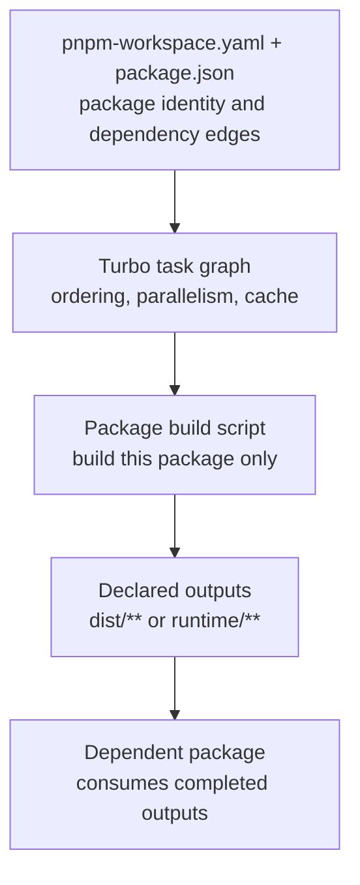
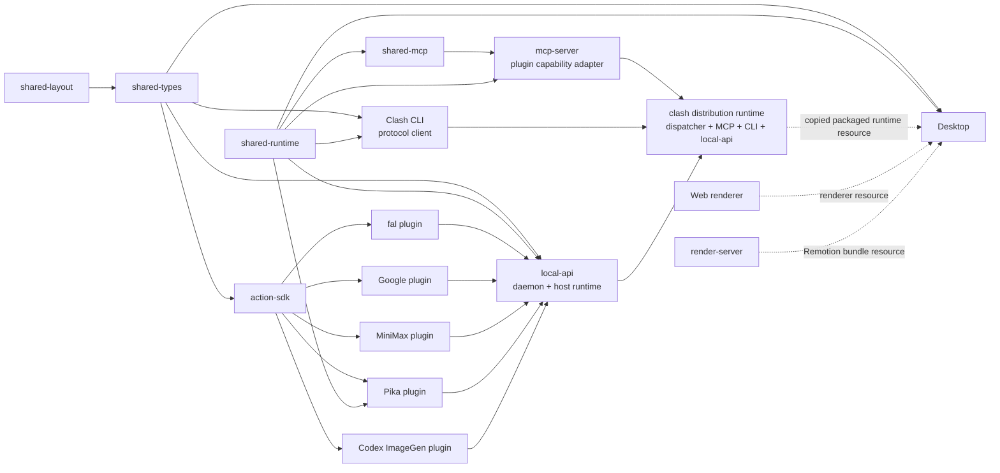
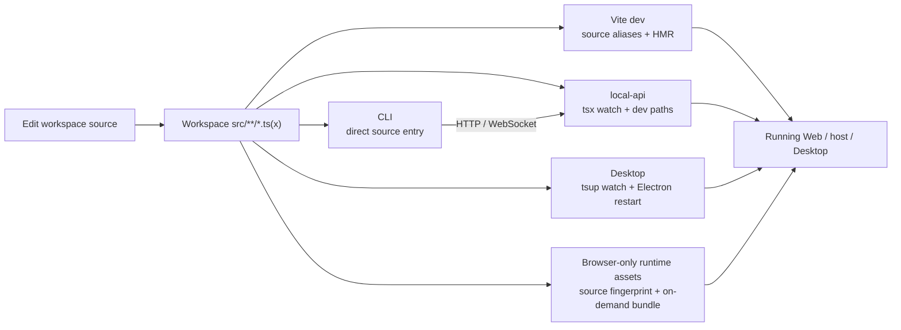

# Build Architecture

Clash uses the workspace dependency graph as the single source of truth for build order. A package
declares every workspace artifact it consumes in `dependencies` or `devDependencies`; Turbo turns
those declarations into a task graph; each package's `build` script builds only that package.

## Ownership model



The boundary is deliberate:

- A package `build` script must not invoke another workspace package's `build` script.
- `turbo.json` owns cross-package ordering through `dependsOn: ["^build"]`.
- Node.js 24.18+ (Node 24.x) is the repository runtime and Node bundle target; browser bundles keep
  their own ECMAScript targets.
- Workspace dependencies replace path-based lists such as `npm --prefix ../../packages/...`.
- Generated documentation is an explicit generation or packaging step, not a hidden dependency
  build.
- Packages that consume generated artifacts declare the artifact producer as a direct dependency.

This prevents two builds from running `tsup --clean` against the same `dist` directory at once, a
race that can temporarily remove declaration files while a downstream DTS build is reading them.

## Main artifact graph



The graph shows build-time artifact flow. The CLI's runtime arrow to `local-api` is deliberately not
shown here because it is HTTP/WebSocket, not a package import. Runtime process ownership is covered
in [Architecture](./architecture.md).

The dependency boundary is strict:

- `local-api` must not depend on or import implementation from `@clash/cli`.
- The private CLI client artifact must not bundle daemon implementation; it consumes the local
  host protocol. The public `clash` distribution still contains that CLI artifact and the
  `local-api` host artifact side by side, so users install one package.
- Desktop does not import `local-api` source. It discovers or starts the host entry copied from the
  unified `clash` distribution runtime, while depending directly on shared contracts/runtime and
  Desktop-specific modules.
- Desktop packaging includes the same runtime's dispatcher and CLI as child-agent tools. This is a
  declared packaging artifact, just like the web renderer and Remotion bundle; none creates a
  runtime implementation dependency from `local-api` to the CLI.

`clash-bridge` is not a workspace package. Its ACP session runtime, plugin host, and optional hosted
connector are daemon responsibilities and therefore build as part of `local-api`. A corresponding
CLI command, when present, is only a control client for the host.

## Development resolution

Development does not consume workspace `dist` directories:



Development aliases must preserve the production boundary: consumers may resolve shared package
source directly, Desktop launches the local host through its TypeScript development entry, and
`local-api` must not import CLI implementation. The host may inject the CLI source entry as an
executable resource for child agents; that child CLI still calls the host protocol. Editing a shared
package, CLI, or host module should be picked up by its watcher without a manual package build.
Bundled executable plugins use attested development launchers that import their TypeScript source
through `tsx`; the Host watches each plugin source plus the shared Action SDK/contracts it imports
(and the shared runtime helpers imported by MiniMax and Pika) and recycles only that plugin child
when one changes.

Remotion compositions and the headless Director viewport are browser programs even though the
daemon invokes them. In a source runtime, the daemon fingerprints their workspace source before
each render and rebuilds only the changed browser bundle into a temporary development cache. It
does not read `apps/render-server/.remotion-bundle` or
`plugins/clash/runtime/director-bundle`. Those directories are production packaging outputs only.
As a result, changing `remotion-*`, `director-*`, or one of
their shared source dependencies takes effect on the next render without running a build command
or restarting Desktop.

Production artifact packages still resolve package exports to declared `dist/**` or `runtime/**`
outputs, ordered and cached by Turbo. Source-only UI packages such as `@clash/gui` are compiled by
the final application bundler; their package `build` task is a standalone type-safety gate rather
than a second copy of the application bundle.

## Commands

Run builds through Turbo from the repository root:

```sh
# Everything
pnpm build

# One package and the dependencies required by its build task
pnpm build:package @clash/local-api

# The complete headless distribution, including exact first-party plugin payloads
pnpm build:package clash

# One package's tests; the root task graph prepares build outputs first
pnpm test:package @clash/cli
```

Long-running development watchers remain package-local because Turbo's `dev` task is persistent:

```sh
pnpm dev:package @clash/local-api
pnpm dev:package @clash/web
```

Dependency orchestration commands live only in the root `package.json`:

```sh
pnpm build:package <workspace-name>
pnpm test:package <workspace-name>
pnpm lint:package <workspace-name>
pnpm typecheck:package <workspace-name>
```

Package-local scripts are atomic. For example, `local-api`'s `build` is only `tsc`, and its `test`
is only `vitest run src`; the root task graph prepares dependencies before invoking either one.
Package-local scripts must not use `--filter` to invoke a different workspace. Cross-package smoke,
packaging, release, and startup orchestration belongs in the root `package.json`.

## Adding a dependency

When package A imports code or consumes a generated artifact from package B:

1. Add B to A's `dependencies` when it is part of the shipped runtime, or `devDependencies` when it
   is used only while building or testing A.
2. Keep A's `build` script limited to A's own compiler, bundler, generators, and copy steps.
3. Declare any non-`dist` output in `turbo.json` so cache restores are complete.
4. Verify with `pnpm install --frozen-lockfile` and a filtered Turbo build from a clean output state.

Do not add a relative `npm --prefix` build chain. It duplicates the dependency graph, bypasses
Turbo caching, and becomes stale when packages are renamed or split.
