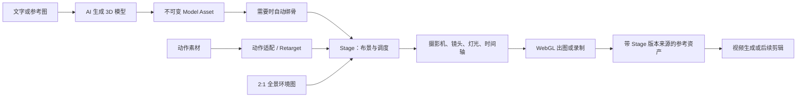
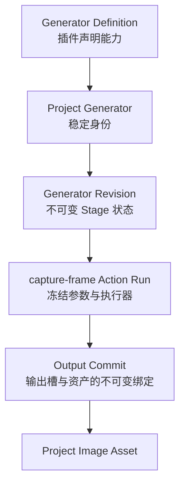

# 把 Stage 想成一座装进电脑的摄影棚

> 一篇写给 3D、动画和实时渲染零基础读者的 Clash Director Stage 技术导览。
>
> 本文按 2026 年 8 月的仓库实现撰写。它会明确区分“已经可用”、
> “底层合同或算法已经存在”和“仍需补齐的产品工作流”。

第一次打开 Stage，很容易把它理解成“一个能摆 3D 模型的画布”。这个说法不算错，
但只说到了最表面的一层。

更准确的比喻是：**Stage 是一座装进电脑的虚拟摄影棚**。

你可以把人物、桌椅、车辆和灯放进摄影棚，安排它们的位置与动作，架设摄影机，选择镜头，
然后在某个时间点拍下一帧，或者把整段镜头录成视频。拍出来的画面还可以继续交给视频生成模型，
作为构图、人物站位和摄影机运动都更明确的参考。

这意味着 Stage 同时碰到了很多领域：3D 图形学、数字资产格式、骨骼动画、摄影、实时渲染、
AI 模型调用、插件系统、版本控制和本地优先协作。本文会把这些技术一层层拆开。

## 先用一个例子理解完整流程

假设我们要做一个镜头：

> 一名侦探走进昏暗的办公室，在桌前停下，拿起一封信；摄影机从门口缓慢推近。

在 Stage 里，这件事大致会变成下面的流水线：



这里最重要的思想是：Stage 不是直接替代最终的视频生成模型。它更像**预演和控制层**。
纯文字生成视频时，“侦探站在哪儿、桌子多大、摄影机往哪儿走”都藏在提示词里；Stage 把这些隐含意图
变成可检查、可修改、可复现的数据。

## Stage 究竟保存了什么

Stage 保存的不是一张截图，而是一份结构化的场景说明，也可以称为 **Scene DSL**。
DSL 是“领域专用语言”的缩写；你可以把它理解成一份机器能严格读懂的拍摄计划。

一份 Stage 状态主要包含：

- 场景背景、全景环境和网格；
- 人物、模型、道具、布景、车辆、灯光和人群；
- 每个物体的位置、旋转和缩放；
- 摄影机及其镜头参数；
- 可编辑的镜头序列、转场和摄影机运动；
- 关键帧、动作片段、故事节拍和摄影机提示；
- 动作素材以及它们的骨架、坐标系和单位信息。

这份数据先经过严格的 Schema 校验，再交给渲染器。Schema 可以理解为表格的填写规则：
它规定位置必须是三个有限数字，灯光强度不能是负数，远裁剪面必须比近裁剪面远，镜头时长必须大于零。
这样，Agent 和 GUI 即使从不同入口编辑同一个 Stage，也不会各自发明一套格式。

早期 Stage 的读取合同里还能识别内嵌的截图记录，以便旧项目迁移；当前作者状态明确禁止把 Capture 输出
塞回 Stage。镜头计划属于 Stage，拍出的图片和视频属于独立资产。

## 第一层基础：3D 世界里的位置和大小

### 三个坐标轴

3D 世界需要三个方向。Clash 的人形动画标准使用：

- X：左右；
- Y：上下；
- Z：前后；
- 1 个单位：1 米；
- 右手坐标系；
- 人物默认朝向 `+Z`。

不同软件未必遵守相同约定。某些素材以 Z 为上方，有些以厘米为单位，有些角色朝 `-Y`。
如果不先统一，常见结果就是人物躺在地上、变成巨人，或者向后滑行。

因此 Stage 的动作素材会记录：上轴、前轴、左右手系、每单位多少米、根骨和髋骨是谁。
导入时先计算一张坐标转换矩阵，把来源空间转换成 Clash 空间。

### Transform：物体的三个基本属性

每个物体都有一个 Transform：

```text
position = 在哪里
rotation = 朝哪里
scale    = 有多大
```

Stage 还支持父子关系和挂点。例如一个人坐在马鞍上，人物可以附着到马的 `saddle` 挂点；
马移动时，人物的世界位置会由“马的 Transform × 挂点偏移 × 人物自己的 Transform”共同计算。

这类层级变换是 3D 场景图的基础。它也是“只改父物体，整组子物体一起走”的原因。

## 第二层基础：一个 3D 模型到底是什么

### Mesh：由很多三角形拼成的表面

电脑通常不是把椅子理解成“椅子”，而是把它看作很多顶点、边和三角形组成的表面，这个表面叫 Mesh。
三角形或多边形的数量常被称为面数或 Polycount。

面数越高不等于一定越好：

- 高面数可以保留细节，但更占内存、上传更慢、渲染更贵；
- 低面数更适合实时场景，但轮廓可能变粗糙；
- 绑骨算法通常也会限制可处理的面数。

所以 AI 3D 模型卡会暴露目标面数、几何质量等参数，而不是把“质量”抽象成一个无法解释的万能滑块。

### 材质、贴图、UV 和 PBR

Mesh 只定义形状。物体看起来像木头、金属还是皮肤，由材质和贴图决定。

- **贴图**：贴在模型表面的图片；
- **UV**：把 3D 表面展开到 2D 图片上的坐标关系；
- **PBR**：基于物理的渲染材质，常用颜色、金属度、粗糙度、法线等信息近似真实表面。

可以把 UV 想成地球仪展开成世界地图。没有合理 UV，纹理就可能拉伸、接缝或错位。

### 为什么 Stage 以 glTF / GLB 为主要运行格式

glTF 是 Khronos 制定的开放 3D 运行时交付格式，能装下场景层级、Mesh、材质、贴图、骨架和动画；
GLB 则把这些内容尽量打包进一个二进制文件。Khronos 把 glTF 定位为高效的运行时交付格式，
而不是 Blender 工程那样的完整创作工程格式。参见
[glTF 2.0 规范](https://registry.khronos.org/glTF/specs/2.0/glTF-2.0.html)。

Stage 的动作导入底层也能解析 FBX 和 BVH：

- FBX 常见于传统 DCC 和游戏动画流程；
- BVH 主要保存骨架层级与动作数据；
- glTF / GLB 更适合浏览器和实时交付。

“能解析”不代表这些格式天然一致。导入之后仍要处理单位、坐标轴、骨骼命名和 Rest Pose。

### 静态模型和可动模型

Clash 的协议把它们都称为 `model`，与 image、video、audio、text 同级，而不是再造一个顶层 `rig` 类型。

资产元数据中的 `flexibility` 表示模型的形变能力：

- `0`：静态或刚性模型；
- `1`：已经绑骨、可以形变的模型。

它不是骨骼数量，也不是物理学里的自由度。桌子和已经绑骨的人物都是 Model Asset，区别只是能力不同。

## AI 如何生成 3D 模型

Stage 本身不训练 3D 大模型。Clash 用 Model Card、Provider 和插件把外部能力接进来。

### Model Card、Provider 和插件分别是什么

可以用“菜谱和厨房”来理解：

- **Model Card** 是菜谱：声明模型能吃什么输入、产出什么、有哪些参数；
- **Provider** 是厨房：保存账户配置并提供实际服务；
- **Binding** 表示这间厨房能做这张菜谱；
- **Executor** 是执行流程：提交任务、轮询状态、取回结果；
- **插件** 是安装包：把 Provider、Binding 和 Executor 注册给 Host。

因此“一个模型可以有多个 Provider”与“插件贡献 Provider”并不冲突。卡片描述产品语义，插件描述谁来执行。

当前内置的 3D 卡包括 Meshy 6、Meshy 7、Tripo H3.1，以及 Meshy、Tripo 各自的 Auto Rig 卡。
基础 3D 卡可以接文字或一张可选图片；Provider 根据实际输入选择 Text-to-3D 或 Image-to-3D 接口。
Auto Rig 则是另一张 Model-to-Model 卡：输入一个模型，输出一个已经绑骨的模型。

### 为什么生成和绑骨是两个步骤

“形状看起来像人”和“这个人能自然弯胳膊”是两件不同的事。

3D 生成首先解决几何、纹理和整体外观；Auto Rig 再识别身体结构，建立骨架，并计算每个顶点受哪些骨头影响。
Meshy 官方也把 Rigging 定义为给 humanoid 模型添加 armature 并把 Mesh 绑定到骨架，且明确说明标准双足人形更适合自动绑骨。
参见 [Meshy Rigging API](https://docs.meshy.ai/en/api/rigging)。

Provider 调用是异步的：Clash 提交任务后会得到任务 ID，随后轮询，直到得到 GLB 下载地址或失败信息。
这个过程由私有 Durable Task 保存重试、截止时间和 Provider token；项目里只公开粗粒度的 Run 状态和最终资产。

## 第三层基础：骨骼为什么能让模型动起来

### Skeleton 和 Skinning

骨骼是一棵层级树。移动大腿骨，小腿和脚会跟随；旋转脊柱，胸口、脖子和头也会受影响。

模型表面的每个顶点会记录它受哪些骨骼影响以及影响权重。例如肘部附近的顶点可能同时受上臂和前臂影响。
运行时把多个骨骼变换按权重混合，就是常见的线性混合蒙皮（Linear Blend Skinning）。

这解释了两个常见问题：

- 有骨架但没有正确权重，模型会像硬纸板一样断开；
- 权重不好，肩膀、髋部和手腕会在弯曲时塌陷。

### Rest Pose：骨架的“零点”

Rest Pose 是骨架没有播放动画时的参考姿势，常见的是 T-Pose 和 A-Pose。
动画保存的是骨骼相对这套参考姿势的变化。

如果动作来源是 T-Pose，而目标角色的参考姿势是 A-Pose，直接复制旋转就会让肩膀长期抬高或扭曲。
因此 Retarget 必须考虑源和目标的参考姿势差异。

## 第四层基础：动画不是视频，而是一组随时间变化的数字

### Clip、Track 和 Keyframe

一个动画片段叫 Animation Clip，例如 `Walk`、`Wave` 或 `Idle`。
Clip 里面有许多 Track，每条 Track 控制一个目标属性：

```text
Hips.position
LeftUpperArm.rotation
Camera.focalLengthMm
```

Track 上的 Keyframe 记录“某个时间点应该是什么值”。两帧之间的值由插值算法计算：

- Hold：保持上一个值，适合突然切换；
- Linear：匀速插值；
- Bezier：通过曲线做缓入缓出。

Stage 的关键帧既能控制物体的位置、旋转和缩放，也能控制摄影机 FOV、焦距、对焦距离和光圈值。

### 语义动作层

用户不应该被迫记住每个 GLB 里的内部 Clip 名字。Stage 定义了 `walk`、`run`、`sit`、`wave`、
`talk`、`pickup` 等语义动作，再通过 Action Map 映射到模型实际拥有的 Clip。

如果模型里有 `Idle_Neutral`，它可以映射成 `idle`；如果另一个模型只有 `Stand_01`，也可以映射到同一语义。
这是“产品动作语言”和“文件内部命名”之间的适配层。

### 混合、分层与 Root Motion

动作切换不能总是瞬间发生。Stage 的 Action Clip 有淡入、淡出、播放速度、循环方式和层级：

- Full Body：控制全身；
- Upper Body：只覆盖上半身；
- Blend：在两个动作间按权重混合；
- Root Motion：决定动画里根骨的位移如何处理。

Root Motion 有三种常见策略：

- `apply`：动画带着人物向前走；
- `in-place`：去掉根位移，由 Stage 的位置轨道移动人物；
- `extract`：把根位移提取成可单独处理的数据。

Stage 目前常用 in-place，让“人物走多远”和“脚步怎么摆”分开控制，更方便镜头预演。

## Retarget：把一套动作穿到另一副骨架上

### 为什么不能直接复制动画

两个角色可能都叫“人形”，但它们的骨骼名称、数量、层级、朝向、身高和手脚比例都可能不同。
如果直接把源骨骼旋转复制给目标，结果可能是手臂翻转、脚陷进地面或髋部乱跳。

成熟的 Retarget 流程通常包含：

1. 识别源骨架和目标骨架；
2. 映射 hips、spine、upper arm、lower leg 等语义骨骼或骨链；
3. 统一坐标轴、单位和朝向；
4. 补偿 T-Pose / A-Pose 等 Rest Pose 差异；
5. 按人物比例修正髋部和 Root Motion；
6. 必要时使用 IK 固定手脚接触点；
7. 检查滑步、穿模和关节极限。

Three.js 提供 `SkeletonUtils.retargetClip` 作为相近骨架间的基础工具；更完整的工业方案会像
[Unreal IK Retargeter](https://dev.epicgames.com/documentation/en-us/unreal-engine/ik-rig-animation-retargeting-in-unreal-engine)
一样按骨链映射，并用 IK 保持手脚接触。

### Stage 当前做到哪一步

Stage 已经有 `clash-humanoid-v1` 人形骨架规范、常见骨骼别名识别、GLB/glTF/FBX/BVH 解析、
坐标归一化、Rest Pose 偏移修正，以及基于 Three.js SkeletonUtils 的 Clip Retarget。

当前内置 Anny 人物会把多个动作来源 Retarget 到同一个目标骨架，并把下半身运动和上半身手势分层混合。
系统还会抽样检查脚底滑动、左右脚接触高度差、关节活动过大和身体自相交。

但需要准确区分两件事：

- **底层能力已存在**：人形动作解析、归一化、Retarget 和 QA；
- **通用产品流程仍是部分完成**：任意 Provider 生成的角色、任意外部动作、自动 Rig Profile 建立、
  IK 修脚和最终可复用动画资产，还没有全部串成一键式端到端工作流。

对带内嵌动画的普通 GLB，Stage 已能检查骨骼和 Clip 名称，推断 Action Map，并直接用 Three.js
`AnimationMixer` 播放；这属于“模型自带动画”，不等于跨骨架 Retarget。

## 摄影机：Stage 为什么不只存一个视角

### FOV、焦距和传感器

透视摄影机的 FOV 是视野角，焦距是镜头的毫米数，传感器尺寸则决定同一焦距能看到多宽。
三者满足近似关系：

```text
FOV = 2 × arctan(传感器高度 / (2 × 焦距))
```

因此 24 mm 看起来更广，85 mm 更窄、更像人像镜头。Stage 提供从 14 mm 到 135 mm 的镜头预设，
并让焦距和 FOV 保持一致。

Stage 的摄影机合同还保存：

- 透视或正交投影；
- 对焦距离；
- 光圈 f-stop；
- 快门角度；
- ISO；
- 近、远裁剪面。

目前焦距、FOV 和对焦/光圈等值可以编辑、存储和动画化；但视口还不是完整的物理摄影机模拟器，
并没有把景深、运动模糊和真实曝光全部实现成最终画面效果。数据合同先保留了这些创作意图。

### 镜头和摄影机运动

Stage 的 Shot Sequence 不只是“选哪台摄影机”，还包含起始时间、时长、画幅和转场。
摄影机 Rig 支持：

- Dolly：前后推拉；
- Truck：左右平移；
- Pedestal：上下升降；
- Pan / Tilt：水平或垂直摇摄；
- Orbit：绕主体环绕；
- Crane：模拟摇臂运动。

路径可以线性插值，也可以用 Catmull–Rom 曲线得到更平滑的轨迹；镜头还能锁定焦距或在运动中变焦。

### 构图检查

Stage 能保存主主体、次主体、头顶留白、视线前方留白、最小摄影距离和主体间距，
也能保存人物关系轴的摄影机侧别。Core 会检查镜头是否越轴、人物是否太近、遮挡是否严重等问题。

它不是要取代摄影师，而是把“这个镜头为什么不舒服”尽量转成 Agent 也能理解的结构化反馈。

## 360° 全景环境：一张图片为什么能包住整个摄影棚

Stage 支持 2:1 的等距柱状投影（Equirectangular）全景图。它像世界地图一样：横向覆盖 360° 经度，
纵向覆盖从头顶到脚下的 180° 纬度。渲染时，这张图被采样到摄影机周围的环境球面。

全景图提供的是视觉环境，不会自动变成真的墙、地面和碰撞体。为了解决“图片里的地板到底多大”这个问题，
Stage 额外保存校准信息：

- 拍摄原点的位置和旋转；
- 地平线在图片上的纵向位置；
- 正前方对应图片上的横向位置；
- 网格每格代表多少米；
- 可工作的有限长方体空间。

这样，2D 全景背景和 3D 人物就能共享相对可信的地平线、朝向与米制比例。

## 灯光、材质和阴影如何变成像素

Stage 使用 Three.js 作为 3D 引擎，并通过 React Three Fiber 把 Three.js 场景表达成 React 组件。
React Three Fiber 官方将自己定义为 Three.js 的 React Renderer：React 负责声明和状态组织，
真正的 Scene、Camera、Mesh 和渲染循环仍由 Three.js 工作。参见
[React Three Fiber Introduction](https://r3f.docs.pmnd.rs/getting-started/introduction)。

视口目前包含环境光、方向光以及点光源、聚光灯、方向光等 Stage 对象，并使用实时阴影。
大致的实时渲染流程是：

1. CPU 计算当前时间的物体、骨骼和摄影机状态；
2. 把顶点、纹理和材质参数送给 GPU；
3. 顶点着色器把 3D 顶点投影到屏幕；
4. 光栅化把三角形覆盖的区域变成像素候选；
5. 片元着色器计算材质、灯光、阴影和纹理颜色；
6. 深度测试决定前后遮挡；
7. 得到屏幕图像。

这种方式速度快，适合交互式预演；它与离线路径追踪器不同，不以最高物理真实度为目标。

对大量相似物体，GPU 还可以使用 Instancing：一份几何和材质配上许多不同的位置，一次批量绘制。
Stage 的 Crowd 就使用这种思路，避免“100 个人就复制 100 份完整 Mesh”带来的开销。

## 浏览器里的画面如何变成项目资产

### 交互视口

GUI 使用 React 19、Three.js、React Three Fiber 和 Drei。Orbit Controls 负责观察场景，
Transform Controls 负责移动、旋转和缩放物体；关键帧时间尺则让用户编辑镜头、动作和属性曲线。

### 无头 WebGL 渲染

“无头”是指没有可见窗口的浏览器。Local Host 会启动打包后的 Director WebGL 页面，
把冻结的 Stage 状态、时间点、画幅和资产 URL 传进去，然后读取 PNG。

这条路径很重要，因为它让 Agent 调用和 GUI 预览使用同一套产品渲染器，而不是服务器另写一套近似实现。
每张输出会记录分辨率、时间点、画幅、活动摄影机、PNG 哈希和 Stage 状态哈希。

Stage 也有基于浏览器 Canvas 录制的相机视频导出路径。它适合产生参考视频，不等同于最终电影级渲染。

## 为什么 Stage 还需要 Generator、Run 和 Output Commit

如果只考虑画面，按下“截图”似乎只需要 `canvas.toBlob()`。但生产系统还必须回答：

- 这张图来自哪个 Stage 版本？
- 用的是哪个时间点和摄影机？
- 任务崩溃重试时，会不会重复发布两个结果？
- 下游视频模型用的是旧画面还是新画面？

因此 Director Stage 被投影成一个原生 Generator：



关键原则是：**作者状态和输出事实分开**。

拍出的 PNG 不写回 Stage 的可编辑状态；它通过 Run 和 Output Commit 成为独立资产。
这样，编辑 Stage 不会篡改历史截图，而历史截图也永远能追溯到当时的 Stage Revision。

## 本地优先、Loro 和并发编辑

Stage 存在项目的本地 Loro 副本里。Loro 是 CRDT 数据结构库；CRDT 的目标是让多个副本在离线或并发编辑后
能够合并，而不依赖“最后保存的人覆盖所有人”。Loro 使用 Version Vector 和 Frontiers 表达版本，
参见 [Loro Version](https://loro.dev/docs/tutorial/version)。

Clash 在这个基础上增加了几条产品规则：

- 读取会形成内部 observation；
- 写入使用 Compare-And-Set，简称 CAS；
- 如果别人已经修改了你读过的版本，旧写入会失败并要求重新读取；
- 不存在 `force` 绕过；
- 已被下游引用的节点通过 Copy-on-Write 保留历史语义。

所以 Agent 的正常体验仍然是“读、改、应用”，而不是手动处理数据库锁或同步 token。

## Agent、CLI、MCP 和插件分别扮演什么角色

Stage 的 source of truth 在 Project 里，不在 GUI，也不在 Agent 对话里。

- GUI 是可视化编辑器；
- CLI 提供本地工作树投影和显式 apply；
- MCP 提供类型化的 Agent 工具；
- Local Host 负责校验、版本、资产、插件和运行任务；
- 插件声明 Generator、Provider、Model Binding、Executor 和 Host Tool 权限。

Agent 调整一个物体时，并不是向 Three.js 对象随手赋值后就算完成。最终修改必须通过统一的 Stage 合同，
经过 read-before-write 与 CAS，形成新的不可变 Generator Revision。

这也是为什么插件不能把任何本地函数伪装成系统能力：Manifest 必须声明贡献和所需 Host Tool，
而 Host 冻结真正调用的插件 ID、版本、export ID 和 schema hash。

## 质量保障：不仅要“能跑”，还要知道跑的是什么

Stage 相关测试大致分成几层：

### 结构校验

Zod Schema 拦截非法场景、摄影机、动作和镜头数据。共享类型是 GUI、CLI、MCP 和 Host 的同一事实来源。

### 动画与骨架 QA

- 必需的人形骨骼是否存在；
- 手臂是否穿进躯干；
- 手是否穿进大腿；
- 脚掌接触地面时是否滑动；
- 左右脚接触高度是否差异过大；
- 关节旋转是否超出合理范围。

### 镜头 QA

- 主体是否太近；
- 主次主体是否重叠；
- 是否违反设定的关系轴；
- 障碍物是否挡住主体；
- 头顶留白和前方留白是否符合约束。

### 渲染与插件验证

- Headless WebGL smoke test 验证真实浏览器能加载场景；
- Capture contract 验证冻结的 Stage envelope 和输出；
- Provider adapter test 验证参数确实传到上游；
- Plugin contract harness 通过真实 stdio 协议运行插件，但使用声明好的虚拟 Host 响应，避免误收费；
- Live smoke test 需要真实 API Key，属于另外一层验证。

“单元测试通过”不等于“厂商在线 API 一定可用”；反过来，一次在线请求成功也不能证明版本、重试和资产来源正确。
这些测试层必须同时存在。

## 资产来源、许可证和哈希为什么也是技术问题

3D 文件能打开，不代表可以随便分发。Stage 的内置素材库会保存来源页面、许可证、许可证链接和源文件哈希。
当前 Poly Haven 与 Quaternius 的内置素材按各自记录的 CC0 来源交付；哈希用于确认打包的文件仍是审阅过的那一份。

AI Provider 输出则要遵守用户所选套餐、Provider 条款以及输入素材的权利。Clash 可以保存模型、Provider、
任务和资产来源，但不能凭一条元数据替用户创造版权。对商业项目，正确做法是保留来源、生成参数、账户计划、
许可证快照和人工修改记录，而不是只保留最终 GLB。

## 现在已经实现了什么，哪些还没有

| 能力                                               | 当前状态                                                  |
| -------------------------------------------------- | --------------------------------------------------------- |
| 场景对象、Transform、附件和分组                    | 已实现                                                    |
| 内置人物、动物、道具、布景、车辆、灯光和人群       | 已实现                                                    |
| Project Model Asset 作为 Stage 模型                | 已实现                                                    |
| Meshy / Tripo 文字或图片生成 3D                    | Provider 插件与模型路由已实现；真实在线调用需配置 API Key |
| Meshy / Tripo Auto Rig                             | Model-to-Model 插件路径已实现；真实在线调用需配置 API Key |
| GLB / glTF 内嵌动画播放与动作名推断                | 已实现                                                    |
| 内置 Anny 动作 Retarget、分层混合与动作 QA         | 已实现                                                    |
| 任意 GLB/glTF/FBX/BVH 的解析、坐标归一化和人形检查 | 底层能力已实现                                            |
| 任意生成角色 × 任意动作的一键 Retarget             | 部分实现，尚未形成完整通用产品工作流                      |
| IK 手脚接触修正                                    | 工业方案明确，但通用 Stage 后处理尚未完整交付             |
| 关键帧、动作片段、Root Motion、镜头序列            | 已实现                                                    |
| 真实摄影机参数存储与动画                           | 已实现                                                    |
| 完整物理景深、曝光和运动模糊                       | 尚未完整实现                                              |
| 2:1 全景环境与米制工作空间校准                     | 已实现                                                    |
| 实时 WebGL 视口与 Headless PNG Capture             | 已实现                                                    |
| 参考视频导出                                       | 已有桌面/Canvas 录制路径                                  |
| 刚体物理、碰撞、布料、头发、流体                   | 当前不是 Stage 已交付能力                                 |
| 面部表情、口型和语音驱动表演                       | 当前不是完整交付能力                                      |
| 电影级路径追踪最终渲染                             | 当前不是 Stage 的定位                                     |

## 小白最值得先记住的十个词

| 词             | 最简单的解释                |
| -------------- | --------------------------- |
| Mesh           | 三角形拼成的 3D 表面        |
| Material       | 表面如何反光和着色          |
| Texture        | 贴在表面的图片              |
| UV             | 3D 表面与 2D 贴图的对应关系 |
| Skeleton / Rig | 控制模型形变的骨架          |
| Skinning       | 顶点如何跟随骨头            |
| Clip           | 一段可播放的动画            |
| Keyframe       | 某个时间点的确定数值        |
| Retarget       | 把源骨架动作适配到目标骨架  |
| Root Motion    | 动画中角色整体移动的部分    |

## 推荐的学习顺序

如果你想继续深入，不需要一开始就学矩阵推导。按这个顺序更自然：

1. 在 Stage 里摆三个物体，理解位置、旋转和缩放；
2. 导入一个 GLB，观察静态模型与带动画模型的区别；
3. 给摄影机换 24 mm、50 mm 和 85 mm 镜头，感受透视变化；
4. 做两个关键帧，让人物或摄影机移动；
5. 播放 Walk，并分别观察 in-place 和根位移；
6. 再学习 Skeleton、Skinning、Rest Pose 和 Retarget；
7. 最后理解 Generator Revision、Run 和 Output Commit 为什么保证可追溯。

## 结语

Stage 的价值不是“在视频软件里再塞一个 3D 软件”。它真正解决的是：

> 把原本只存在于提示词和脑海里的空间、动作与镜头意图，变成 Agent、人和生成模型都能共同读取的结构化事实。

Three.js 让这些事实实时变成画面；glTF 搬运模型与动画；骨架和 Retarget 让动作能够复用；
摄影机和镜头系统把场景变成叙事；Generator、Loro、不可变资产和插件系统则保证每次输出都知道自己从哪里来。

当这些层连接起来，Stage 才不只是“一个 3D 预览框”，而是 AI 视频生产流程里的虚拟摄影棚和控制平面。
