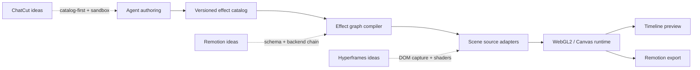

# Clash 特效与转场系统调研：ChatCut、Remotion、Hyperframes

调研日期：2026-07-15  
源码快照：ChatCut `fd271fe`、Remotion `ae327ff`、Hyperframes `15ca6fd`

> 当前产品契约（2026-08-07）：本文保留外部 effect/transition 调研，
> 但不定义第二套内容合成引擎。Clash 中动态图形唯一可执行路径是
> `Remotion TSX -> Canvas remotion-component -> Timeline sourceNodeId -> Timeline render`。
> 下文出现的 DOM 捕获只描述第三方实现或 effect 内部 source adapter，不能作为
> Agent 可选择的创作、预览或导出路线。

## 结论

三个项目确实提供了不同的 shader 思路，但差异主要在系统边界，而不只是 shader 数量：

| 产品        | 核心思路                        | Shader 在系统中的位置                                                                                          | Clash 值得采用的部分                                                    |
| ----------- | ------------------------------- | -------------------------------------------------------------------------------------------------------------- | ----------------------------------------------------------------------- |
| ChatCut     | catalog-first 的 Agent 生成协议 | Agent 生成继承 `EffectProcessor` / `TransitionProcessor` 的 TypeScript 类，GLSL 是其中一个 pass                | 先搜目录再生成、限制参数数量、沙箱校验、版本化发布流程                  |
| Remotion    | 统一 effect graph               | `@remotion/effects` 同时管理 2D Canvas 与 WebGL2 effect，预留 WebGPU；transition presentation 另有一套组件 API | effect descriptor、schema、backend 分组、canvas pool、跨 backend 桥接   |
| Hyperframes | DOM-first 的确定性视频合成      | 先把两个完整 HTML scene 捕获成纹理，再做 WebGL transition；导出端有 page-side / Node-side fallback             | DOM 捕获适配器、预览/导出一致性、短时电影化转场、Apache-2.0 shader 目录 |

对 Clash 的推荐不是三选一，而是分层吸收：

当前落地选择：保留 Clash 自己的版本化 Effect SDK，吸收经过许可证审查的转场思路并加入 provenance 元数据。Agent 创作的动态图形始终是单文件 Remotion TSX；Canvas 节点负责编辑与预览，Timeline 通过稳定 `sourceNodeId` 引用最新源码，最终仅由 Timeline 的 Remotion renderer 交付媒体。

## 1. `@remotion/effects` 是 shader 吗？

准确回答：一部分是，而且占多数；但包本身是一个 effects runtime，不是裸 shader 文件集合。

在 Remotion `4.0.489` 的源码快照中：

- effect backend 类型是 `2d | webgl2 | webgpu`；
- 当前 package 内有 48 个 `webgl2` effect definition、10 个 `2d` definition；
- backend chain 会过滤 disabled effect，按 backend 分组，在同 backend 内用 canvas pool ping-pong；
- 跨 backend 时通过 canvas 或 `ImageBitmap` 桥接；
- definition 同时包含参数 schema、校验、setup/apply/cleanup、稳定 key。

所以 `blur`、`wave`、`chromatic-aberration`、`zoom-blur`、`pixel-dissolve` 等确实由 WebGL2 shader 执行，但 brightness、contrast 等也可以落在 2D Canvas。类型上已经预留 WebGPU，本次快照尚未看到 package 内的 WebGPU effect definition。

还要区分两个概念：

- `@remotion/effects`：对 canvas source 逐帧应用的 effect chain；
- `@remotion/transitions`：在两个 React scene 之间编排 transition presentation。

Remotion 新增的 `linearBlur`、`filmBurn`、`dissolve`、`ripple`、`crosswarp` 等高级 presentation 使用 HTML-in-canvas 捕获 React/DOM scene，再做像素合成。这条路线和 Hyperframes 很接近，但依赖 Chrome 尚未普及的 `canvas-draw-element` 能力，必须保留 capability gate 与 fallback。

### Clash 当前不直接升级的原因

Clash 目前锁在 Remotion `4.0.370`，而调研快照是 `4.0.489`。Remotion 要求相关 package 版本一致，直接引入最新版 `@remotion/effects` 会变成一次横跨 CLI、renderer、transitions 与回归渲染的升级，不适合夹在首批 shader 接入中完成。

另外，`@remotion/effects/package.json` 标记为 `UNLICENSED`，实际受 Remotion 仓库的定制许可证约束。采用前需要按团队/公司规模确认授权；推荐通过依赖使用，不复制其实现源码。

## 2. ChatCut：重点是 Agent shader authoring protocol

ChatCut public plugin 的 `shader-gen` 不是一包现成 shader，而是一套生成工作流：

1. 先查询 effect library，有可用项就直接复用；
2. 没有匹配项时再提交生成请求；
3. 生成 TypeScript class，继承注入的 processor；
4. transition 使用 `u_outgoing` / `u_incoming` / progress，effect 使用单输入纹理；
5. 参数 schema 限制为 number、boolean、color、select、vec2 等可审计类型；
6. 通过 AST、安全规则、编译和 class validation 后才能安装。

它最有价值的产品规则是：默认值先好看，只暴露 2–5 个控制项，用户主要看到一个 `intensity`，复杂度留在实现内部。这正好解释了第一版 Clash demo 为什么显得“哈里哈气”——转场持续 2.4 秒，且视觉参数被当成展示主体；成熟系统更强调短时、克制和目录复用。

风险：调研快照根目录未发现许可证文件，且 public plugin 没有公开生产端 shader library。因此本次只采用协议思想，不复制 ChatCut 源码。

## 3. Hyperframes：重点是把完整 DOM scene 变成纹理

Hyperframes 的 `@hyperframes/shader-transitions` 是三者中最接近“现成转场库”的部分。当前目录包含 14 个 shader 名称，包括 `whip-pan`、`light-leak`、`flash-through-white`、`cinematic-zoom`、`sdf-iris`、`cross-warp-morph` 等。

它与简单双纹理 shader 的关键区别，是 source adapter：

- 优先使用实验性的 `drawElementImage` 把完整 DOM scene 捕获到 canvas；
- 不可用时回退到 `html2canvas`；
- engine render 使用两阶段协议：先 seek/clone scene，强制浏览器 paint，再捕获纹理并 composite；
- 对 video frame、跨域资源、3D transform、blend mode 等限制有显式检测与降级；
- producer 端用 worker pool 做 shader blend，并通过 frame reorder buffer 保持确定性输出顺序。

这比“在 Timeline 上放一个 WebGL canvas”更接近真正的编辑器系统，因为它回答了最难的问题：文字、图片、视频、CSS 组合场景如何稳定变成 shader 输入。

Hyperframes 使用 Apache-2.0，适合在保留声明与变更说明的前提下改写进 Clash。它的原始 shader 是 WebGL1 风格；本次实现转换为 Clash WebGL2 / GLSL ES 3.0，并把强度、方向、柔和度等参数纳入 Clash schema。

## 4. ChatCut Library：参考全部能力，不照抄全部 Tab

ChatCut 的 Library 把七类内容放在同一浏览入口：Motion Graphics、Sound Effects、Transitions、FX、Zoom、LUTs、Audio FX。这个统一入口值得参考，但它们在底层不是同一种东西，更不能全部建模为 shader。

源码中的几个关键事实：

- Motion Graphic 的代码与可编辑属性属于 asset；时间、位置、尺寸和实例覆盖属于 timeline item；
- Sound Effect 是音频 asset，目录优先，找不到时才生成；
- Transition 连接相邻的两个 visual item；
- 普通 FX 默认 item-bound，也允许覆盖 track range；
- `builtin:zoom` 只能 track-bound，错误地绑定 item 会写入成功但预览不生效；
- 内置 LUT 是 effect ref，用户上传的 `.cube` 是 LUT asset，两条路径必须显式区分；
- Audio FX 应是音频 processor，不应进入 WebGL effect runtime。

Clash 的动态图形不再拥有独立的 layer/spec/HTML 模型，也不创建平行的预览或导出命令。当前契约只有四层：

- Agent 在工作区创作 default-export 的单文件 Remotion TSX；
- 源码以原文持久化到独立 Canvas `remotion-component` 节点，并在 Editor 中编译预览；
- Timeline composition item 使用 `runtime: remotion` 和该节点的稳定 `sourceNodeId`，不复制源码；
- 最终媒体由 Timeline render 产生，并把完成的 Asset 与 Timeline revision 一起读回。

因此 Library 中的 Motion Graphics 条目如果包含可编辑代码，其 artifact 是 Remotion 组件，apply 动作是创建或选择 Canvas 组件节点，再把该节点引用加入 Timeline。对同一 Canvas 节点的修改会出现在后续 Timeline 预览与渲染中；需要保护既有下游版本时，才显式 copy-on-write 并重新连线。

### 推荐给普通用户的入口

Clash 不应原样复制七个并列 Tab。推荐六个用户入口，底层仍保留七个精确 category：

| 用户入口       | 内部 category               | 用户理解                           |
| -------------- | --------------------------- | ---------------------------------- |
| Recommended    | 动态聚合                    | 根据选中片段、内容和节奏推荐       |
| Graphics       | `motion-graphics`           | 字幕条、数据图、标题动画等画面元素 |
| Transitions    | `transitions`               | 两段素材之间怎么切换               |
| Visual Effects | `fx`、`zoom`                | 画面处理和镜头运动                 |
| Color Looks    | `luts`                      | 整体颜色与影调                     |
| Audio          | `sound-effects`、`audio-fx` | 插入声音或处理已有声音             |

内部 apply contract：

| category        | artifact                          | apply target                                                   |
| --------------- | --------------------------------- | -------------------------------------------------------------- |
| Motion Graphics | Canvas `remotion-component`       | 插入 `custom/remotion` composition item，并保留 `sourceNodeId` |
| Sound Effects   | audio asset                       | 插入 audio track item                                          |
| Transitions     | visual effect ref                 | 相邻 clip boundary                                             |
| FX              | visual effect ref                 | visual item 或 track range                                     |
| Zoom            | visual effect ref / motion preset | visual track range                                             |
| LUTs            | built-in effect ref 或 LUT asset  | visual item                                                    |
| Audio FX        | audio processor ref               | audio item 或 audio track                                      |

截图中的 FX 也应按实现机制拆分：

- Rectangle/Circle Mask：mask、stencil 或 shader；
- Local Mosaic、Magnifying Glass、Tilt-Shift、CRT、ASCII Rain：单 pass 或 multi-pass visual processor，适合 WebGL2；
- Camera Shake：确定性的 transform/motion processor，不需要 shader；
- Black Overlay：composite preset 或可插入 overlay asset，不应强迫走 shader。

这套拆分让 UI 仍然是一个 Library，Agent 却能在选择 item 之前就知道目标是视频轨、音频轨、clip boundary 还是 track range。所有 category 都遵循 catalog-first：先搜索现成项，匹配不到再进入生成或开发流程。

### CapCut 浏览模式：复制交互结构，不复制内部分类

CapCut 截图中值得抽取的结构是：

1. 顶部一级能力栏切换素材、音频、文本、特效、转场、滤镜、调节、模板等工作模式；
2. 左侧树负责收藏、父 collection 和二级 topic；
3. 主区顶部统一搜索，下面使用大缩略图网格；
4. 卡片明确展示免费/需要权益、已内置/需下载/下载中/已安装/失败；
5. collection 只是对 category、tags、favorite 的查询，不能改变 artifact 类型或 apply contract。

Clash 当前应先把这套模式放在已有 Assets/Timeline 编辑入口内部，而不是新增一个独立全局目的地。第一阶段可使用六个一级入口；左侧 collection 由真实 catalog 数据驱动。没有真实 entitlement 或下载后端时，不显示假的会员菱形和下载进度。

为支持该模式，catalog item 与用户 view state 分开：

- immutable item：id、version、category、artifact、apply、tags、provenance；
- collection：group、parent、category/tag/favorite query；
- per-user view state：favorite、access、delivery state 和下载 progress。

## 5. OpenReel / OpenCut 的补充判断

- OpenReel 已有 WebGPU / WebCodecs 路线，以及 crossfade、dip、wipe、slide 和基础调色/模糊/锐化/辉光等效果。它适合参考 GPU 视频管线，不是当前最强的现成电影化 shader catalog。
- OpenCut 的公开 issue 仍把“引入开源 filters/transitions/effects 库”当作待建设方向，说明它更适合作为编辑器 UX/数据模型参考，而不是本次效果源。
- 如果后续需要扩大 transition 数量，MIT 的 `gl-transitions`（125 个 transition）是更合适的 catalog 候选；需要先做质量分级，而不是把 125 个效果直接全部暴露给用户。

## 6. 本次实现

本次实现新增：

- `clash/whip-pan@1`：方向位移加克制的 12-tap motion blur；
- `clash/light-leak@1`：短时暖色光漏与 ACES tone mapping；
- `clash/flash-through-white@1`：适合 editorial cut 的柔和过曝；
- `EffectDefinition.provenance`：记录 provider、upstreamId、sourceUrl、license、adapted；
- demo 转场窗口从 2.4 秒缩短为 0.6 秒；
- 保留原来的 `displacement-warp`、`prism-split`、`pixel-dissolve` ID，不破坏历史工程。
- Timeline Library 的七类 runtime schema、六个用户分组和 category-level Agent apply contract；
- Motion Graphics 条目统一为 Canvas `remotion-component`，Timeline 只保留实时 `sourceNodeId`；
- CapCut-style collection query 与 per-user favorite/entitlement/download view state；
- runtime validation 会拒绝声音素材/视觉 effect 混用、Zoom item-bound 等错误组合。

这三种新效果是第一批 curated set，不代表最终 UI 要把所有参数都显示出来。默认 UI 应只展示效果名和一个强度入口，高级参数折叠到 inspector。

## 7. 后续实施顺序

### Phase 1：已完成

- 版本化 effect registry、compiler、WebGL2 runtime；
- cinematic curated set 与来源元数据；
- 短时 demo 与 deterministic frame 参数；
- shader source、manifest 和 demo plan 测试。

### Phase 2：Timeline source adapter

- 对 ``、`<video>`、`<canvas>` 直接生成 `CanvasImageSource`；
- 对文本/复合 DOM 走 HTML-in-canvas capability probe；
- 捕获失败、跨域污染或 context lost 时回退 `clash/crossfade`；
- preview 和 export 必须走同一 effect definition 与同一参数求值。

### Phase 3：Effect graph

- 增加 clip effect stack，而不只支持 transition；
- 按 backend 合并连续 pass，复用 framebuffer/canvas；
- 为 2D → WebGL2、WebGL2 → 2D 设计显式 bridge；
- 加 context loss、分辨率变化和 GPU budget 测试。

### Phase 4：Agent authoring

- `effect search` 必须先于 `effect create`；
- 新 shader 通过 AST/import/global allowlist、GLSL compile、schema 和帧一致性检查；
- manifest 强制 namespace、version、fallback、license/provenance；
- 生成器只能写独立 effect package，不能直接修改 editor core。

## 资料

- [Remotion effects source](https://github.com/remotion-dev/remotion/tree/main/packages/effects)
- [Remotion transitions](https://www.remotion.dev/docs/transitions/)
- [Remotion linear blur presentation](https://www.remotion.dev/docs/transitions/presentations/linear-blur)
- [Remotion film burn presentation](https://www.remotion.dev/docs/transitions/presentations/film-burn)
- [Hyperframes repository](https://github.com/heygen-com/hyperframes)
- [ChatCut agent plugin](https://github.com/ChatCut-Inc/agent-plugin)
- [gl-transitions catalog](https://gl-transitions.com/)
- [OpenReel repository](https://github.com/Augani/openreel-video)
- [OpenCut effects proposal](https://github.com/OpenCut-app/OpenCut/issues/713)
